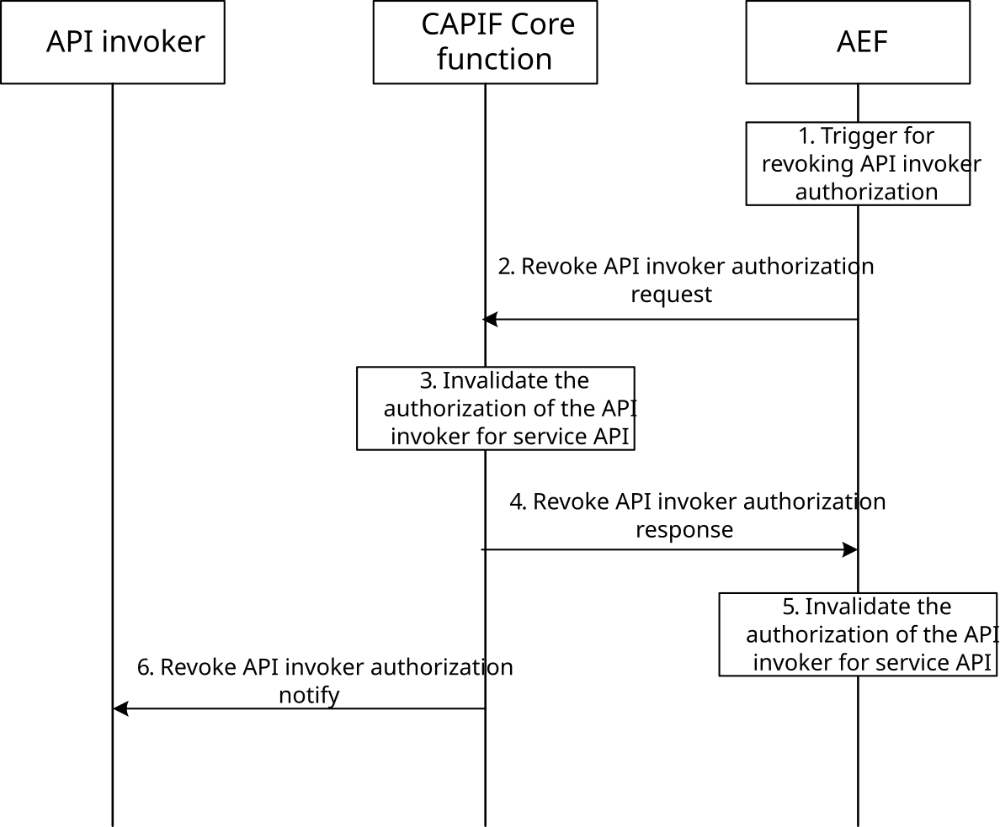
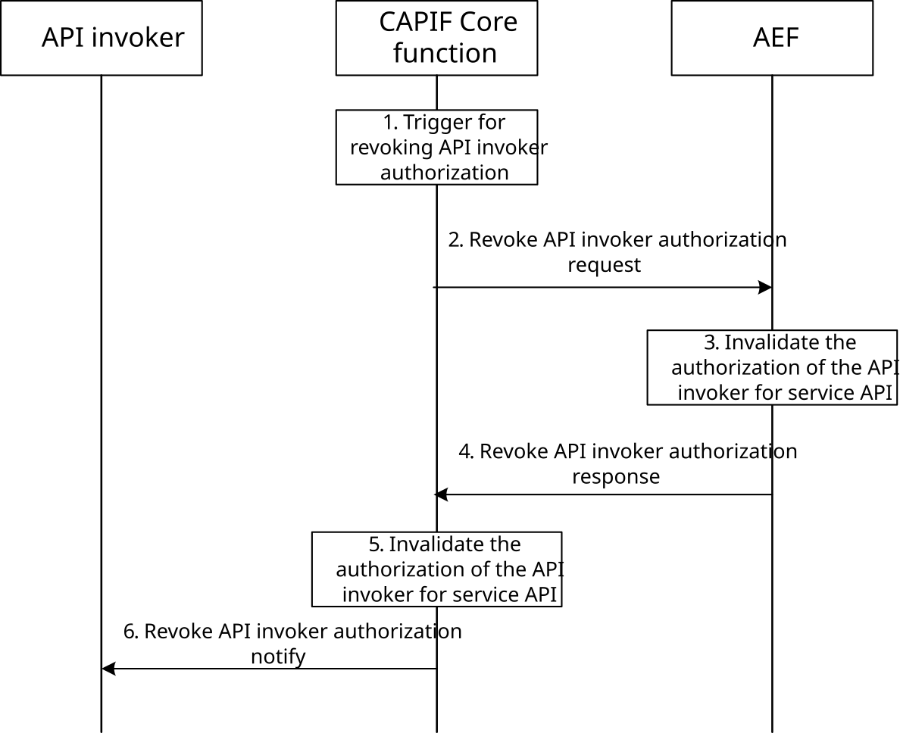

# 8.23 CAPIF revoking API invoker authorization

## 8.23.1 General

The CAPIF controls the access of service API by the API invoker based on policy or usage limits. If the usage limits have exceeded, the authorization of the API invoker for accessing the service APIs is revoked. The decision to revoke the API invoker authorization may be triggered by the AEF or the CAPIF core function. The AEF can be within PLMN trust domain or within 3rd party trust domain.

In RNAA scenarios, the decision to revoke the API invoker authorization may be initiated by the CAPIF core function based on triggers at the CAPIF core function.

## 8.23.2 Information flows

### 8.23.2.1 Revoke API invoker authorization request

Table 8.23.2.1-1 describes the information flow revoke API invoker authorization request from the API exposing function to the CAPIF core function or from the CAPIF core function to the API exposing function.

Table 8.23.2.1-1: Revoke API invoker authorization request

<table>
<colgroup>
<col style="width: 33%" />
<col style="width: 16%" />
<col style="width: 50%" />
</colgroup>
<tbody>
<tr class="odd">
<td>Information element</td>
<td>Status</td>
<td>Description</td>
</tr>
<tr class="even">
<td>API invoker identity information</td>
<td>M</td>
<td>The information that determines the identity of the API invoker</td>
</tr>
<tr class="odd">
<td>Service API identification list</td>
<td>M</td>
<td>The identification information of the service API(s) for which the authorization is revoked.</td>
</tr>
<tr class="even">
<td>Security information</td>
<td>
O

(NOTE 1, 2)
</td>
<td>Security information (as specified in 3GPP TS 33.122 [12]) for authorization revocation.</td>
</tr>
<tr class="odd">
<td>Cause</td>
<td>M</td>
<td>The cause for revoking the API invoker authorization (e.g., RO authorization revocation).</td>
</tr>
<tr class="even">
<td colspan="3">
NOTE 1: The security information may be included in the Revoke API invoker authorization request from the CAPIF core function to the API exposing function (i.e., it is not used in the request from the API exposing function to the CAPIF core function).

NOTE 2: If the security information is not included, the revocation applies to all the permissions granted for the service API.
</td>
</tr>
</tbody>
</table>

### 8.23.2.2 Revoke API invoker authorization response

Table 8.23.2.2-1 describes the information flow revoke API invoker authorization response from the CAPIF core function to the API exposing function or from the API exposing function to the CAPIF core function.

Table 8.23.2.2-1: Revoke API invoker authorization response

|                     |        |                                                                       |
|---------------------|--------|-----------------------------------------------------------------------|
| Information element | Status | Description                                                           |
| Result              | M      | Indicates the success or failure of revoke API invoker authorization. |
| Cause               | O      | The cause for the request failure.                                    |

### 8.23.2.3 Revoke API invoker authorization notify

Table 8.23.2.3-1 describes the information flow revoke API invoker authorization notify from the CAPIF core function to the API invoker.

Table 8.23.2.3-1: Revoke API invoker authorization notify

<table>
<colgroup>
<col style="width: 33%" />
<col style="width: 16%" />
<col style="width: 50%" />
</colgroup>
<tbody>
<tr class="odd">
<td>Information element</td>
<td>Status</td>
<td>Description</td>
</tr>
<tr class="even">
<td>API invoker identity information</td>
<td>M</td>
<td>The information that determines the identity of the API invoker whose authorization has been revoked</td>
</tr>
<tr class="odd">
<td>Service API identification list</td>
<td>M</td>
<td>The identification information of the service API(s) for which the authorization is revoked.</td>
</tr>
<tr class="even">
<td>Security information</td>
<td>
O

(NOTE)
</td>
<td>Security information (as specified in 3GPP TS 33.122 [12]) for authorization revocation.</td>
</tr>
<tr class="odd">
<td>Cause</td>
<td>M</td>
<td>The cause for revoking the API invoker authorization (e.g., RO authorization revocation).</td>
</tr>
<tr class="even">
<td colspan="3">NOTE: If the security information is not included, the revocation applies to all the permissions granted for the service API(s).</td>
</tr>
</tbody>
</table>

### 8.23.2.4 Revoke API invoker authorization notify acknowledgement

Table 8.23.2.4-1 describes the information flow revoke API invoker authorization notify acknowledgement from the API Invoker to the CAPIF core function.

Table 8.23.2.4-1: Revoke API invoker authorization notify acknowledgement

|                     |        |                                                                           |
|---------------------|--------|---------------------------------------------------------------------------|
| Information element | Status | Description                                                               |
| Acknowledgement     | M      | Acknowledgement for the revoke API invoker authorization notify received. |

## 8.23.3 Procedure for CAPIF revoking API invoker authorization initiated by AEF

Figure 8.23.3-1 illustrates the procedure for revoking API invoker authorization to access service API initiated by the AEF.

Pre-conditions:

1\. The API invoker is authenticated and authorized to use the service API.

2\. The AEF in the CAPIF is configured with the access policy to be applied to the service API invocation corresponding to the API invoker and the service API.

3\. Authorization details of the AEF are available with the CAPIF core function.

Figure 8.23.3-1: Procedure for revoking API invoker authorization initiated by AEF

1\. The AEF triggers the revocation of the API invoker authorization.

2\. The AEF sends revoke API invoker authorization request to the CAPIF core function with the details of the API invoker and the service API.

3\. Upon receiving the information to revoke the API invoker's authorization for service API invocation, the CAPIF core function invalidates the API invoker authorization corresponding to the service API.

4\. The CAPIF core function sends a revoke API invoker authorization response to the AEF.

5\. Upon successful revocation of API invoker authorization corresponding to the service API at the CAPIF core function, the AEF invalidates the API invoker authorization corresponding to the service API.

6\. The CAPIF core function sends a revoke API invoker authorization notify to the API invoker whose authorization to access the service API has been revoked.

## 8.23.4 Procedure for CAPIF revoking API invoker authorization initiated by CAPIF core function

Figure 8.23.4-1 illustrates the procedure for revoking API invoker authorization to access service API initiated by the CAPIF core function. This procedure is also used for revoking API invoker authorization supporting RNAA scenarios.

Pre-conditions:

1\. The API invoker is authenticated and authorized to use the service API.

2\. The AEF in the CAPIF is configured with the access policy to be applied to the service API invocation corresponding to the API invoker and the service API.

Figure 8.23.4-1: Procedure for revoking API invoker authorization initiated by CAPIF core function

1\. The CAPIF core function is triggered to revoke the API invoker authorization.

2\. The CAPIF core function sends revoke API invoker authorization request to the AEF with the details of the API invoker and the service API, and optionally, the security information as specified in clause 6.5.3.4 of 3GPP TS 33.122 \[12\].

3\. Upon receiving the information to revoke the API invoker's authorization for service API invocation, the AEF invalidates the API invoker authorization corresponding to the service API or, if provided, the API invoker authorization corresponding to the received security information.

4\. The AEF sends a revoke API invoker authorization response to the CAPIF core function.

5\. The CAPIF core function invalidates the API invoker authorization corresponding to the service API or, if provided, to the received security information.

6\. The CAPIF core function sends a revoke API invoker authorization notify to the API invoker whose authorization to access the service API has been revoked.
