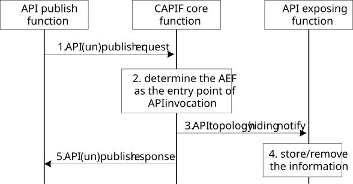

# 8.24 API topology hiding management

## 8.24.1 General

The following procedure in this subclause corresponds to the architectural requirements on API topology hiding. The procedure in this subclause supports API topology hiding by dynamically configuring the address of the AEF providing the Service API to the AEF entry point providing the topology hiding. The API publishing function and the API exposing function may be in different API Provider domains, e.g. within PLMN trust domain and within 3rd party trust domain, or may be the same API Provider domain, e.g., in the PLMN trust domain or 3rd party trust domain.

## 8.24.2 Information flows

### 8.24.2.1 API topology hiding notify

Table 8.24.2.1-1 describes the information flow API topology hiding notify from the CAPIF core function to the API exposing function.

Table 8.24.2.1-1: API topology hiding notify

|                                      |        |                                                                                                                                                                   |
|--------------------------------------|--------|-------------------------------------------------------------------------------------------------------------------------------------------------------------------|
| Information element                  | Status | Description                                                                                                                                                       |
| Service API identification           | M      | The identification information of the service API with the API topology hiding                                                                                    |
| API exposing function(s) information | M      | Indicates the one or more AEF(s) which provides the service API to apply the topology hiding including the interface details (e.g. IP address, port number, URI). |
| Action                               | M      | Indicates the notification action for the API topology hiding (created or revoked).                                                                               |

## 8.24.3 Procedure

Figure 8.24.3-1 illustrates the procedure for API topology hiding management by API (un)publish function.

Pre-condition:

1\. Authorization details of the APF are available with the CAPIF core function.

2\. The API exposing function has subscribed to CAPIF event for API topology hiding status.

Figure 8.24.3-1: API topology hiding via API (un)publish

1\. The API publishing function sends a service API publish request as described in subclause 8.3.2.1 or a service API unpublish request as described in subclause 8.4.2.1 to the CAPIF core function.

2\. Upon receiving the service API (un)publish request, the CAPIF core function checks whether the API publishing function is authorized to perform the service API (un)publish. If authorized, based on the service APIs and policy:

\- For service API publish, the CCF applies the topology hiding by selecting an AEF providing the topology hiding as the entry point for service API invocation. The selected AEF information is stored with the service API information received from API publish function at the CAPIF core function (API registry).

\- For service API unpublish, the previously selected AEF as topology hiding entry point and the associated service API information at the CAPIF core function (API registry) are removed.

3\. The CCF sends the API topology notify to the AEF selected as the entry point for service API invocation. The service API identification and the AEF(s) information which provides the service API details are included.

4\. Upon receiving the notification, the AEF stores the received information for further service API invocation request forwarding if the action in the API topology notify indicates "created" or removes the stored API forwarding information if the action in the API topology notify indicates "revoked".

5\. The CCF sends an API (un)publish response to the API publish function.
