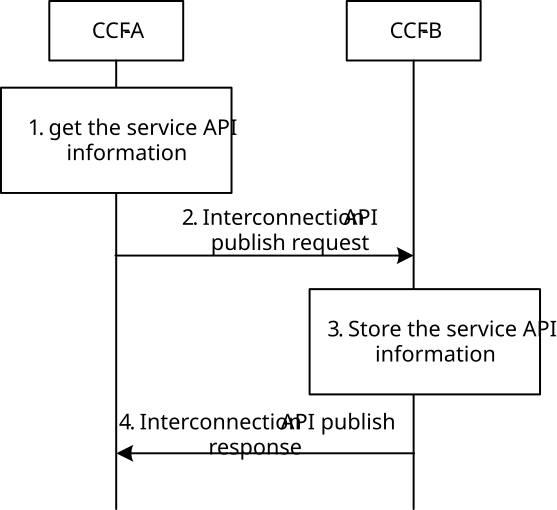
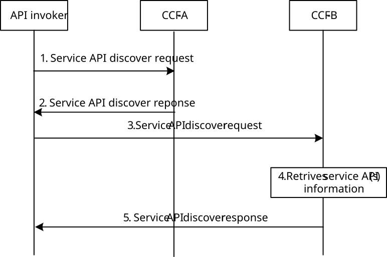
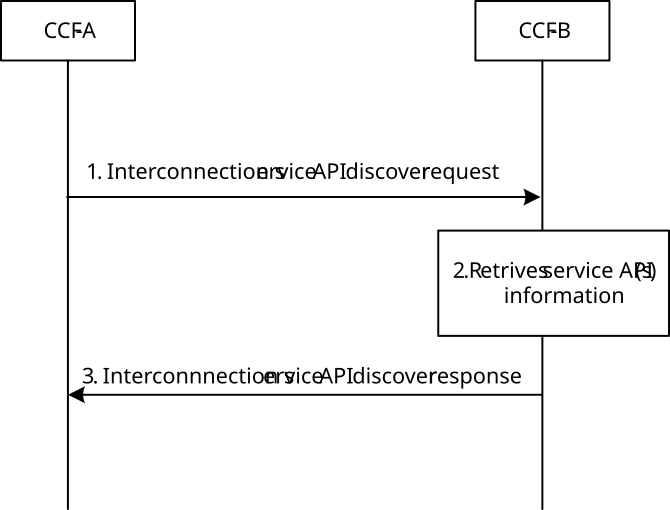
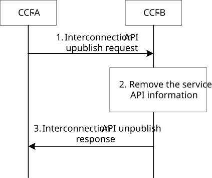
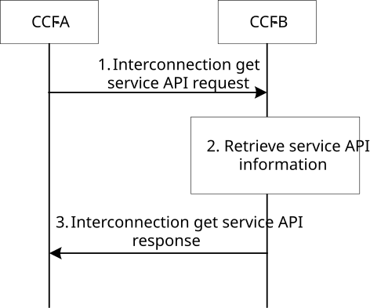
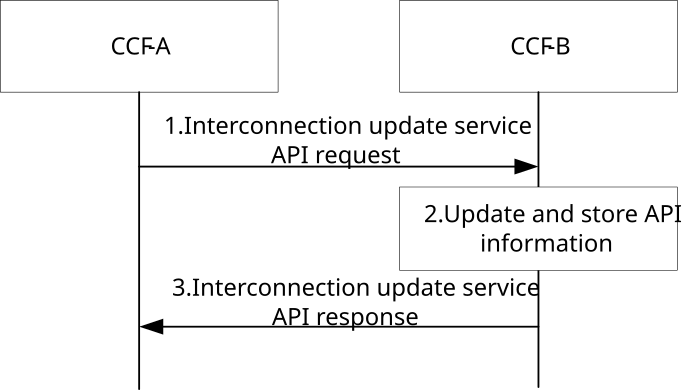
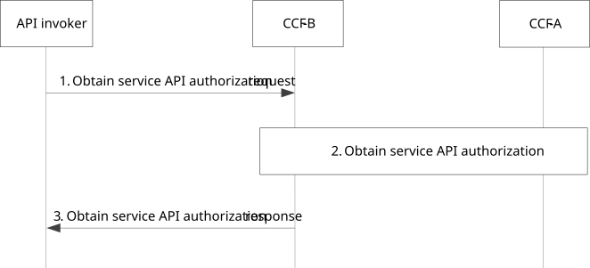
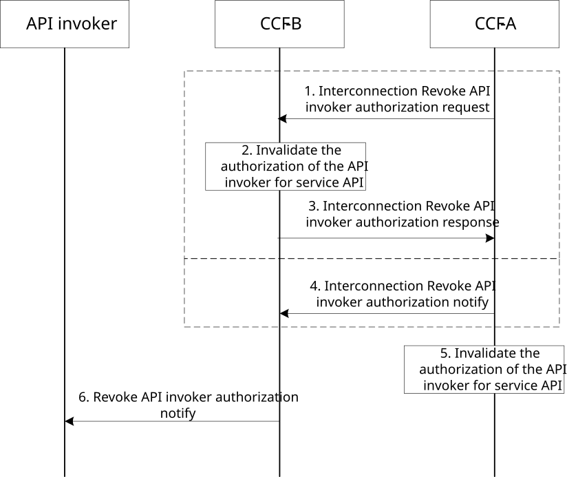
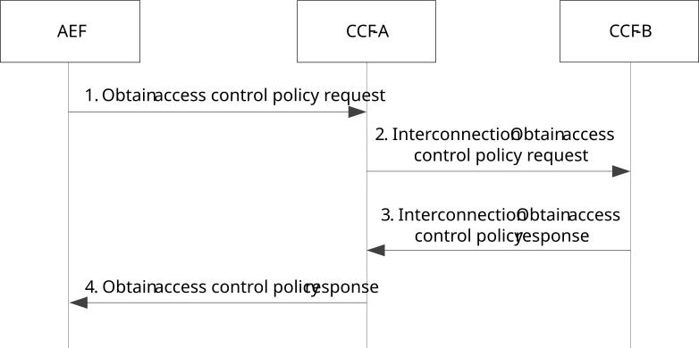
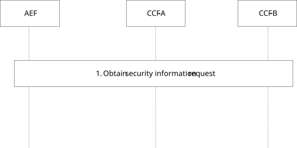

# 8.25.3 Procedure

## 8.25.3.1 Service API publish for CAPIF interconnection

This subclause describes the procedure for service API publish for CAPIF interoperation.

Pre-condition:

1\. CCF-A and CCF-B connect to each other, and either belong to the single trust domain of the same CAPIF provider or trust domains of different CAPIF providers.

2\. CCF-B is configured as the designated CAPIF core function in the trust domain of CAPIF provider A.

3\. When CCF-A and CCF-B belong to trust domains of different CAPIF providers, the two CAPIF providers have business agreement for service API sharing.

Figure 8.25.3.1-1: Interconnection API publish

1\. CCF-A gets the service APIs to be shared with CCF-B from the API publish function which is in the same CAPIF provider domain of CCF-A as described in subclause 8.3.3, or from another CCF as described in this procedure.

2\. Based on the shareable information for the service API or the service API category information, the CCF-A determines to publish the service API or the service API category information to the CCF-B. The CCF-A sends the interconnection API publish request to CCF-B with the details of at least one of service APIs or the category information of the service APIs, along with the identity information of CCF-A, shareable information and CAPIF provider domain information if allowed to share. The API topology hiding may be enabled.

3\. CCF-B stores the service API information or service API category provided by the CCF-A.

4\. CCF-B provides an interconnection API publish response to the CCF-A indicating success or failure result and triggers notifications to subscribed API invokers as described in subclause 8.8.4.

## 8.25.3.2 Service API discovery involving multiple CCFs

This subclause describes a procedure for service API discovery involving multiple CCFs

Pre-condition:

1\. CCF-A and CCF-B connect to each other, and either belong to the single trust domain of the same CAPIF provider or trust domains of different CAPIF providers.

2\. When CCF-A and CCF-B belong to trust domains of different CAPIF providers, the two CAPIF providers have business agreement for service API sharing.

Figure 8.25.3.2-1: Service API discovery involving multiple CCFs

1\. The API invoker sends a service API discover request to the CCF-A. It includes the API invoker identity and query information.

2\. The CCF-A verifies the identity of the API invoker and retrieves the stored service API(s) information. The information of CCF-B matching the discovery criteria is returned to API invoker in the service API discover response.

NOTE: The remaining steps are only applied when the service API category without detail service API information is included in the interconnection API publish request as described in subclause 8.25.2.1.

3\. The API invoker sends an service API discover request to the CCF-B. The identity of API invoker is included. The query information is also provided.

4\. Upon receiving the service API discover request, the CCF-B verifies the identity of the API invoker. The CCF-B retrieves the stored service API(s) information as per the query information in the service API discover request. Further, the CCF-B applies the discovery policy and performs filtering of service APIs information which matches the discovery criteria.

5\. The CCF-B sends an service API discover response to the API invoker with the list of service API information for which the API invoker has the required authorization.

## 8.25.3.3 Service API discovery for CAPIF interconnection

This subclause describes a procedure for service API discovery for CAPIF interconnection. The CCF-A and the CCF-B may belong to the same CAPIF provider domain or different CAPIF provider domains. When the CCF-A and the CCF‑B belong to different CAPIF provider domains, the two CAPIF providers shall have business agreement for service API discovery.

Pre-conditions:

1\. The CCF-A is configured with the CCF-B information.

2\. The CCF-B is configured with the CCF-A information.

3\. The CCF-A is triggered (e.g. API invoker service API discovery, periodic service API discovery) to perform service API discovery with the CCF-B.

Figure 8.25.3.3-1: Service API discovery for CAPIF interconnection

1\. The CCF-A sends the interconnection service API discover request to the CCF-B. The identity of the CCF-A and the query information are included.

2\. The CCF-B upon receiving the interconnection service API discover request verifies the identity of the CCF-A. The CCF-B retrieves the stored service API(s) or the CCF(s) information as per the query information in the interconnection service API discover request. Further, the CCF-B applies the discovery policy and performs the filtering of service APIs or the CCF(s) information. The topology hiding policy may be applied to the retrieved list of service API information.

3\. The CCF-B sends the interconnection service API discover response to the CCF-A with the list of service API information for which the CCF-A has the required authorization or the CCF(s) information that matches the discovery criteria.

## 8.25.3.4 Service API unpublish for CAPIF interconnection

This clause describes the procedure for service API unpublish for CAPIF interconnection.

Pre-condition:

1\. CCF-A and CCF-B connect to each other, and either belong to the single trust domain of the same CAPIF provider or trust domains of different CAPIF providers. When CCF-A and CCF-B belong to trust domains of different CAPIF providers, the two CAPIF providers have business agreement for service API sharing.

2\. CCF-B is configured as the designated CAPIF core function in the trust domain of CAPIF provider A.

3\. CCF-A has successfully published service APIs to the designated CCF (i.e., CCF-B) using the procedure in clause 8.25.3.1.

Figure 8.25.3.4-1: Interconnection API unpublish

1\. CCF-A sends an interconnection API unpublish request to CCF-B. The request includes a service API published information reference. If the shareable information IE was present in the interconnection API publish request (see clause 8.25.2.1), the API unpublish request should be forwarded to the provided list of CAPIF provider domain information during the publish procedure.

2\. Upon receiving the interconnection API unpublish request, the CCF-B checks whether the CCF-A is authorized to unpublish service APIs. If the check is successful, CCF-B will remove the requested service API information from the API registry.

3\. CCF-B sends an interconnection API unpublish response to CCF-A containing the operation result and triggers notifications to subscribed API invokers (if any) as described in subclause 8.8.4.

## 8.25.3.5 Retrieve service APIs for CAPIF interconnection

This clause describes the procedure to retrieve service APIs information in a CAPIF interconnection scenario.

Pre-condition:

1\. CCF-A and CCF-B connect to each other, and either belong to the single trust domain of the same CAPIF provider or trust domains of different CAPIF providers. When CCF-A and CCF-B belong to trust domains of different CAPIF providers, the two CAPIF providers have business agreement for service API sharing.

2\. CCF-B is configured as the designated CAPIF core function in the trust domain of CAPIF provider A.

Figure 8.25.3.5-1: Retrieve service APIs for CAPIF interconnection

1\. CCF-A sends an interconnection get service API request to CCF-B with service API published information reference provided by the CAPIF core function when the service API was published.

2\. Upon receiving interconnection get service API request, CCF-B checks whether CCF-A is authorized to get the published service APIs information. If the check is successful, the corresponding service API information is retrieved from the CAPIF core function (API registry).

3\. CCF-B sends an interconnection get service API response to CCF-A which includes the requested service API information if the retrieval operation was successful.

## 8.25.3.6 Update service APIs for CAPIF interconnection

Figure 8.25.3.6-1 illustrates the procedure for updating the published service APIs information by a CAPIF core function.

Pre-conditions:

1\. CCF-A and CCF-B connect to each other, and either belong to the single trust domain of the same CAPIF provider or trust domains of different CAPIF providers. When CCF-A and CCF-B belong to trust domains of different CAPIF providers, the two CAPIF providers have business agreement for service API sharing.

2\. CCF-B is configured as the designated CAPIF core function in the trust domain of CAPIF provider A.

Figure 8.25.3.6-1: Update service APIs for CAPIF interconnection

1\. The CCF-A sends an interconnection update service API request to the CCF-B, including the information in table 8.25.2.9-1.

2\. Upon receiving the interconnection update service API request, the CCF-B checks whether the CCF-A is authorized to update the published service APIs information. If the check is successful, the service API information provided by the CCF-A is updated at the CCF-B (API registry).

3\. The CCF-B provides an interconnection update service API response to the CCF-A containing the result of the update operation and triggers notifications to subscribed API invokers (if any) as described in subclause 8.8.4.

## 8.25.3.7 API invoker obtaining authorization for service API access in CAPIF interconnection

Pre-condition:

1\. The API invoker has discovered service APIs provided by an AEF via procedure defined in step 1 and 2 of clause 8.25.3.2.

2\. The API invoker and the CCF-B are in the same trusted domain.

3\. The AEF and the CCF-A are in the same trusted domain.

4\. The CCF-A and the CCF-B are connected to each other, and they have business agreement for service API authorization.

5\. The CCF-A is the authorization function for service API access on the AEF.

Figure 8.25.3.7-1: Procedure for the API invoker obtaining authorization for service API access

1\. The API invoker sends an obtain service API authorization request to the CCF-B for obtaining permission to access the service API by including the API invoker identity information and any information required for authentication of the API invoker.

2\. After successful authentication validation of the API invoker, if the CCF-B determines that the service API access authorization cannot be done by itself alone, then the CCF-B obtains service API authorization from the CCF-A, as specified in clause 8.25.2.16.

3\. The authorization information to access the service APIs is sent to the API invoker in the obtain service API authorization response.

## 8.25.3.8 Procedure for CAPIF revoking API invoker authorization in CAPIF interconnection

Pre-conditions:

1\. The API invoker is authenticated by CCF-B and authorized by CCF-B and CCF-A to use the service API. The API invoker has obtained authorization to use the service API as specified in clause 8.25.3.7.

2\. The CCF-B may have available access control policies corresponding to the service API.

3\. The CCF-A is triggered to revoke API invoker authorization for service API access, e.g. AEF requested the revocation of API invoker authorization.

Figure 8.25.3.8-1: Procedure for revoking API invoker authorization in CAPIF interconnection

1\. If the CCF-B keeps service API authorization information for the API invoker, and the CCF-A is triggered to revoke API invoker authorization information for service API access, the CCF-A sends an interconnection revoke API invoker authorization request to the CCF-B with the details of the API invoker, the AEF and the service API.

2\. Upon receiving the information to revoke the API invoker's authorization for service API invocation, the CCF-B invalidates the API invoker authorization corresponding to the service API.

3\. The CCF-B sends an interconnection revoke API invoker authorization response to the CCF-A. The CCF-B sends the Revoke API invoker authorization notify described in step 6.

4\. Instead of step 1 to 3, if the CCF-A keeps service API authorization information for the API invoker, and the authorization information is revoked, the CCF-A sends an interconnection revoke API invoker authorization notify to the CCF-B.

5\. The CCF-A invalidates the API invoker authorization corresponding to the service API.

6\. The CCF-B sends a revoke API invoker authorization notify to the API invoker whose authorization to access the service API has been revoked.

## 8.25.3.9 Procedure for obtaining access control policy in CAPIF interconnection

Pre-condition:

1\. The AEF is hosting the service API but the policy to perform access control is not available with AEF.

2\. The CCF-B has available access control policies corresponding to one or more service APIs.

3\. The AEF and the CCF-A are in the same trusted domain.

Figure 8.25.3.9-1: Procedure for obtaining access control policy in CAPIF interconnection

1\. The AEF sends an obtain access control policy request to the CCF-A for obtaining the policy to perform the access control on service API invocations by including the details of the hosted service API.

2\. After successful authentication validation of the AEF, if the CCF-A determines that the service API access control policy authorization cannot be done by itself alone, then the CCF-A sends an interconnection obtain access control policy request to the CCF-B.

NOTE 1: If the CCF-A has enough access control policy available, it executes the procedure defined in clause 8.12.3 without interaction with the CCF-B.

3-4. The CCF-B determines appropriate access control policy for service APIs upon the request sent by the CCF-A. The access control policy information is sent to the AEF (via the CCF-A) in the (interconnection) obtain access control policy response.

NOTE 2: To maintain synchronization between the AEF and the CCF for the policy cached at AEF, the AEF can subscribe to the policy update event at the CCF-A according to the procedure in clause 8.8.3 and receive notifications about any updated policy at the CCF-A according to the procedure in clause 8.8.4. Correspondingly, the CCF-A can subscribe to policy update event at the CCF-B if service API authorization is performed by the CCF-B.

## 8.25.3.10 Procedure for obtaining security information in CAPIF interconnection

Pre-condition:

1\. The AEF has no security information available for authentication and/or authorization.

2\. The CCF-B has security information available for authentication and/or authorization corresponding to one or more service APIs.

3\. The AEF and the CCF-A are in the same trusted domain.

Figure 8.25.3.10-1: Procedure for obtaining security information in CAPIF interconnection

1\. The AEF obtains the API invoker information required for authentication and/or authorization by the AEF from the CCF-A by including the details of the API invoker and hosted service API. After successful authentication validation of AEF, if the CCF-A determines that it has no security information, then the CCF-A obtains security information from the CCF-B. Then the security information required for service API invocations is sent to the AEF.

NOTE 1: If the CCF-A has security information available, it executes the procedure defined in clause 8.14.3, clause 8.15.3 or clause 8.16.3 without interaction with the CCF-B.

NOTE 2: The CCF-A can subscribe to API invoker onboarding event at the CCF-B according to the procedure in clause 8.8.3 and receive notifications about any onboarded API invoker and its security related onboarding information at the CCF-B according to the procedure in clause 8.8.4.
