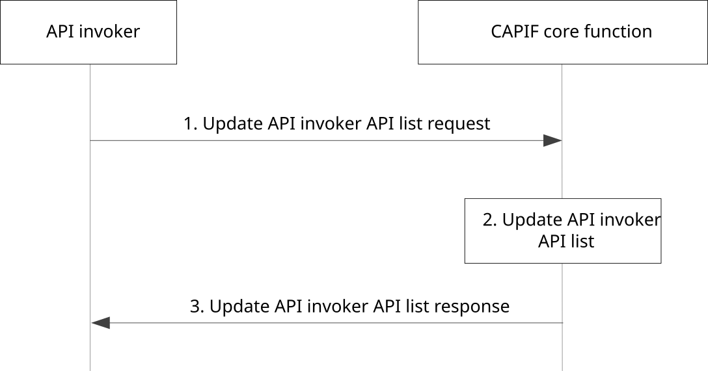

# 8.26 Update API invoker's API list

## 8.26.1 General

The procedure in this subclause corresponds to the architectural requirements for updating the API invoker's API list on the CAPIF core function. The CAPIF enables API invoker to update its own API list e.g. subsequent to discovering new API(s).

## 8.26.2 Information flows

### 8.26.2.1 Update API invoker API list request

Table 8.26.2.1-1 describes the information flow update API invoker API list request from the API invoker to the CAPIF core function.

Table 8.26.2.1-1: Update API invoker API list request

|                                  |        |                                                                           |
|----------------------------------|--------|---------------------------------------------------------------------------|
| Information element              | Status | Description                                                               |
| API invoker identity information | M      | Identity information of the API invoker requesting update                 |
| APIs for update                  | M      | List of APIs that need update (e.g. enroll new API(s), disenroll API(s)). |

### 8.26.2.2 Update API invoker API list response

Table 8.26.2.2-1 describes the information flow update API invoker API list response from the CAPIF core function to the API invoker.

Table 8.26.2.2-1: Update API invoker API list response

<table>
<colgroup>
<col style="width: 33%" />
<col style="width: 16%" />
<col style="width: 50%" />
</colgroup>
<tbody>
<tr class="odd">
<td>Information element</td>
<td>Status</td>
<td>Description</td>
</tr>
<tr class="even">
<td>Result</td>
<td>M</td>
<td>Indicates the success or failure of the update operation</td>
</tr>
<tr class="odd">
<td>API information</td>
<td>
O

(see NOTE 1)
</td>
<td>List of APIs and the categories of service APIs that the API invoker can access</td>
</tr>
<tr class="even">
<td>Reason</td>
<td>
O

(see NOTE 2)
</td>
<td>This element indicates the reason for failure of the operation.</td>
</tr>
<tr class="odd">
<td colspan="3">
NOTE 1: Information element shall be present when update API invoker API list status is successful. At least one API successfully enrolled is considered as success response.

NOTE 2: Information element shall be present when update API invoker API list has failed.
</td>
</tr>
</tbody>
</table>

## 8.26.3 Procedure

Figure 8.26.3-1 illustrates the procedure for updating the API invoker API list on the CAPIF.

Pre-conditions:

1\. The API invoker has been onboarded as a recognized user of the CAPIF and associated API invoker profile is provisioned.

2\. The API invoker has visibility to new APIs information (e.g. updates on API catalogue or dashboard, API discovery).

Figure 8.26.3-1: Procedure for updating the API invoker profile on the CAPIF

1\. For updating of the API invoker API list on the CAPIF, the API invoker triggers update API invoker API list request towards the CAPIF core function, providing the information to be updated (e.g. enroll new APIs, disenroll APIs).

2\. The CAPIF core function updates the API invoker API list of the requesting API invoker, according to the grant from the CAPIF administrator or the API management. For the disenrolled API(s), the authorization corresponding to the API invoker is revoked from CAPIF, if available.

NOTE 1: Completion of updating process can require explicit grant by the CAPIF administrator or the API management, which is left out-of-scope of this solution. CAPIF can handle the grant process internally without the need of explicit grant by the CAPIF administrator.

3\. The update API invoker API list response provides a success or failure indication. When not all the APIs included in the request are enrolled, the success result include information about the APIs that the API invoker can access. When the update status is failure, the reason for failure is included.
