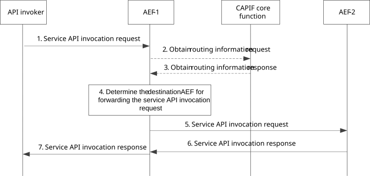

# 8.27 Dynamically routing service API invocation

## 8.27.1 General

The procedure in this subclause corresponds to the architectural requirements for dynamic routing of service API invocation. The CAPIF enables dynamically routing the service API invocation request based on the detailed information of the invocation. The AEF acting as service communication entry point and the destination AEF for handling service API call may be in different API Provider domains, e.g. within the PLMN trust domain and within 3rd party trust domain, or may be the same API Provider domain, e.g., in the PLMN trust domain or 3rd party trust domain.

## 8.27.2 Information flows

### 8.27.2.1 Obtain routing information request

Table 8.27.2.1-1 describes the information flow dynamic routing information request from the API exposing function to the CAPIF core function.

Table 8.27.2.1-1: Obtain routing information request

|                            |        |                                                                                                                                                                             |
|----------------------------|--------|-----------------------------------------------------------------------------------------------------------------------------------------------------------------------------|
| Information element        | Status | Description                                                                                                                                                                 |
| Service API identification | M      | The identification information of the service API for which invocation is requested. The service API identification is part of the specific service API invocation request. |
| AEF identity information   | M      | Identity information of the entity requesting the routing information                                                                                                       |

### 8.27.2.2 Obtain routing information response

Table 8.27.2.2-1 describes the information flow dynamic routing information response from the CAPIF core function to the API exposing function.

Table 8.27.2.2-1: Obtain routing information response

|                                                        |        |                                                                                                                                                                               |
|--------------------------------------------------------|--------|-------------------------------------------------------------------------------------------------------------------------------------------------------------------------------|
| Information element                                    | Status | Description                                                                                                                                                                   |
| Service API identification information                 | M      | The identification information of the service API for which invocation is requested.                                                                                          |
| Routing rule(s) information for service API invocation | M      | Indicates the routing rule(s) for service API invocation, e.g., mapping of IP address range and AEF identity, or mapping of area serving the service API and AEF information. |

## 8.27.3 Procedure

Figure 8.27.3-1 illustrates the procedure for dynamically routing the service API invocation from the AEF acting as service communication entry point to the destination AEF for handling service API.

Pre-conditions:

1\. The API invoker has performed the service discovery and received the details of the service API which includes the information about the service communication entry point of the AEF-1 in the CAPIF.

2\. The API invoker is authenticated and authorized to use the service API.

3\. The AEF-1 is the AEF acting as service communication entry point for the service API, and AEF-2 is one of the multiple destination AEF which provides the service API.

Figure 8.27.3-1: Procedure for dynamic routing of service API invocation

1\. The API invoker performs service API invocation according to the interface of the service API by sending a service API invocation request towards the AEF-1 which exposes the service API towards the API invoker, and acts as topology hiding entity.

2\. If the routing rule information for the service API invocation is not available, the AEF-1 sends obtain routing information request to the CAPIF core function.

3\. The CAPIF core function creates routing rule information for the service API and sends obtain routing information response with the routing rule information.

NOTE: Steps 2 and 3 can be performed before step 1and after receiving the API topology hiding notify as described in subclause 8.24.3.

4\. The AEF-1 further resolves the actual destination of the service API address information (AEF-2) according to the routing rule information and the invocation parameters in service API invocation request.

5\. The AEF-1 forwards the incoming service API invocation request to AEF-2.

6\. The AEF-2 returns the service API invocation response to AEF-1.

7\. The AEF-1 sends the service API invocation response to the API invoker.
