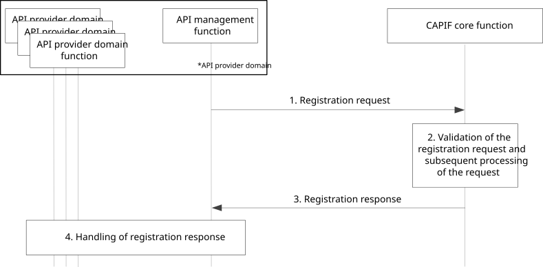

# 8.28 Registering the API provider domain functions on the CAPIF

## 8.28.1 General

The procedure in this subclause corresponds to the architectural requirements for registering the API provider domain functions on the CAPIF. This procedure registers the API provider domain functions as authorized users of the CAPIF functionalities.

NOTE: The security aspects of this procedure are specified in 3GPP TS 33.122 \[12\] clauses 6.6 and 6.10.

## 8.28.2 Information flows

### 8.28.2.1 Registration request

Table 8.28.2.1-1 describes the information flow, registration request, from the API management function to the CAPIF core function.

Table 8.28.2.1-1: Registration request

|                                       |        |                                                                                                                            |
|---------------------------------------|--------|----------------------------------------------------------------------------------------------------------------------------|
| Information element                   | Status | Description                                                                                                                |
| List of API provider domain functions | M      | List of API provider domain functions including role (e.g. AEF, APF, AMF) and, if required, specific security information. |
| API provider name                     | O      | The API provider name uniquely identifies an API provider (e.g. Internet Service Provider).                                |
| Security information                  | M      | Information for CAPIF core function to validate the registration request                                                   |

### 8.28.2.2 Registration response

Table 8.28.2.2-1 describes the information flow, registration response, from the CAPIF core function to the API management function.

Table 8.28.2.2-1: Registration response

<table>
<colgroup>
<col style="width: 33%" />
<col style="width: 16%" />
<col style="width: 50%" />
</colgroup>
<tbody>
<tr class="odd">
<td>Information element</td>
<td>Status</td>
<td>Description</td>
</tr>
<tr class="even">
<td>List of identities</td>
<td>
M

(see NOTE 1)
</td>
<td>List of identities, for each successfully registered API provider domain function and any specific security information.</td>
</tr>
<tr class="odd">
<td>Security information</td>
<td>O</td>
<td>Information to be used by the API provider domain function in subsequent CAPIF API invocations. Provided when registration is successful.</td>
</tr>
<tr class="even">
<td>Reason</td>
<td>
O

(see NOTE 2)
</td>
<td>Information related to registration result specific to individual API provider domain functions. Provided when the registration fails.</td>
</tr>
<tr class="odd">
<td colspan="3">
NOTE 1: Information element shall be present when at least one registration request is successful.

NOTE 2: Information element may be present when at least one registration requests fail.
</td>
</tr>
</tbody>
</table>

## 8.28.3 Procedure

Figure 8.28.3-1 illustrates the procedure for registering API provider domain functions on the CAPIF core function.

Figure 8.28.3-1: Procedure for registration of API provider domain functions on CAPIF

1\. For registration of API provider domain functions on the CAPIF core function, the API management function sends a registration request to the CAPIF core function. The registration request contains a list of information about all the API provider domain functions, which require registration on the CAPIF core function.

2\. The CAPIF core function validates the received request and generates the identity and other security related information for all the API provider domain functions listed in the registration request.

3\. The CAPIF core function sends the generated information in the registration response message to the API management function.

4\. The API management function configures the received information to the individual API provider domain functions.
