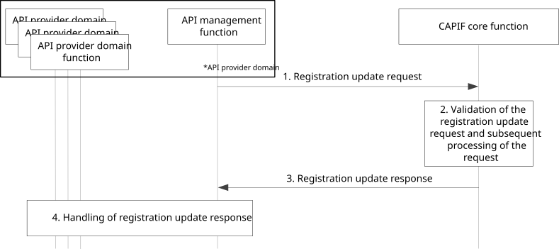

# 8.29 Update registration information of the API provider domain functions on the CAPIF

## 8.29.1 General

The procedure in this subclause corresponds to the architectural requirements for update of the registration information of the API provider domain functions on the CAPIF.

NOTE: The security aspects of this procedure are specified in 3GPP TS 33.122 \[12\] clauses 6.6 and 6.10.

## 8.29.2 Information flows

### 8.29.2.1 Registration update request

Table 8.29.2.1-1 describes the information flow, registration update request, from the API management function to the CAPIF core function.

Table 8.29.2.1-1: Registration update request

|                                                        |        |                                                                                                                                               |
|--------------------------------------------------------|--------|-----------------------------------------------------------------------------------------------------------------------------------------------|
| Information element                                    | Status | Description                                                                                                                                   |
| List of API provider domain functions requiring update | M      | List of API provider domain functions requiring updates, including role (e.g. AEF, APF, AMF) and, if required, specific security information. |
| Security information                                   | M      | Information for CAPIF core function to validate the registration request                                                                      |

### 8.29.2.2 Registration update response

Table 8.29.2.2-1 describes the information flow, registration update response, from the CAPIF core function to the API management function.

Table 8.29.2.2-1: Registration update response

<table>
<colgroup>
<col style="width: 33%" />
<col style="width: 16%" />
<col style="width: 50%" />
</colgroup>
<tbody>
<tr class="odd">
<td>Information element</td>
<td>Status</td>
<td>Description</td>
</tr>
<tr class="even">
<td>List of identities</td>
<td>
M

(see NOTE 1)
</td>
<td>List of identities, for each successfully updated API provider domain function and any specific security information.</td>
</tr>
<tr class="odd">
<td>Security information</td>
<td>O</td>
<td>Information to be used by the API provider domain function in subsequent CAPIF API invocations. Provided when registration update is successful.</td>
</tr>
<tr class="even">
<td>Reason</td>
<td>
O

(see NOTE 2)
</td>
<td>Information related to registration update result specific to individual API provider domain functions. Provided when the registration fails.</td>
</tr>
<tr class="odd">
<td colspan="3">
NOTE 1: Information element shall be present when at least one registration update request is successful.

NOTE 2: Information element may be present when at least one registration update requests fail.
</td>
</tr>
</tbody>
</table>

## 8.29.3 Procedure

Figure 8.29.3-1 illustrates the procedure for updating the registration information of the API provider domain functions on the CAPIF core function.

Figure 8.29.3-1: Procedure for update of registration information of API provider domain functions on CAPIF

1\. For updating the registration information of API provider domain functions on the CAPIF core function, the API management function sends a registration update request to the CAPIF core function. The registration update request contains a list of information about all the API provider domain functions, which require registration update on the CAPIF core function.

2\. The CAPIF core function validates the received request and updates the identity and other security related information for all the API provider domain functions listed in the registration request.

3\. The CAPIF core function sends the updated information in the registration update response message to the API management function.

4\. The API management function configures the received information to the individual API provider domain functions.
