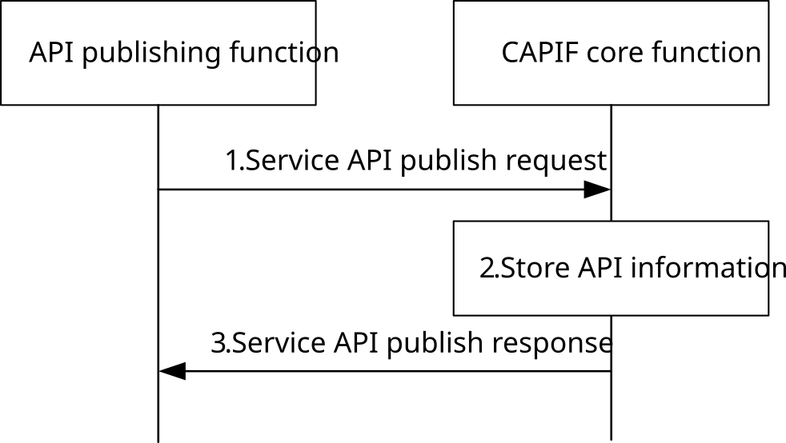

# 8.3 Publish service APIs

## 8.3.1 General

The CAPIF supports publishing service APIs by the API provider. The API publishing function can be within PLMN trust domain or within 3rd party trust domain.

## 8.3.2 Information flows

### 8.3.2.1 Service API publish request

Table 8.3.2.1-1 describes the information flow service API publish request from the API publishing function to the CAPIF core function.

Table 8.3.2.1-1: Service API publish request

<table>
<colgroup>
<col style="width: 33%" />
<col style="width: 16%" />
<col style="width: 50%" />
</colgroup>
<tbody>
<tr class="odd">
<td>Information element</td>
<td>Status</td>
<td>Description</td>
</tr>
<tr class="even">
<td>API publisher information</td>
<td>M</td>
<td>The information of the API publisher may include identity, authentication and authorization information</td>
</tr>
<tr class="odd">
<td>Service API information</td>
<td>
M

(see NOTE 2)
</td>
<td>The service API information includes the service API name, API provider name (optional), List of public IP ranges of UEs (optional), service API category (e.g. V2X, IoT), service API status (e.g. active, inactive), communication type, description, Serving Area Information (optional), AEF location (optional), interface details (e.g. IP address, port number, URI), protocols, version numbers, data format, Service KPIs (optional), service API operation(s) and resource(s) (optional), and Network Slice Info (optional), security methods, indication about allowing dissemination of the service API information during Open Discovery, the applicability of RO authorization to the service API (e.g. yes/no, or yes/no per operation/resource) and when RO authorization applies, the applicable purposes.</td>
</tr>
<tr class="even">
<td>Shareable information</td>
<td>
O

(see NOTE 1)
</td>
<td>Indicates whether the service API information or the service API category can be published to other CCFs. And if sharing, a list of CAPIF provider domain information where the service API information or the service API category can be published is contained.</td>
</tr>
<tr class="odd">
<td>Usage Information</td>
<td>O</td>
<td>List of information related to the usage of API provider domain’s service API invocation logs.</td>
</tr>
<tr class="even">
<td>&gt;usage value</td>
<td>M</td>
<td>Usage issued: “Allowed”, “Not Allowed”.</td>
</tr>
<tr class="odd">
<td>&gt;target identities</td>
<td>O</td>
<td>List of identities of the entities (e.g., other API provider name, identities of the other API provider functions, as specified in clause 8.28) for which the “usage value” applies.</td>
</tr>
<tr class="even">
<td colspan="3">
NOTE 1: If the shareable information is not present, the service API information is not allowed to be shared.

NOTE 2: The active and inactive states of the service APIs of 3GPP AEFs are based on the respective combinations of the management states (administrative, operational) specified in the management domain in TS 28.541 [17], TS 28.532 [18] and TS 28.538 [19].
</td>
</tr>
</tbody>
</table>

The Service KPIs is defined as below:

Table 8.3.2.1-2: Service KPIs

| Information element         | Status | Description                                                                      |
|-----------------------------|--------|----------------------------------------------------------------------------------|
| Maximum Request rate        | O      | Maximum request rate from the API Invoker supported by the server.               |
| Maximum Response time       | O      | The maximum response time advertised for the API Invoker's service requests.     |
| Availability                | O      | Advertised percentage of time the server is available for the API Invoker's use. |
| Available Compute           | O      | The maximum compute resource available for the API Invoker.                      |
| Available Graphical Compute | O      | The maximum graphical compute resource available for the API Invoker.            |
| Available Memory            | O      | The maximum memory resource available for the API Invoker.                       |
| Available Storage           | O      | The maximum storage resource available for the API Invoker.                      |
| Connection Bandwidth        | O      | The connection bandwidth in Kbit/s advertised for the API Invoker's use.         |

Editor's Note: Whether the Publish API needs to be updated to support the publication of roaming policies is FFS.

### 8.3.2.2 Service API publish response

Table 8.3.2.2-1 describes the information flow service API publish response from the CAPIF core function to the API publishing function.

Table 8.3.2.2-1: Service API publish response

<table>
<colgroup>
<col style="width: 33%" />
<col style="width: 16%" />
<col style="width: 50%" />
</colgroup>
<tbody>
<tr class="odd">
<td>Information element</td>
<td>Status</td>
<td>Description</td>
</tr>
<tr class="even">
<td>Result</td>
<td>M</td>
<td>Indicates the success or failure of publishing the service API information</td>
</tr>
<tr class="odd">
<td>Service API published information reference</td>
<td>
O

(see NOTE)
</td>
<td>The information which can be used for referencing the information (set) about the published service API by the API publishing function.</td>
</tr>
<tr class="even">
<td>Service API information</td>
<td>
O

(see NOTE)
</td>
<td>The authorized service API information, which may be a subset or the full set, of the Service API information as specified in Table 8.3.2.1-1.</td>
</tr>
<tr class="odd">
<td colspan="3">NOTE: This information element is included when the Result indicates success.</td>
</tr>
</tbody>
</table>

## 8.3.3 Procedure

Figure 8.3.3-1 illustrates the procedure for publishing the service APIs. The service API publish mechanism is supported by the CAPIF core function.

Pre-conditions:

1\. Authorization details of the APF are available with the CAPIF core function.

2\. API invokers may have subscribed with the CAPIF core function to obtain new service API information.

Figure 8.3.3-1: Publish service APIs

1\. The API publishing function sends a service API publish request to the CAPIF core function, with the details of the service API. If the service API is to be shared to other CAPIF core functions, the shareable information and the CAPIF provider domain information are included. The API publishing function may also include indication about allowing the dissemination of the service API information during Open Discovery. The request may include Usage Information.

2\. Upon receiving the service API publish request, the CAPIF core function checks whether the API publishing function is authorized to publish service APIs. If the check is successful, the service API information and Usage information provided by the API publishing function is stored at the CAPIF core function (API registry). CCF considers the Usage Information for using the published service API’s invocation logs for offering of services.

NOTE: One service API provider can only request usage information for its owned service API.

3\. The CAPIF core function provides a service API publish response to the API publishing function indicating success or failure result and triggers notifications to subscribed API invokers as described in subclause 8.8.4.
