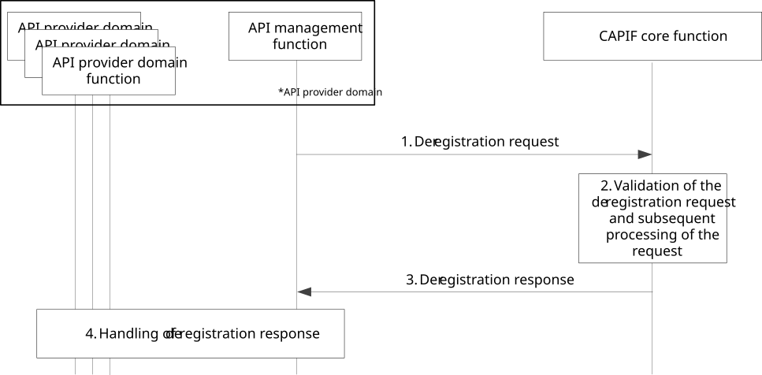

# 8.30 Deregistering the API provider domain functions on the CAPIF

## 8.30.1 General

The procedure in this subclause corresponds to the architectural requirements for deregistering the API provider domain functions on the CAPIF. This procedure deregisters the API provider domain functions as authorized users of the CAPIF functionalities.

NOTE: The security aspects of this procedure are specified in 3GPP TS 33.122 \[12\] clauses 6.6 and 6.10.

## 8.30.2 Information flows

### 8.30.2.1 Deregistration request

Table 8.30.2.1-1 describes the information flow, deregistration request, from the API management function to the CAPIF core function.

Table 8.30.2.1-1: Deregistration request

|                      |        |                                                                            |
|----------------------|--------|----------------------------------------------------------------------------|
| Information element  | Status | Description                                                                |
| Security information | M      | Information for CAPIF core function to validate the deregistration request |

### 8.30.2.2 Deregistration response

Table 8.30.2.2-1 describes the information flow, deregistration response, from the CAPIF core function to the API management function.

Table 8.30.2.2-1: Deregistration response

|                     |        |                                                                  |
|---------------------|--------|------------------------------------------------------------------|
| Information element | Status | Description                                                      |
| Result              | M      | Indicates the success or failure of the deregistration operation |

## 8.30.3 Procedure

Figure 8.30.3-1 illustrates the procedure for deregistering API provider domain functions on the CAPIF core function.

Figure 8.30.3-1: Procedure for deregistration of API provider domain functions on CAPIF

1\. For deregistration of API provider domain functions on the CAPIF core function, the API management function sends a deregistration request to the CAPIF core function.

2\. The CAPIF core function validates the received request and processes the deregistration request.

3\. The CAPIF core function sends a deregistration response message to the API management function.

4\. The API management function processes the deregistration to the individual API provider domain functions.
