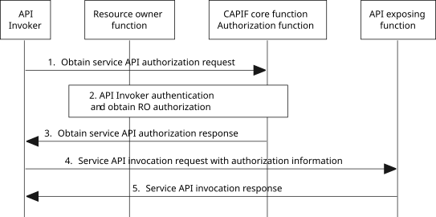

# 8.31 API invoker obtaining authorization from resource owner

## 8.31.1 General

CAPIF may authorize the API invoker to invoke the service API based on the authorization information from the resource owner given before the API invocation.

Clause 8.31.3 shows the procedure for obtaining the authorization information.

## 8.31.2 Information flows

NOTE: The security aspects of this procedure are specified in TS 33.122 \[12\].

## 8.31.3 Procedure

Figure 8.31.3-1 illustrates the procedure for API invoker obtaining authorization from resource owner.

Pre-conditions:

1\. The resource owner function (ROF) can communicate with the CCF (Authorization function).

2\. Access to an API exposing function offered service API requires obtaining authorization from a resource owner (RO).

Figure 8.31.3-1: Procedure for API invoker obtaining authorization from resource owner

1\. The API invoker requests to obtain authorization information to invoke the service API exposed by the API exposing function (AEF) and to access information owned by the resource owner at the AEF through the invocation of an obtain service API authorization request to the CCF. The request contains API invoker information required for authorization, the information identifying the service API, the purpose for data processing and any information required for authentication of the API invoker. The request may include finer level service API access requirements (e.g., access per service API operation or access per API service resource) and resource owner-related information required to obtain resource owner authorization information.

NOTE 1: The details of the information provided by the API invoker for obtaining service API access are specified in 3GPP TS 33.122 \[12\].

2\. The CCF performs the authentication of the API invoker (using authentication information). Then the Authorization function determines the authorization by checking the authorization information available in the CCF and by checking the authorization information provided by the RO via the ROF. The request to the ROF contains application service information (e.g. the application service provider and application identifier), the purpose for data processing and the resource owner data information for which the API invoker requests access grants.

NOTE 2: The detailed procedure to obtain the RO's authorization information is specified in 3GPP TS 33.122 \[12\].

NOTE 3: Step 1 can occur when the API invoker receives a failure in Service API invocation response indicating that authorization information from resource owner(s) is required.

> 3\. Based on the RO authorization information obtained via the ROF, the CCF sends an obtain service API authorization response to the API invoker.

4\. The API invoker sends service API invocation request to the API exposing function with the authorization information received from CCF (Authorization function) in step 3.

5\. The API invoker receives the service API invocation response resulting from the service API invocation once the API exposing function has checked whether the API invoker is authorized to invoke that service API based on the authorization information received from CCF (Authorization function).
