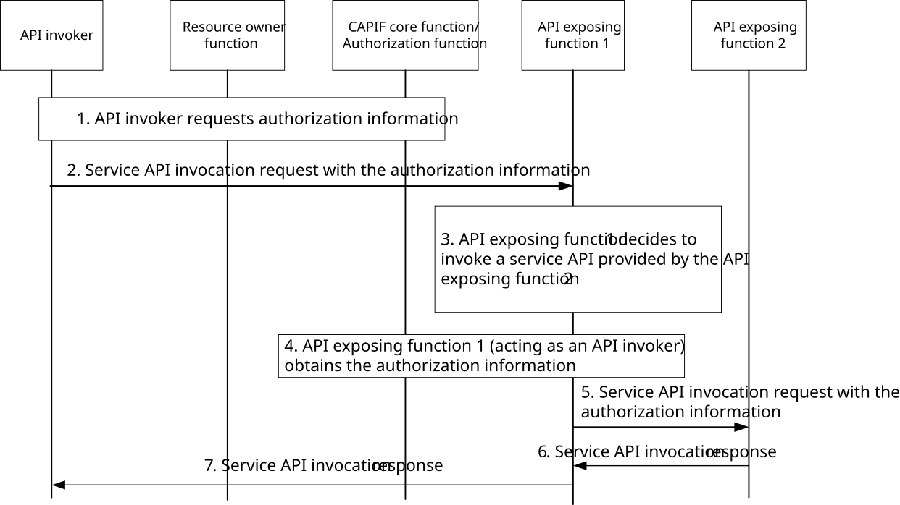

# 8.32 Reducing authorization information inquiry in a nested API invocation

## 8.32.1 General

The nested API invocation scenario is a scenario where an API invocation towards a first API exposing function triggers that API exposing function to request an API invocation towards a second API exposing function, which is in the same API provider domain as the first API exposing function, which can be the PLMN trust domain or a 3rd party trust domain. This scenario addresses the situation in which a service API may require the services of other service APIs. For example, if the API invoker invokes SEAL SS_LocationInfoRetrieval API (clause 9.4.4 of TS 23.434 \[15\]), the location management server (acting as an API exposing function for the API invoker and as an API invoker for the NEF) may invoke NEF API to retrieve UE location information from 5GC. In this scenario, the CAPIF may reduce the authorization information inquiries for a nested API invocation using procedure described in clause 8.32.3.

## 8.32.2 Information flows

NOTE: The security aspects of this procedure are specified in TS 33.122 \[12\].

## 8.32.3 Procedure

Figure 8.32.3-1 illustrates the procedure to obtain authorization information in a nested API invocation, in which an API exposing function receiving the service API invocation request interacts with another API exposing function to provide the service.

Pre-conditions:

1\. The resource owner function can communicate with the CCF (Authorization function).

2\. The API exposing functions 1 and 2 are in the same trust domain.

Figure 8.32.3-1: Procedure for obtaining authorization information in a nested API invocation

1\. The API invoker requests authorization information to invoke the service API exposed by API exposing function 1.

NOTE 1: This step use either the procedure to obtain authorization to access service API specified in clause 8.11 or the procedure to obtain authorization to access service API that involves the resource owner function as specified in clause 8.31.

2\. The API invoker sends a service API invocation request to API exposing function 1 with the authorization information received in step 1. The API exposing function 1 verifies the API invoker request.

3\. Based on the service API invocation request, API exposing function 1 decides to invoke another service API exposed by API exposing function 2.

4\. API exposing function 1, acting as an API invoker, before interacting with API exposing function 2, shall obtain from the CCF the authorization information to access the service API exposed by API exposing function 2.

NOTE 2: To obtain the authorization information, the API exposing function 1 exchanges the authorization information provided in the API invoker's request (in step 2) with authorization information for accessing the service API exposed by API exposing function 2, e.g. to avoid further interaction with the API invoker. The security mechanism involved in this exchange are out of scope of the present document.

5\. API exposing function 1, acting as an API invoker sends a service API invocation request to API exposing function 2 with the authorization information received in step 4.

6\. The API exposing function 1 receives the service API invocation response resulting from the service API invocation once API exposing function 2 has checked whether the API exposing function 1, acting as API invoker, is authorized to invoke that service API based on the authorization information.

7\. The API invoker receives the service API invocation response resulting from the service API invocation.
