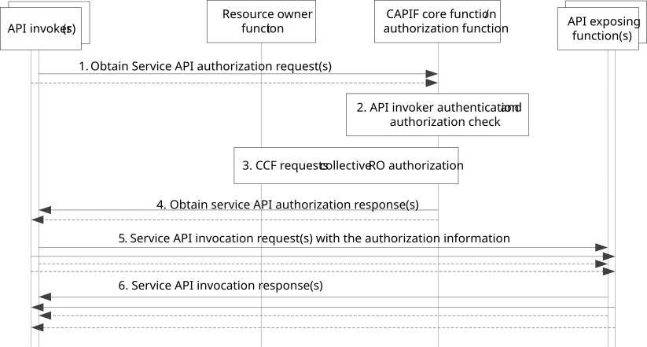

# 8.33 Obtaining collective authorization from a resource owner

## 8.33.1 General

Using the procedure described in clause 8.31 the CAPIF may authorize an API invoker to invoke a service API based on the authorization information from the resource owner given before the API invocation. This clause describes an extension to that procedure to enable the CAPIF to obtain authorization information from the resource owner relating to multiple API invokers and service APIs in a single interaction.

Clause 8.33.3 shows the procedure for obtaining collective authorization information from a resource owner via their resource owner function.

## 8.33.2 Information flows

NOTE: The security aspects of this procedure are specified in clause 6.4 and 6.5.3 of 3GPP TS 33.122 \[12\].

## 8.33.3 Procedure

Figure 8.33.3-1 illustrates the procedure for obtaining collective authorization from resource owner.

The mechanism to obtain collective authorization from a resource owner is supported by the CAPIF core function.

Pre-conditions:

> 1\. The resource owner function can communicate with the CCF (Authorization function).
>
> 2\. Access to an API exposing function offered service API requires obtaining authorization from a resource owner.
>
> 3\. The API invoker is successfully onboarded as described in clause 8.1.
>
> 4\. The CCF is configured for handling collective authorization, see table 8.33.3-1.

Figure 8.33.3-1: Procedure for obtaining collective authorization from resource owner

1\. An API invoker sends obtain service API authorization request to the CAPIF core function for obtaining permission to access a service API by including its API invoker identity information and any information required for authentication of the API invoker. The API invoker includes in the request information about the purpose and the targeted resources and operations to be performed on those resources.

2\. The CCF performs the authentication of the API invoker (using authentication information) and checks whether it is permitted to access the requested service API by checking whether a resource owner authorization information is already available for that API invoker. If the authorization for accessing the requested resources for the signalled purpose is already granted, the procedure continues with step 4.

3\. If authorization information is not available regarding whether the API invoker is permitted to access the requested service API (i.e., there is no applicable resource owner authorization information available) the collective resource owner authorization configuration (table 8.33.3-1) is assessed.

If authorization trigger criteria have been specified as part of the collective resource owner authorization configuration, interactions with the resource owner are only initiated once the trigger conditions are met.

If trigger criteria have not been set or once the trigger conditions are met, the authorization function determines the authorization by interacting with the resource owner via the ROF deployed on a UE. Based on the configured collective resource owner authorization configuration at the CCF and any cached “obtain service API authorization requests”, the scope of the request towards the ROF can be expanded to include additional API invokers and or service APIs based on the assumption that there is an association between the requesting API invoker and the API exposing functions and API invokers listed in the CCF configuration.

NOTE 2: The details of the interaction between RO and ROF for capturing the resource owner authorization are considered out-of-scope of the present specification.

NOTE 3: The detailed procedure to obtain the resource owner's authorization information for multiple API invokers in a single request, including whether such authorization can be limited to the API invoker initiating the request and only for the specific service being requested, is out of scope of this release of the specification.

4\. Based on the RO authorization information obtained via the ROF for each API invoker and corresponding service API(s), the CCF sends an API invoker specific service API authorization response (as described in clause 8.31) to the API invoker that initially triggered the collective resource owner authorization information requested and to each API invoker for which a obtain service API authorization request was received (for the same service API) whilst the collective resource owner authorization configuration duration timer was running, i.e., the cached requests.

5\. An API invoker that receives the service API authorization response can send service API invocation requests to the API exposing function with their API invoker specific resource owner authorization information as described in clause 8.31.

6\. The API exposing function will send a service API invocation response once it has successfully checked that the API invoker is authorized to invoke that service API based on the authorization information.

Table 8.33.3-1: Collective resource owner authorization configuration

<table>
<colgroup>
<col style="width: 33%" />
<col style="width: 16%" />
<col style="width: 50%" />
</colgroup>
<tbody>
<tr class="odd">
<td>Information element</td>
<td>Status</td>
<td>Description</td>
</tr>
<tr class="even">
<td>List of API invoker associations (NOTE 1)</td>
<td>O</td>
<td>Lists of API invokers with their associated service APIs</td>
</tr>
<tr class="odd">
<td>&gt; API invoker identity information list</td>
<td>M</td>
<td>List of API invoker identities</td>
</tr>
<tr class="even">
<td>&gt; Service API identification list</td>
<td>M</td>
<td>List of AEF service API identities.</td>
</tr>
<tr class="odd">
<td>List of trigger criteria (NOTE 1)</td>
<td>O</td>
<td>Criteria for triggering requesting of resource owner authorization</td>
</tr>
<tr class="even">
<td>&gt; Duration (NOTE 2)</td>
<td>O</td>
<td>Initiate request towards RO via ROF after the given duration (in seconds) after receiving a obtain service authorization request from an API invoker</td>
</tr>
<tr class="odd">
<td>&gt; Timeperiod (NOTE 2)</td>
<td>O</td>
<td>Time period during which notifications may be sent towards RO via ROF.</td>
</tr>
<tr class="even">
<td>&gt; Resource owner identifier</td>
<td>O</td>
<td>Can only be included if a duration or timeslot is included. Indicates that the resource owner authorization trigger criteria is to be applied to the specific resource owner identified by their GPSI, i.e., no other resource owner authorization trigger criteria shall be applied for that resource owner.</td>
</tr>
<tr class="odd">
<td colspan="3">
NOTE 1: At least one of these attributes shall be present

NOTE 2: Only one of these attributes shall be present
</td>
</tr>
</tbody>
</table>
