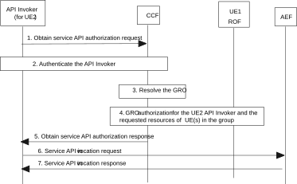

# 8.34 UE-deployed API invoker accessing other UEs’ resources of a group

## 8.34.1 General

This clause specifies the procedures for API invoker on a UE to be able to access the services exposing resources of other UEs of a group. The UEs belong to the same group and the same VAL service provider (IoT case) or the same user and all of them belong to the same CAPIF provider domain.

The authorization relationship between UE2 (the API invoker is in UE2) and the target UE, given by the membership to the same group, is within the CAPIF provider domain. The difference of this scenario compared with the procedure of an API invoker obtaining authorization from resource owner described in clause 8.31 is that:

a\. the API invoker is not deployed in the UE whose resources are being accessed,

b\. the API invoker needs to provide in the request, in addition to the identity of the UE whose resources are being accessed, the Group Identifier; and

c\. the group membership needs to be managed by the CAPIF provider as described in Annex E.

NOTE: Other possible scenarios, e.g. where the authorization relationship given by the membership to the same group is within the Application Service Provider, are not specified in this release of the specification.

## 8.34.2 Information flows

NOTE: The security aspects of this procedure are specified in 3GPP TS 33.122 \[12\].

## 8.34.3 Procedure

Figure 8.34.3-1 presents the procedure for enabling a UE-hosted API invoker accessing network-hosted resources owned by other UEs that belong to the same group.

Pre-condition:

1\. The network hosts individual resources for a group of UEs which can be accessed via AEF provided the necessary security conditions are met.

2\. UE1, UE2 and the UE whose resources are being accessed, belong to the same group and the same VAL service provider (IoT case) or the same user.

3\. CCF is provisioned with the information of a Group Resource Owner (GRO) which indicates UE1 as the authorized RO (e.g. by business relationship between the group of UEs) to provide resource owner authorization for the resources belonging to the UEs in this group.

NOTE 1: In this release of the specification group context information is provisioned by the CAPIF administrator as specified in Annex E and the other mechanisms are out of scope of this release.

Figure 8.34.3-1: UE-deployed API invoker accessing other UEs’ resources of a group

1\. The API invoker (e.g., in UE2) sends an Obtain service API authorization request to the CCF for obtaining permission to access the service API for other UE's resources hosted in the network (e.g., location) by including the API invoker identity information and any information required for authentication of the API invoker. The request includes API invoker information, the group identifier, and the UE in a group whose resources are to be accessed. Additionally, the API invoker may include in the request information about the purpose and operations (scope) to be performed on the targeted resources.

2\. CCF performs authentication of the API invoker (using authentication information) as specified in 3GPP TS 33.122 \[12\].

3\. The CCF, based on the group identifier determines that RO authorization is provided by a GRO. The CCF then resolves the identity of the GRO responsible for the group of UEs based on the provisioned group context information related to the GRO, as specified in Annex E. The CCF shall additionally retrieve the identity of the UE hosting the API invoker, i.e. UE2, and shall check whether UE2 belongs to the group. The CCF shall also check that the UE whose resources are to be accessed belongs to the group.

Editor's Note: How the CCF identifies the API invoker is on the UE and obtains the identity of the UE hosting the API invoker during the authentication of the API invoker is to be detailed by SA3.

4\. If step 3 is successful, the CCF performs the resource owner authorization check using the GRO as the RO for the requested resources of other UE(s) belonging to the group.

NOTE: The details of the procedure to obtain resource owner’s authorization information from GRO are out the scope of this release of the specification.

5\. Based on the group resource owner authorization received in step 4, the CCF sends an Obtain service API authorization response to the API invoker. The authorization response indicates that the access to UE (resource owner) network resource(s) is authorized for an indicated scope.

6\. The API invoker sends service API invocation request to the API exposing function with the RO authorization information received in step 5.

7\. The API invoker receives the service API invocation response resulting from the service API invocation once the API exposing function has checked whether the API invoker is authorized to invoke that service API based on the RO authorization information.
