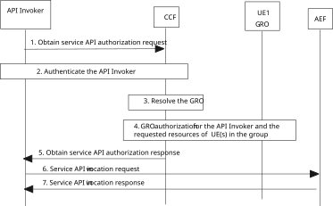

# 8.34a API invoker deployed in an application server accessing UE’s resources of a group of UEs

## 8.34a.1 General

This clause specifies the procedures for API invoker deployed on an application server to be able to access the services exposing resources of a UE that belongs to a group of UEs. The UEs of the group belong to the VAL service provider (e.g., IoT case) and all of them belong to the same CAPIF provider domain. The Application server also belongs to the VAL service provider.

The differences of this scenario compared with the procedure described in clause 8.34 are:

1\. The API invoker is deployed in an application server;

2\. The membership of the API invoker to the group of the UEs (in step 3 of clause 8.34.3) is not required; and

3\. The GRO need not be a member of the group; and

4\. The relation of the API invoker with the group of UEs is included in the configuration data for CAPIF, as described in Annex E.

The group membership, the relation of the API invoker with the group through the application behind the API invoker and authorization information to provide RO authoriation are managed by the CAPIF provider as described in Annex E.

## 8.34a.2 Information flows

NOTE: The security aspects of this procedure are specified in 3GPP TS 33.122 \[12\].

## 8.34a.3 Procedure

Figure 8.34a.3-1 presents the procedure for enabling an API invoker deployed in an application server accessing network-hosted resources owned by a UEs that belongs to a group.

Pre-condition:

1\. The network hosts individual resources for a group of UEs which can be accessed via AEF provided the necessary security conditions are met.

2\. CCF may be provisioned with the information of a Group Resource Owner (GRO) which provides resource owner authorization for the resources belonging to the UEs in this group.

NOTE: In this release of the specification, group context and resource owner authorization information is provisioned by the CAPIF administrator as specified in Annex E and the use of the GRO to provide RO authorization for the requested resources is out of scope of this release.

Figure 8.34a.3-1: API invoker deployed on an application server accessing UE’s resources of a group of UEs

1\. The API invoker deployed on an application server sends an Obtain service API authorization request to the CCF for obtaining permission to access the service API for a UE's resources hosted in the network (e.g., location) by including the API invoker identity information and any information required for authentication of the API invoker. The request includes API invoker information, the group identifier, and the UE in a group whose resources are to be accessed. Additionally, the API invoker may include in the request information about the purpose and operations (scope) to be performed on the targeted resources.

2\. CCF performs authentication of the API invoker (using authentication information) as specified in 3GPP TS 33.122 \[12\].

3\. The CCF, based on the group identifier determines that RO authorization is provided by a GRO. The CCF determines whether the API invoker is allowed to request authorization for a UE that belongs to the group based on group context information specified in Annex E. The CCF then resolves the identity of the GRO responsible for the group of UEs based on the provisioned group context information related to the GRO, as specified in Annex E. The CCF shall also check that the UE whose resources are to be accessed belongs to the group.

4\. If step 3 is successful, the CCF performs the resource owner authorization check using the GRO as the RO for the requested resources of other UE(s) belonging to the group.

Same as steps 5 to 7 described in clause 8.34.
