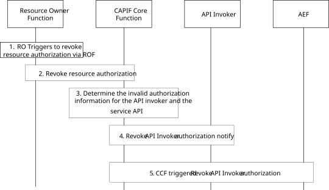

# 8.35 Revoking resource owner authorization

## 8.35.1 General

The procedure in this subclause corresponds to the architectural requirements for revoking resource owner authorization.

## 8.35.2 Information flows

The information flows for the interactions between the CAPIF core function, the API Invoker and the AEF are described in clause 8.23.2.

NOTE: The security aspects of this procedure are specified in clause 6.5.3.4 of 3GPP TS 33.122 \[12\].

## 8.35.3 Procedure

Figure 8.35.3-1 illustrates the procedure for revoking resource owner authorization to access service API initiated by the resource owner function.

Pre-conditions:

1\. The API invoker is authenticated and authorized to use the service API.

Figure 8.35.3-1: Procedure for revoking resource owner authorization

1\. The RO triggers the revocation of the resource authorization via ROF.

2\. The ROF requests resource authorization revocation to the CAPIF core function.

NOTE: The detailed procedure of resource authorization revocation is to be specified in TS 33.122 \[12\].

3\. The CAPIF core function determines the revoked authorization information for the API Invoker and Service API as specified in clause 6.5.3.4 of TS 33.122 \[12\].

4\. The CAPIF core function sends a revoke resource authorization notification to the API invoker according to the procedure in clause 8.23.4.

5\. The CAPIF core function sends a revoke resource authorization notification to the API exposing function according to the procedure in clause 8.23.4.
