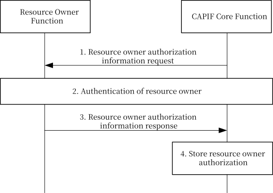

# 8.36 CCF Obtaining Resource Owner Authorization

## 8.36.1 General

The procedure in this subclause corresponds to the architectural requirements for CCF obtaining resource owner authorization.

## 8.36.2 Information flows

The information flows for the interactions to obtain RO authorization information from the RO function are part of the Obtain service API authorization procedure described in clause 8.31.2.

NOTE: The security aspects of this procedure are specified in clause 6.5.3.B of 3GPP TS 33.122 \[12\].

## 8.36.3 Procedure

Figure 8.36.3-1 illustrates the procedure for CCF obtaining resource owner authorization.

Pre-condition:

1\. ROF and CCF have successfully completed mutual authentication.

Figure 8.36.3-1: Procedure for obtaining resource owner authorization

1\. The CAPIF core function sends the resource owner authorization information request along with the API invoker information received in the obtaining service API authorization procedure as described in clause 8.31.3.

2\. Authentication of the resource owner is performed as specified in clause 6.5.3.1 of 3GPP TS 33.122 \[12\].

3\. The resource owner sends the resource owner authorization information response via ROF to the CAPIF core function along with the resource authorization information as specified in clause 8.31.3.

4\. The CAPIF core function stores the resource owner authorization information.
