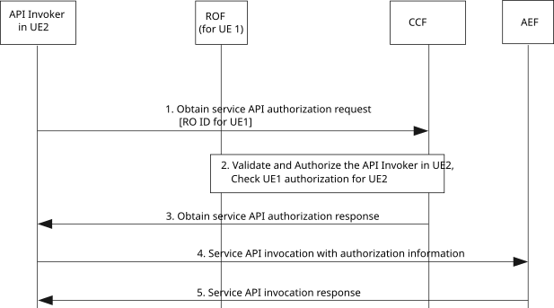

# 8.37 UE-deployed API invoker accessing other UEs’ resources

## 8.37.1 General

This clause specifies the procedures for API invoker on a UE to be able to access the services exposing resources of other UEs.

The authorization relationship between UE2 (the API invoker is in UE2) and UE1 (the resource owner of the accessed network resources is at UE1) is within the Application Service Provider. The difference of this scenario compared with the procedure of an API invoker obtaining authorization from resource owner described in clause 8.31 is that the API invoker is not deployed in the resource owner’s UE.

NOTE: Other possible scenarios, e.g. where the authorization relationship between UE(s) is in the CAPIF domain, are not specified in this release of the specification.

## 8.37.2 Information flows

NOTE: The security aspects of this procedure are specified in 3GPP TS 33.122 \[12\].

## 8.37.3 Procedure

Figure 8.37.3-1 presents the procedure for enabling a UE-hosted API invoker accessing network-hosted resources owned by other UEs for the scenarios introduced in clause 8.37.1.

Pre-condition:

1\. The network hosts individual resource(s) for a UE which can be accessed via AEF provided the necessary security conditions are met.

2\. UE 1 and UE 2 belong to the same CAPIF provider domain. The API invoker knows the RO identifier for UE1.

Figure 8.37.3-1: UE-deployed API invoker accessing other UEs’ resources

1\. The API invoker in UE2 sends an Obtain service API authorization request to the CCF for obtaining permission to access the service API for other UE’s (UE1) resources hosted in the network by including the API invoker identity information and any information required for authentication of the API invoker.

The request shall include the RO identity for UE1, whose resources are trying to be accessed, the API invoker information that is requesting the access, and the information about the purpose and scope to be performed on the targeted resources.

2\. The CCF validates and authorizes the API invoker in UE2 as specified in 3GPP TS 33.122 \[3\]. If the API invoker validation is successful, the CCF checks the Resource Owner authorization information of UE1. The CCF obtains whether the RO (UE1) authorized to the API invoker the access to the network resource(s) for the specified purpose and scope. If the RO authorization information is not available, the CCF may interact with UE1 via ROF to obtain it.

3\. Based on the UE1 resource owner authorization obtained in step 2, the CCF sends an Obtain service API authorization response to the API invoker. The response indicates that UE1, as resource owner, authorizes the service API access for an indicated scope.

4\. The API invoker sends service API invocation request to the API exposing function with the RO authorization information received in step 2.

5\. The API invoker receives the service API invocation response resulting from the service API invocation once the API exposing function has checked whether the API invoker is authorized to invoke that service API based on the RO authorization information.
