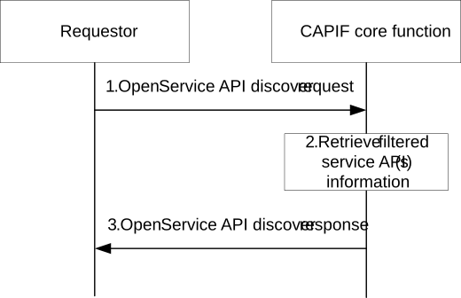

# 8.38 Open Discover service APIs

## 8.38.1 General

The following procedure in this subclause corresponds to supporting open discover service APIs. Such open discovery operation allows requestor to discover service API information about the available set of APIs offered by CCF before onboarding.

## 8.38.2 Information flows

### 8.38.2.1 Open Service API discover request

Table 8.38.2.1-1 describes the information flow open service API discover request from the requestor to the CAPIF core function.

Table 8.38.2.1-1: Open Service API discover request

<table>
<colgroup>
<col style="width: 33%" />
<col style="width: 16%" />
<col style="width: 50%" />
</colgroup>
<tbody>
<tr class="odd">
<td>Information element</td>
<td>Status</td>
<td>Description</td>
</tr>
<tr class="even">
<td>Query information</td>
<td>
O

(see NOTE)
</td>
<td>Criteria for discovering matching service APIs. It may contain Service API information described in table 8.3.2.1-1, except service API interface details.</td>
</tr>
<tr class="odd">
<td colspan="3">NOTE: It should be possible to discover all the service APIs.</td>
</tr>
</tbody>
</table>

### 8.38.2.2 Open Service API discover response

Table 8.38.2.2-1 describes the information flow open service API discover response from the CAPIF core function to the requestor.

Table 8.38.2.2-1: Open Service API discover response

<table>
<colgroup>
<col style="width: 33%" />
<col style="width: 16%" />
<col style="width: 50%" />
</colgroup>
<tbody>
<tr class="odd">
<td>Information element</td>
<td>Status</td>
<td>Description</td>
</tr>
<tr class="even">
<td>Result</td>
<td>M</td>
<td>Indicates the success or failure of the open discovery of the service API information</td>
</tr>
<tr class="odd">
<td>Service API information</td>
<td>
O

(see NOTE)
</td>
<td>Filtered service APIs information that can be shared to the requestor not a recognized user of the CAPIF. It may contain Service API information described in table 8.3.2.1-1, except service API interface details.</td>
</tr>
<tr class="even">
<td colspan="3">NOTE: The service API information shall be present if the Result information element indicates that the open service API discover operation is successful. Otherwise, it shall not be present.</td>
</tr>
</tbody>
</table>

## 8.38.3 Procedure

Figure 8.38.3-1 illustrates the procedure for open discover service APIs.

The open service API discovery mechanism is supported by the CAPIF core function.

Pre-conditions:

1\. The requestor is not a recognized user of the CAPIF.

2\. The CAPIF core function is aware of the Service API information that can be disseminated according to the requestor who is not a recognized user of the CAPIF.

Figure 8.38.3-1: Open Discover service APIs

1\. The requestor sends an open service API discover request to the CAPIF core function. It may include the query information from the requestor.

Editor's Note: The security aspects of this procedure are under study on TR 33.700-23 in SA3.

2\. Upon receiving the open service API discover request, if query information is included, the CAPIF core function retrieves the stored service API(s) information as per the query information in the open service API discover request, otherwise all stored service API(s) information is retrieved. Further, since the requestor is not a recognized user of CAPIF, the CAPIF core function applies the indication about allowing the dissemination of service API information received from the APF (clause 8.3.2.1), and if it's not available, the configured information about the service APIs allowed for dissemination (specified in Annex E), if available and perform the filtering of service APIs information.

NOTE: If the indication about allowing the dissemination of service API information is not available in the CCF via publish (clause 8.3.2.1) and configuration (Annex E) mechanisms, the CAPIF core function could filter the service APIs information to return in the Open Discovery response based on implementation specific means.

3\. The CAPIF core function sends an open service API discover response to the requestor with the filtered list of service API information.
