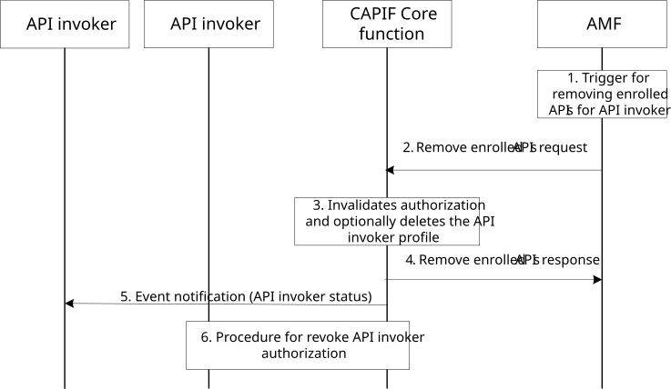

# 8.39 API provider domain remove enrolled APIs for API invoker

## 8.39.1 General

The API invoker receives onboarding enrolment information from the API provider domain, which is used by the API invoker to onboard to CCF. In certain scenarios (e.g. the API invoker has unsubscribed to the services provided by the API provider domain) it is required remove enrolled APIs for the APIs provided by API provider domain. The following procedure in this subclause corresponds to enrolled service APIs for a given API invoker.

## 8.39.2 Information flows

### 8.39.2.1 Remove enrolled service APIs request

Table 8.39.2.1-1 describes the information flow for remove enrolled service APIs request from the AMF to the CCF.

Table 8.39.2.1-1: Remove enrolled service APIs request

|                                  |        |                                                                |
|----------------------------------|--------|----------------------------------------------------------------|
| Information element              | Status | Description                                                    |
| API invoker identity information | M      | Identity information of the API invoker requesting offboarding |
| List of APIs                     | O      | List of APIs to be removed from the enrollment                 |

### 8.39.2.2 Remove enrolled service APIs response

Table 8.39.2.2-1 describes the information flow for remove enrolled service APIs response from the CCF to the AMF.

Table 8.39.2.1-1: Remove enrolled service APIs response

|                     |        |                                                            |
|---------------------|--------|------------------------------------------------------------|
| Information element | Status | Description                                                |
| Result              | M      | Indicates the success or failure of the request            |
| List of APIs        | O      | List of APIs removed from the enrolment if case of success |
| Reason              | O      | Indicate the reason of failure                             |

## 8.39.3 Procedure

Figure 8.39.3-1 illustrates the procedure for removing enrolled APIs for the API invoker from the CCF initiated by the AMF.

Pre-conditions:

1\. The API invoker had successfully onboarded to the CCF.

Figure 8.39.3-1: Procedure for removing enrolled APIs for API invoker

1\. The AMF has decided to remove enrolled APIs for the API invoker based on certain condition.

2\. The AMF sends remove enrolled APIs request for the API invoker to the CAPIF core function with the details of the API invoker.

3\. Upon receiving the request, the CCF determines to disenroll the service APIs for the API invoker. The CAPIF core function invalidates the API invoker authorization corresponding to the service APIs. The CCF may decide to offboard the API invoker if all enrolled APIs are removed from the API invoker profile.

4\. The CAPIF core function sends a remove enrolled APIs response to the AMF.

5\. If CCF has decided to offboard the API invoker, the CCF sends an event notification with event API invoker status to the API invoker if the API invoker subscribed to onboarding information changes. The notification message includes status as offboarded and may include the reason for the offboarding.

6\. If the CCF has revoked authorization for the API invoker, it initiates the procedure to inform AEF as specified in clause 8.23.4.
