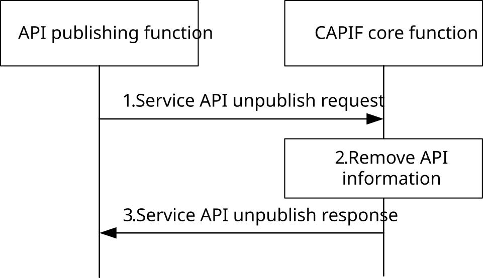

# 8.4 Unpublish service APIs

## 8.4.1 General

The CAPIF supports unpublishing service APIs by the API provider. Once the service API information is unpublished, it is no more available to be discovered by API invokers. The API publishing function can be within PLMN trust domain or within 3rd party trust domain.

## 8.4.2 Information flows

### 8.4.2.1 Service API unpublish request

Table 8.4.2.1-1 describes the information flow service API unpublish request from the API publishing function to the CAPIF core function.

Table 8.4.2.1-1: Service API unpublish request

|                                             |        |                                                                                                                                                                        |
|---------------------------------------------|--------|------------------------------------------------------------------------------------------------------------------------------------------------------------------------|
| Information element                         | Status | Description                                                                                                                                                            |
| API publisher information                   | M      | The information of the API publisher may include identity, authentication and authorization information                                                                |
| Service API published information reference | M      | The information provided by the CAPIF core function which can be for referencing the information (set) about the published service API by the API publishing function. |

### 8.4.2.2 Service API unpublish response

Table 8.4.2.2-1 describes the information flow service API unpublish response from the CAPIF core function to the API publishing function.

Table 8.4.2.2-1: Service API unpublish response

|                     |        |                                                                              |
|---------------------|--------|------------------------------------------------------------------------------|
| Information element | Status | Description                                                                  |
| Result              | M      | Indicates the success or failure of unpublishing the service API information |

## 8.4.3 Procedure

Figure 8.4.3-1 illustrates the procedure for unpublishing the service APIs. The service API unpublish mechanism is supported by the CAPIF core function.

Pre-conditions:

1\. Authorization details of the APF are available with the CAPIF core function.

2\. API invokers may have subscribed with the CAPIF core function to obtain notification regarding service API unpublish.

Figure 8.4.3-1: Unpublish service APIs

1\. The API publishing function sends a service API unpublish request to the CAPIF core function, with service API published information reference provided by the CAPIF core function when the service API was published.

2\. Upon receiving the service API unpublish request, the CAPIF core function checks whether the API publishing function is authorized to unpublish service APIs. If the check is successful, the service API information provided by the API publishing function is removed at the CAPIF core function (API registry).

3\. The CAPIF core function provides a service API unpublish response to the API publishing function and triggers notifications to subscribed API invokers as described in subclause 8.8.4.
