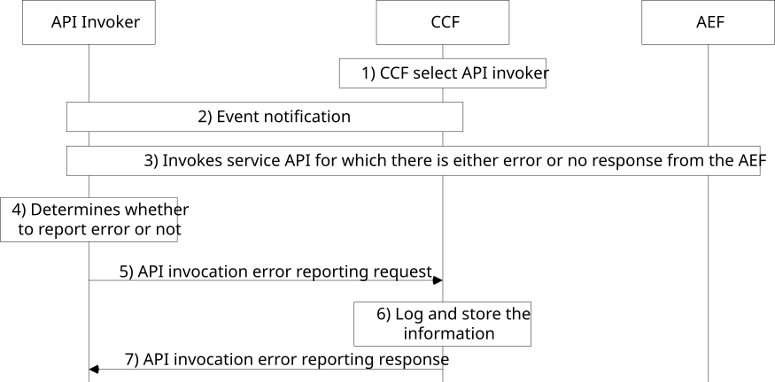

# 8.40 API invoker reporting errors

## 8.40.1 General

The procedure is used to collect data at CCF which can be used for service API analytics.

Editor's Note: Security aspects of this procedure are FFS and need to be validated by SA3.

## 8.40.2 Information flows

### 8.40.2.1 API invocation error reporting request

Table 8.40.2.1-1 describes the information flow for API invoker to report API invocation errors to the CAPIF core function.

Table 8.40.2.1-1: API invocation error reporting request

|                                  |        |                                                                                                                                          |
|----------------------------------|--------|------------------------------------------------------------------------------------------------------------------------------------------|
| Information element              | Status | Description                                                                                                                              |
| API invoker identity information | M      | Identity information of the API invoker                                                                                                  |
| API invocation log information   | M      | API invocation error information such as interface details, service API name, version, invocation result / error, time stamp information |

### 8.40.2.2 API invocation error reporting response

Table 8.40.2.2-1 describes the information flow API invocation error reporting response from the CAPIF core function to the API invoker.

Table 8.40.2.2-1: API invocation error reporting response

<table>
<colgroup>
<col style="width: 33%" />
<col style="width: 16%" />
<col style="width: 50%" />
</colgroup>
<tbody>
<tr class="odd">
<td>Information element</td>
<td>Status</td>
<td>Description</td>
</tr>
<tr class="even">
<td>Result</td>
<td>M</td>
<td>Indicates the success or failure of the request</td>
</tr>
<tr class="odd">
<td>Failure cause</td>
<td>
O

(NOTE)
</td>
<td>Indicates reason for failure</td>
</tr>
<tr class="even">
<td colspan="3">NOTE: This IE is included for failure response.</td>
</tr>
</tbody>
</table>

## 8.40.3 Procedure

Figure 8.40.3-1 illustrates the procedure for API invocation error reporting. The API invocation error reporting mechanism is supported by the CAPIF core function.

Pre-conditions:

1\. The API invoker is onboarded, discovered the service APIs, and received service authorization to invoke the service APIs.

2\. The CCF determines the need to enable AEF error reporting by API invoker for a specific AEF (e.g., based on local policies, loss of connectivity with the AEF).

Figure 8.40.3-1: API invocation error reporting

1\. The CCF selects the API invoker(s) for AEF error reporting based on the API invoker’s support for AEF status reporting indicated in the API invoker profile and operator policy. In addition, the CCF shall only select API invoker(s) that have subscribed to the "Report AEF error" event and are currently authorized to access Service APIs exposed by the targeted AEF or have recently discovered the targeted AEF.

2\. The CCF notifies the selected API invoker(s) to start or stop reporting using the Event Notification procedure for the "Report AEF error" event as specified in clause 8.8.4. The notification may include reporting requirements (e.g., reporting threshold, reporting interval).

3\. The API invoker invokes the service API for which there is either an error or no response received from the AEF.

4\. The API invoker determines whether to send the error report based on the reporting requirements previously received from the CCF. If a reporting threshold or reporting interval was provided, the API invoker shall only send the error report if the number of consecutive failures meets the threshold and the time since the last report exceeds the interval.

5\. The API invoker sends the API invocation error reporting request message to the CCF. The request message includes the parameters as specified in Table 8.40.2.1-1.

6\. Upon receiving the request, the CCF makes a log entry, stores the information, and may update the status of published APIs of the reported AEF in the API registry.

NOTE: Before updating the status in the API registry, the CCF may verify the AEF status (e.g., by correlating reports from multiple API invokers or verifying AEF reachability).

7\. The CCF sends the API invocation error reporting response to the API invoker. The response message includes the parameters as specified in Table 8.40.2.2-1.
