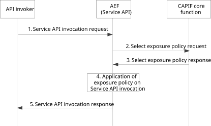

# 8.42 AEF Fetch exposure policy

## 8.42.1 General

The AEF executes this procedure when it needs to obtain from the CCF the policy to apply during service API invocation (e.g., when the policies are not available at the AEF). The fetch exposure policy procedure only applies when the AEF is within the PLMN trust domain.

## 8.42.2 Information flows

### 8.42.2.1 Select exposure policy request

Table 8.42.2.1-1 describes the information flow Select exposure policy request from the AEF to the CAPIF core function.

Table 8.42.2.1-1: Select exposure policy request

|                                  |        |                                                                                      |
|----------------------------------|--------|--------------------------------------------------------------------------------------|
| Information element              | Status | Description                                                                          |
| API invoker identity information | M      | The information that determines the identity of the API invoker                      |
| Service API identification       | M      | The identification information of the service API for which invocation is requested. |

### 8.42.2.2 Select exposure policy response

Table 8.42.2.2-1 describes the information flow Select exposure policy response from the CAPIF core function to the AEF.

Table 8.42.2.2-1: Select exposure policy response

<table>
<colgroup>
<col style="width: 33%" />
<col style="width: 16%" />
<col style="width: 50%" />
</colgroup>
<tbody>
<tr class="odd">
<td>Information element</td>
<td>Status</td>
<td>Description</td>
</tr>
<tr class="even">
<td>Result</td>
<td>M</td>
<td>Indicates the success or failure of the apply exposure policy operation</td>
</tr>
<tr class="odd">
<td>Exposure Policy</td>
<td>
O

(see NOTE)
</td>
<td>
Exposure Policy information, that consists of:

- List of allowed VPLMN IDs per API invoker and service API. When the target UE is roaming in a VPLMN included in the list of allowed VPLMN IDs, the service API is authorized for the indicated API invoker.
</td>
</tr>
<tr class="even">
<td>Failure Cause</td>
<td>
O

(see NOTE)
</td>
<td>Failure Cause.</td>
</tr>
<tr class="odd">
<td colspan="3">NOTE: The Roaming policy information shall be present when the Result information element indicates that the Select exposure policy operation is successful. When the Result information element indicates failure, the Failure information element shall be present.</td>
</tr>
</tbody>
</table>

## 8.42.3 Procedure

Figure 8.42.3-1 illustrates the procedure for applying exposure policies on the service API invocations.

Pre-conditions:

1\. The API invoker has performed the service API discovery and received the details of the service API which includes the information about the service communication entry point of the AEF in the CAPIF.

2\. The API invoker is authenticated and authorized to use the service API.

3\. The exposure policy e.g. to apply roaming considerations is not available with AEF.

4\. The CAPIF core function is configured with the exposure policies corresponding to one or more service APIs.

5\. The AEF supports the retrieval from the core network of roaming information of the target UE included in the service API request.

Figure 8.42.3-1: Procedure for AEF fetching exposure policyl

1\. The API invoker performs service API invocation according to the interface of the service API by sending a service API invocation request towards the AEF which exposes the service API towards the API invoker.

2\. If the exposure policy is not configured in the AEF, then the AEF may obtain the exposure policy from the CAPIF core function by invoking the Select exposure policy request.

3\. The CCF checks the available exposure policies (e.g., roaming policies) and returns them in the Select exposure policy response. The CCF may have received the configuration for exposure policies from the API provider domain as described in clause 8.3.2 or may have them locally configured as described in table E-1. The exposure policies provided by the API provider using the Publish API take precedence over the ones configured in table E-1.

4\. The AEF applies the received exposure policy for the service API and API invoker.

\- When the AEF receives roaming policies, the AEF uses N33 interface to retrieve roaming information from the core network. The AEF performs the validation of service API invocation based on the roaming information retrieved from the core network and the received list of allowed VPLMNs per API invoker and service API, by checking whether the target UE is roaming, and if so, the target UE is camping in a VPLMN included in the list of allowed VPLMNs.

5\. The API invoker receives a service API invocation response from the AEF.
