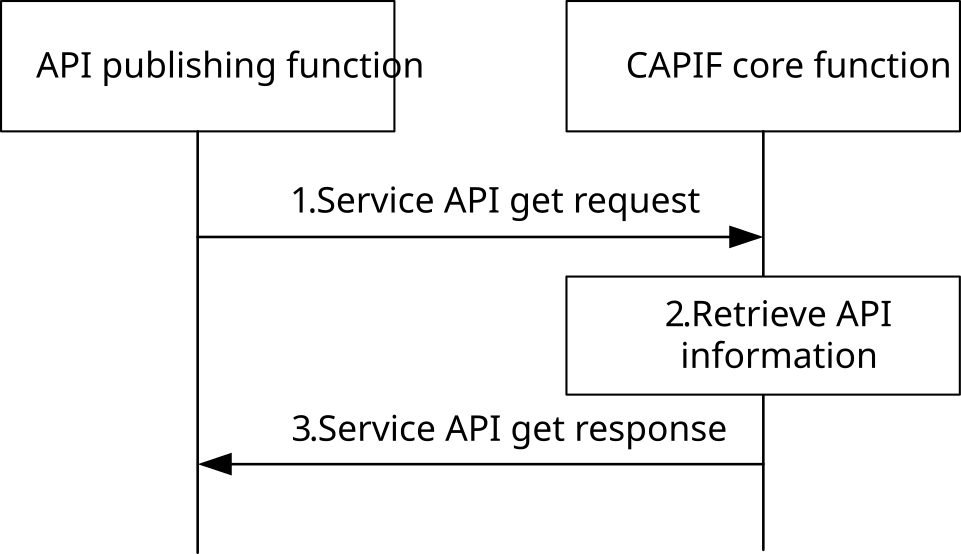

# 8.5 Retrieve service APIs

## 8.5.1 General

The CAPIF supports retrieving the published service APIs information by the API provider. The API publishing function can be within PLMN trust domain or within 3rd party trust domain.

## 8.5.2 Information flows

### 8.5.2.1 Service API get request

Table 8.5.2.1-1 describes the information flow service API get request from the API publishing function to the CAPIF core function.

Table 8.5.2.1-1: Service API get request

|                                             |        |                                                                                                                                                                        |
|---------------------------------------------|--------|------------------------------------------------------------------------------------------------------------------------------------------------------------------------|
| Information element                         | Status | Description                                                                                                                                                            |
| API publisher information                   | M      | The information of the API publisher may include identity, authentication and authorization information                                                                |
| Service API published information reference | M      | The information provided by the CAPIF core function which can be for referencing the information (set) about the published service API by the API publishing function. |

### 8.5.2.2 Service API get response

Table 8.5.2.2-1 describes the information flow service API get response from the CAPIF core function to the API publishing function.

Table 8.5.2.2-1: Service API get response

|                                                                                                                                                                            |              |                                                                            |
|----------------------------------------------------------------------------------------------------------------------------------------------------------------------------|--------------|----------------------------------------------------------------------------|
| Information element                                                                                                                                                        | Status       | Description                                                                |
| Result                                                                                                                                                                     | M            | Indicates the success or failure of retrieving the service API information |
| Cause                                                                                                                                                                      | O            | The cause for the request failure.                                         |
| Service API information                                                                                                                                                    | O (see NOTE) | The service API information as specified in Table 8.3.2.1-1.               |
| NOTE: Shall be present if the Result information element indicates that the service API get request is successful. Otherwise service API information shall not be present. |              |                                                                            |

## 8.5.3 Procedure

Figure 8.5.3-1 illustrates the procedure for retrieving the service APIs. The service API retrieval mechanism is supported by the CAPIF core function.

Pre-condition:

1\. Authorization details of the APF are available with the CAPIF core function.

Figure 8.5.3-1: Retrieve service APIs

1\. The API publishing function sends a service API get request to the CAPIF core function, with service API published information reference provided by the CAPIF core function when the service API was published.

2\. Upon receiving the service API get request, the CAPIF core function checks whether the API publishing function is authorized to get published service APIs information. If the check is successful, the corresponding service API information is retrieved from the CAPIF core function (API registry).

3\. The CAPIF core function provides a service API get response to the API publishing function which includes the service API information.
