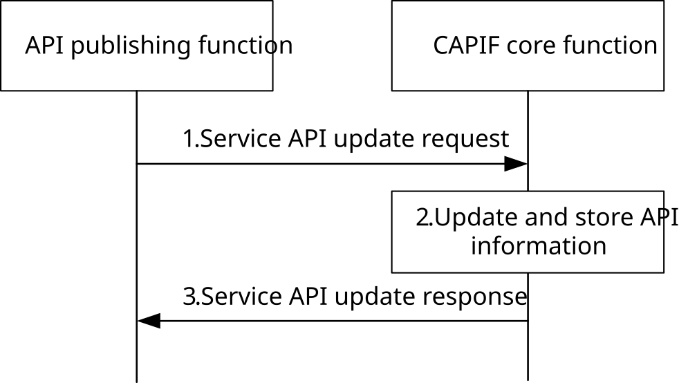

# 8.6 Update service APIs

## 8.6.1 General

The CAPIF core function allows the service API provider to update the information related to the published service API, e.g. a change in the characteristics of the service API. This procedure is initiated by the API publishing function to the CAPIF core function. The API publishing function can be within PLMN trust domain or within 3rd party trust domain.

## 8.6.2 Information flows

### 8.6.2.1 Service API update request

Table 8.6.2.1-1 describes the information flow service API update request from the API publishing function to the CAPIF core function.

Table 8.6.2.1-1: Service API update request

|                                             |        |                                                                                                                                                           |
|---------------------------------------------|--------|-----------------------------------------------------------------------------------------------------------------------------------------------------------|
| Information element                         | Status | Description                                                                                                                                               |
| API publisher information                   | M      | The information of the API publisher may include identity, authentication and authorization information                                                   |
| Service API published information reference | M      | The information (set) provided by the CAPIF core function about the published service API which can be used for reference by the API publishing function. |
| Service API information                     | M      | The service API information as specified in Table 8.3.2.1-1, as required to replace the existing service API information.                                 |
| Reason                                      | O      | The reason of the update (e.g. change log).                                                                                                               |

NOTE: How to monitor service API status when the APF is unable to update service API status is not specified in this release.

### 8.6.2.2 Service API update response

Table 8.6.2.2-1 describes the information flow service API update response from the CAPIF core function to the API publishing function.

Table 8.6.2.2-1: Service API update response

|                         |        |                                                                                                                                                                                                           |
|-------------------------|--------|-----------------------------------------------------------------------------------------------------------------------------------------------------------------------------------------------------------|
| Information element     | Status | Description                                                                                                                                                                                               |
| Result                  | M      | Indicates the success or failure of updating the service API information                                                                                                                                  |
| Cause                   | O      | The cause for the request failure.                                                                                                                                                                        |
| Service API information | O      | The authorized service API information during update, applicable when the update result is success. This can be a subset or the full set, of the Service API information as specified in Table 8.3.2.1-1. |

## 8.6.3 Procedure

Figure 8.6.3-1 illustrates the procedure for updating the published service APIs information. The service API update mechanism is supported by the CAPIF core function.

Pre-conditions:

1\. Authorization details of the APF are available with the CAPIF core function.

2\. API invokers may have subscribed with the CAPIF core function to obtain notification regarding update to service API information.

Figure 8.6.3-1: Update service APIs

1\. The API publishing function sends a service API update request to the CAPIF core function, which includes the service API published information reference provided by the CAPIF core function when the service API was published and the new service API information which is to be updated.

2\. Upon receiving the service API update request, the CAPIF core function checks whether the API publishing function is authorized to update the published service APIs information. If the check is successful, the service API information provided by the API publishing function is updated at the CAPIF core function (API registry).

3\. The CAPIF core function provides a service API update response to the API publishing function and triggers notifications to subscribed API invokers as described in subclause 8.8.4.
