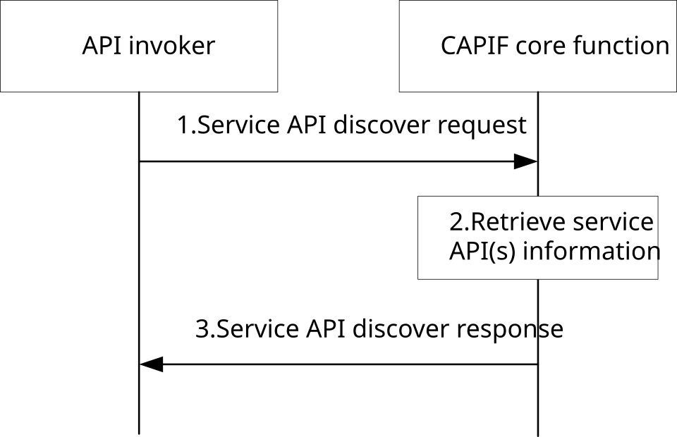

# 8.7 Discover service APIs

## 8.7.1 General

The following procedure in this subclause corresponds to the architectural requirements on discover service APIs. This procedure may be invoked by different types of API invokers (i.e., application management client, hosted application) at different phases (i.e., hosted application development, test phase and hosted application running phase). Different API invokers utlize this procedure for different purpose:

\- service API discovery for interested service APIs with service API informaiton including e.g., API name, API provider name, API category.

\- service API discovery for the interface information (e.g. IP address, port number, URI) of a particular service API in case of the interface information is not provided in the service API information during hosted application running phase.

## 8.7.2 Information flows

### 8.7.2.1 Service API discover request

Table 8.7.2.1-1 describes the information flow service API discover request from the API invoker to the CAPIF core function.

Table 8.7.2.1-1: Service API discover request

<table>
<colgroup>
<col style="width: 33%" />
<col style="width: 16%" />
<col style="width: 50%" />
</colgroup>
<tbody>
<tr class="odd">
<td>Information element</td>
<td>Status</td>
<td>Description</td>
</tr>
<tr class="even">
<td>API invoker identity information</td>
<td>M</td>
<td>Identity information of the API invoker discovering service APIs</td>
</tr>
<tr class="odd">
<td>Query information</td>
<td>O (NOTE 2)</td>
<td>
Criteria for discovering matching service APIs (e.g. service API category, Serving Area Information (optional), preferred AEF location (optional), required API provider name (optional), UE IP address (optional), interfaces, protocols, Service KPIs (optional), security methods, service API operation(s) and resource(s) (optional), and Network Slice Info (optional)).

(see NOTE 1)
</td>
</tr>
<tr class="even">
<td>Service API identification</td>
<td>O (NOTE 2)</td>
<td>The identification information of the service API(s) for which the request is targeting</td>
</tr>
<tr class="odd">
<td colspan="3">
NOTE 1: It should be possible to discover all the service APIs.

NOTE 2: Either "Query information" IE or " Service API identification" IE shall be present.
</td>
</tr>
</tbody>
</table>

### 8.7.2.2 Service API discover response

Table 8.7.2.2-1 describes the information flow service API discover response from the CAPIF core function to the API invoker.

Table 8.7.2.2-1: Service API discover response

<table>
<colgroup>
<col style="width: 33%" />
<col style="width: 16%" />
<col style="width: 50%" />
</colgroup>
<tbody>
<tr class="odd">
<td>Information element</td>
<td>Status</td>
<td>Description</td>
</tr>
<tr class="even">
<td>Result</td>
<td>M</td>
<td>Indicates the success or failure of the discovery of the service API information</td>
</tr>
<tr class="odd">
<td>
Service API information

(see NOTE 2)
</td>
<td>
O

(see NOTE 1, NOTE 3)
</td>
<td>The service API information as specified in Table 8.3.2.1-1, except for the service API status (e.g. active, inactive).</td>
</tr>
<tr class="even">
<td>Interface information</td>
<td>
O

(NOTE 3)
</td>
<td>The interface details (e.g. IP address, port number, URI) of the requested service API(s)</td>
</tr>
<tr class="odd">
<td>CAPIF core function identity information</td>
<td>
O

(see NOTE 1, NOTE 3)
</td>
<td>Indicates the CAPIF core function serving the service API category provided in the query criteria</td>
</tr>
<tr class="even">
<td colspan="3">
NOTE 1: The service API information or the CAPIF core function identity information or both shall be present if the Result information element indicates that the service API discover operation is successful. Otherwise, both shall not be present.

NOTE 2: If topology hiding is enabled for the service API, the interface details shall be the interface details of AEF acting as service communication entry point for the service API.

NOTE 3: "Interface information" IE shall not be present when "Service API information" or "CAPIF core function identity information" is present.
</td>
</tr>
</tbody>
</table>

## 8.7.3 Procedure

Figure 8.7.3-1 illustrates the procedure for discover service APIs.

The service API discovery mechanism is supported by the CAPIF core function.

Pre-conditions:

1\. The API invoker is onboarded and has received an API invoker identity.

2\. The CAPIF core function is configured with a discovery policy information (e.g. to restrict discovery to category of APIs) for API invoker(s).

Figure 8.7.3-1: Discover service APIs

1\. The API invoker sends a service API discover request to the CAPIF core function. It includes the API invoker identity, either query information or the service API identification.

> For service API discovery for interested service APIs, the query information is included.
>
> For service API discovery for interface information, service API identification is included.

2\. Upon receiving the service API discover request, the CAPIF core function verifies the identity of the API invoker (via authentication).

If the query information is included, the CAPIF core function retrieves the stored service API(s) information from the CAPIF core function (API registry) as per the query information in the service API discover request. Further, the CAPIF core function applies the discovery policy and performs filtering of service APIs information retrieved from the CAPIF core function.

If the service API identification is included, the CAPIF core function retrieves the interface information of the requested service API(s).

3\. The CAPIF core function sends a service API discover response to the API invoker.

If the query information is included, the list of service API information is returned.

If the service API identification is included, the interface information is returned.
