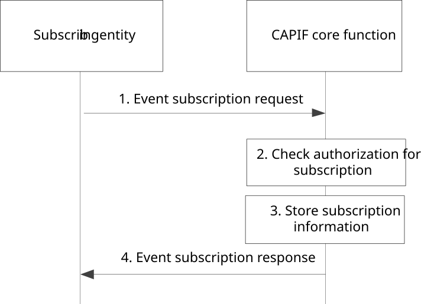
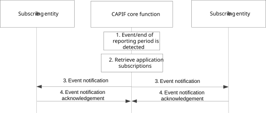
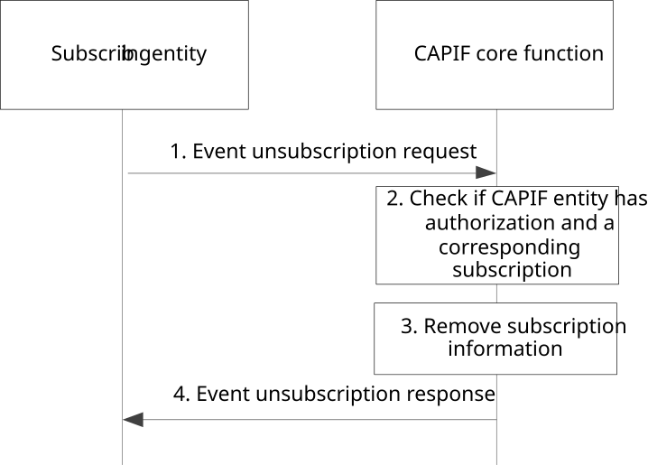
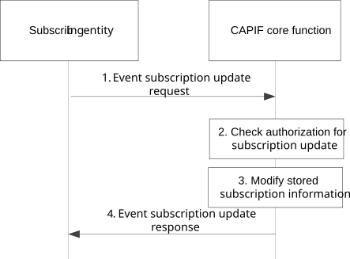

# 8.8 Subscription, unsubscription and notifications for the CAPIF events

## 8.8.1 General

The CAPIF core function enables the subscribing entity (i.e. the API invoker, the API exposing function, the API publishing function, the API management function) to subscribe to and unsubscribe from the CAPIF events such as availability events of service APIs, change in service API information, monitoring service API invocations, API invoker onboarding events, etc. The subscription, unsubscription and notification for the CAPIF events are enabled on the following CAPIF reference points:

\- CAPIF-1 or CAPIF-1e: the API invoker can subscribe to and unsubscribe from CAPIF events and receive notifications from the CAPIF core function;

\- CAPIF-3 or CAPIF-3e: the AEF can subscribe to and unsubscribe from CAPIF events and receive notifications from the CAPIF core function;

\- CAPIF-4 or CAPIF-4e: the API publishing function can subscribe to and unsubscribe from CAPIF events and receive notifications from the CAPIF core function; and

\- CAPIF-5 or CAPIF-5e: the API management function can subscribe to and unsubscribe from CAPIF events and receive notifications from the CAPIF core function.

NOTE: Support for subscriptions and notifications can also be part of the actual service APIs. That type of subscriptions and notifications is not covered by the provisions in this clause.

## 8.8.2 Information flows

### 8.8.2.1 Event subscription request

Table 8.8.2.1-1 describes the information flow for event subscription request from the subscribing entity to the CAPIF core function.

Table 8.8.2.1-1: Event subscription request

|                                    |        |                                                                                          |
|------------------------------------|--------|------------------------------------------------------------------------------------------|
| Information element                | Status | Description                                                                              |
| Identity subscription information  | M      | The information to determine the identity of the subscribing entity                      |
| Event subscription information     | M      | The event subscription information as defined in Table 8.8.2.1-2                         |
| Notification reception information | O      | The information of the subscribing entity for receiving the notifications for the event. |

Table 8.8.2.1-2: Event subscription information

<table>
<colgroup>
<col style="width: 33%" />
<col style="width: 16%" />
<col style="width: 50%" />
</colgroup>
<tbody>
<tr class="odd">
<td>Information element</td>
<td>Status</td>
<td>Description</td>
</tr>
<tr class="even">
<td>Events</td>
<td>M</td>
<td>One or more event identifiers. Table 8.8.6-1 provides a non-exhaustive list of CAPIF events.</td>
</tr>
<tr class="odd">
<td>Event filter information</td>
<td>O</td>
<td>Contains the matching criteria for the indicated event(s) (e.g., optionally the list of AEF(s) for which the CCF will detect the event service API availability).</td>
</tr>
<tr class="even">
<td>Event reporting information</td>
<td>
O

(NOTE)
</td>
<td>
Contains, the notification method for the matched event, e.g. periodic, on event detection, etc.

The event reporting information may include, per event, a reporting threshold on number of matched events, optionally within a time window, that indicates how many times an event must be matched to trigger a notification.
</td>
</tr>
<tr class="odd">
<td colspan="3">NOTE: The threshold on number of matched events applies only to the event detection notification method. The time window represents a fixed time duration (e.g., one hour) and may be provided when the reporting threshold on number of matched events is provided. The count of the matched events and the time window are restarted when the event notification is sent or when the time window expires but the threshold to trigger the notification is not reached.</td>
</tr>
</tbody>
</table>

### 8.8.2.2 Event subscription response

Table 8.8.2.2-1 describes the information flow for event subscription response from the CAPIF core function to the subscribing entity.

Table 8.8.2.2-1: Event subscription response

<table>
<colgroup>
<col style="width: 33%" />
<col style="width: 16%" />
<col style="width: 50%" />
</colgroup>
<tbody>
<tr class="odd">
<td>Information element</td>
<td>Status</td>
<td>Description</td>
</tr>
<tr class="even">
<td>Result</td>
<td>M</td>
<td>Indicates the success or failure of the event subscription operation</td>
</tr>
<tr class="odd">
<td>Cause</td>
<td>O</td>
<td>The cause for the request failure.</td>
</tr>
<tr class="even">
<td>Subscription identifier</td>
<td>
O

(see NOTE)
</td>
<td>The unique identifier for the event subscription.</td>
</tr>
<tr class="odd">
<td colspan="3">NOTE: Shall be present if the Result information element indicates that the event subscription operation is successful. Otherwise subscription identifier shall not be present.</td>
</tr>
</tbody>
</table>

### 8.8.2.3 Event notification

Table 8.8.2.3-1 describes the information flow for event notification from the CAPIF core function to the subscribing entity. A notification about an event is sent to a subscribing entity if the event subscription information in the related subscription match the corresponding attributes of the event content.

Table 8.8.2.3-1: Event notification

|                           |        |                                                                                            |
|---------------------------|--------|--------------------------------------------------------------------------------------------|
| Information element       | Status | Description                                                                                |
| Subscription identifier   | M      | The unique identifier of the event subscription                                            |
| Event identifier          | M      | The unique identifier for the event. For the list of events, refer subclause 8.8.6         |
| Event related information | M      | The event related information (e.g. time at which the event originated, location of event) |
| Event content             | M      | The content of the event information.                                                      |

### 8.8.2.4 Event notification acknowledgement

Table 8.8.2.4-1 describes the information flow event notification acknowledgement from the subscribing entity to the CAPIF core function.

Table 8.8.2.4-1: Event notification acknowledgement

|                     |        |                                                      |
|---------------------|--------|------------------------------------------------------|
| Information element | Status | Description                                          |
| Acknowledgement     | M      | Acknowledgement for the event notification received. |

### 8.8.2.5 Event unsubscription request

Table 8.8.2.5-1 describes the information flow for event unsubscription request from the subscribing entity to the CAPIF core function.

Table 8.8.2.5-1: Event unsubscription request

|                         |        |                                                                                                                                             |
|-------------------------|--------|---------------------------------------------------------------------------------------------------------------------------------------------|
| Information element     | Status | Description                                                                                                                                 |
| Identity information    | M      | The information to determine the identity of the subscribing entity                                                                         |
| Subscription identifier | M      | The unique identifier for the event subscription that was provided to the subscribing entity during the CAPIF event subscription operation. |

### 8.8.2.6 Event unsubscription response

Table 8.8.2.6-1 describes the information flow for event unsubscription response from the CAPIF core function to the subscribing entity.

Table 8.8.2.6-1: Event unsubscription response

|                     |        |                                                                        |
|---------------------|--------|------------------------------------------------------------------------|
| Information element | Status | Description                                                            |
| Result              | M      | Indicates the success or failure of the event unsubscription operation |
| Cause               | O      | The cause for the request failure.                                     |

### 8.8.2.7 Event subscription update request

Table 8.8.2.7-1 describes the information flow for event subscription update request from the subscribing entity to the CAPIF core function.

Table 8.8.2.7-1: Event subscription update request

|                                                                    |          |                                                                                                                                             |
|--------------------------------------------------------------------|----------|---------------------------------------------------------------------------------------------------------------------------------------------|
| Information element                                                | Status   | Description                                                                                                                                 |
| Identity information                                               | M        | The information to determine the identity of the subscribing entity                                                                         |
| Subscription identifier                                            | M        | The unique identifier for the event subscription that was provided to the subscribing entity during the CAPIF event subscription operation. |
| Event subscription information changes                             | O (NOTE) | Updates to the event subscription information which is defined in clause 8.8.2.1                                                            |
| Notification reception information changes                         | O (NOTE) | Updates to the information of the subscribing entity for receiving the notifications for the event                                          |
| NOTE: At least one of these information elements shall be present. |          |                                                                                                                                             |

### 8.8.2.8 Event subscription update response

Table 8.8.2.8-1 describes the information flow for event subscription update response from the CAPIF core function to the subscribing entity.

Table 8.8.2.2-1: Event subscription update response

|                     |        |                                                                             |
|---------------------|--------|-----------------------------------------------------------------------------|
| Information element | Status | Description                                                                 |
| Result              | M      | Indicates the success or failure of the event subscription update operation |
| Cause               | O      | The cause for the request failure.                                          |

## 8.8.3 Procedure for CAPIF event subscription

Figure 8.8.3-1 illustrates the procedure for CAPIF events subscription.

Pre-conditions:

1\. The subscribing entity has the authorization to subscribe for the CAPIF events.

Figure 8.8.3-1: Procedure for CAPIF event subscription

1\. The subscribing entity sends an event subscription request to the CAPIF core function in order to receive notification of events.

2\. Upon receiving the event subscription request from the subscribing entity, the CAPIF core function checks for the relevant authorization for the event subscription.

3\. If the authorization is successful, the CAPIF core function stores the subscription information.

4\. The CAPIF core function sends an event subscription response indicating successful operation.

## 8.8.4 Procedure for CAPIF event notifications

Figure 8.8.4-1 illustrates the procedure for CAPIF event notifications.

Pre-conditions:

1\. The subscription procedure as illustrated in figure 8.8.3-1 is performed by the subscribing entity.

Figure 8.8.4-1: Procedure for CAPIF event notifications

1\. The CAPIF core function may detect events to be consumed by the subscribing entity(s) or the end of a reporting period for the subscription of the subscribing entity(s).

2\. The CAPIF core function retrieves the list of corresponding subscriptions, and determines the event information to send in the event report.

3\. The CAPIF core function sends event notifications to all the subscribing entity(s) that have subscribed for the event when the event matching the criteria (event filter information) and the notification criteria (event reporting information) are fulfilled. If a notification reception information is available as part of the subscribing entity event subscription, then the notification reception information is used by the CAPIF core function to send event notifications to the subscribing entity.

4\. The subscribing entity sends an event notification acknowledgement to the CAPIF core function for the event notification received.

## 8.8.5 Procedure for CAPIF event unsubscription

Figure 8.8.5-1 illustrates the procedure for CAPIF event unsubscription.

Pre-condition:

1\. The subscribing entity has subscribed to the CAPIF events.

Figure 8.8.5-1: Procedure for CAPIF event unsubscription

1\. The subscribing entity sends an event unsubscription request to the CAPIF core function with the information of the subscribed CAPIF event.

2\. Upon receiving the event unsubscription request from the subscribing entity, the CAPIF core function checks for the event subscription corresponding to the subscribing entity and further checks if the subscribing entity is authorized to unsubscribe from the CAPIF event.

3\. If the event subscription information corresponding to the subscribing entity is available and the subscribing entity is authorized to unsubscribe for the CAPIF event, the CAPIF core function removes the subscription information.

4\. The CAPIF core function sends an event unsubscription response indicating successful operation.

## 8.8.5a Procedure for CAPIF event subscription update

Figure 8.8.5a-1 illustrates the procedure for CAPIF events subscription update.

Pre-conditions:

1\. The subscribing entity has the authorization to update subscriptions for CAPIF events.

2\. The subscribing entity has created subscriptions for CAPIF events.

Figure 8.8.5a-1: Procedure for CAPIF event subscription

1\. The subscribing entity sends an event subscription update request to the CAPIF core function in order update a previous subscription to receive notification of events.

2\. Upon receiving the event subscription update request from the subscribing entity, the CAPIF core function checks for the relevant authorization for the event subscription update.

3\. If the authorization is successful, the CAPIF core function updates the subscription information.

4\. The CAPIF core function sends an event subscription update response indicating successful operation.

## 8.8.6 List of CAPIF events

Table 8.8.6-1 provides a non-exhaustive list of CAPIF events.

Table 8.8.6-1: List of CAPIF events

<table>
<colgroup>
<col style="width: 40%" />
<col style="width: 60%" />
</colgroup>
<tbody>
<tr class="odd">
<td>Events</td>
<td>Events Description</td>
</tr>
<tr class="even">
<td>Availability of service APIs</td>
<td>Availability events of service APIs (e.g. active, inactive)</td>
</tr>
<tr class="odd">
<td>Service API updated</td>
<td>Events related to change in service API information</td>
</tr>
<tr class="even">
<td>Monitoring service API invocations</td>
<td>Events corresponding to service API invocations</td>
</tr>
<tr class="odd">
<td>API invoker status</td>
<td>Events related to API invoker status in CAPIF (onboarded, offboarded, onboarding criteria not met status along with the criteria information that is not met.)</td>
</tr>
<tr class="even">
<td>API topology hiding status</td>
<td>Events related to API topology hiding status in CAPIF (created, revoked)</td>
</tr>
<tr class="odd">
<td>System related events</td>
<td>Alarm events providing fault information</td>
</tr>
<tr class="even">
<td>Performance related events</td>
<td>Events related to system load conditions</td>
</tr>
<tr class="odd">
<td>Service API of interest events</td>
<td>Events indicating whether the service API is of interest for the API invoker(s) (e.g., the service API is within the list of service APIs the API Invoker included during onboarding, the service API is within the list of service APIs the API invoker requested during discovery requests and received in responses, or the service API is within the list of service APIs the API invoker requested during discovery requests and but no matching interface information and service API information is returned).</td>
</tr>
<tr class="even">
<td>Report AEF error</td>
<td>
Events notifying the recipient of the event message (e.g., API invoker) to activate (e.g. start) or deactivate (e.g., stop) as AEF error reporting.

Optionally, the event notification may include the reporting requirements (e.g., reporting threshold indicating the minimum number of consecutive failures before reporting, and reporting interval indicating the minimum time duration between successive reports).
</td>
</tr>
</tbody>
</table>
