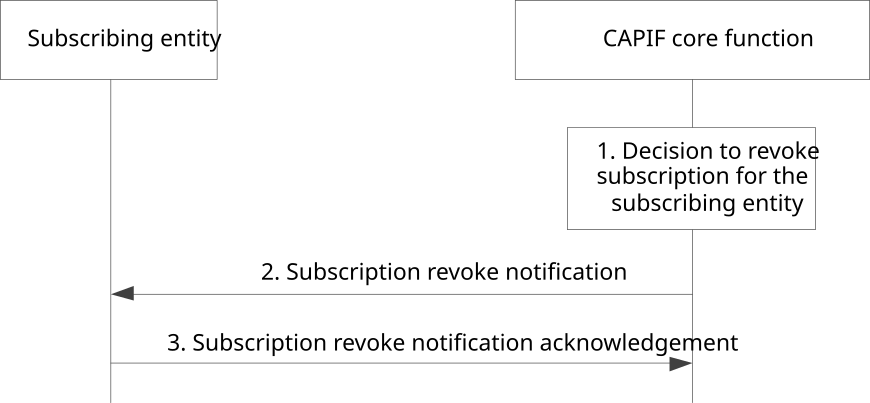

# 8.9 Revoking subscription of the CAPIF events

## 8.9.1 General

The CAPIF core function allows to revoke subscription of CAPIF events for the subscribing entity related to the service API changes, such as availability events of service APIs, change in service API information, monitoring service API invocations, API invoker onboarding events, etc. This procedure is initiated by the CAPIF core function.

NOTE: It is optional to trigger notification by the CAPIF core function for revocation of subscription for CAPIF event(s).

## 8.9.2 Information flows

This subclause describes the information flows for CAPIF event subscription revocation.

### 8.9.2.1 Subscription revoke notification

Table 8.9.2.1-1 describes the information flow for subscription revoke notification from the CAPIF core function to the subscribing entity.

Table 8.9.2.1-1: Subscription revoke notification

|                         |        |                                                                                                                                             |
|-------------------------|--------|---------------------------------------------------------------------------------------------------------------------------------------------|
| Information element     | Status | Description                                                                                                                                 |
| Identity information    | M      | The information to determine the identity of the subscribing entity                                                                         |
| Subscription identifier | M      | The unique identifier for the event subscription that was provided to the subscribing entity during the CAPIF event subscription operation. |
| Reason                  | O      | Indicate the reason of subscription revocation                                                                                              |

### 8.9.2.2 Subscription revoke notification acknowledgement

Table 8.9.2.2-1 describes the information flow for subscription revoke notification acknowledgement from the subscribing entity to the CAPIF core function.

Table 8.9.2.2-1: Subscription revoke notification acknowledgement

|                     |        |                                                    |
|---------------------|--------|----------------------------------------------------|
| Information element | Status | Description                                        |
| Acknowledgement     | M      | The acknowledgement for the received notification. |

## 8.9.3 Procedure

Figure 8.9.3-1 illustrates the procedure for subscription revocation, triggered by the CAPIF core function.

Pre-conditions:

1\. The subscribing entity has previously subscribed to CAPIF event(s) to the CAPIF core function.

Figure 8.9.3-1: Procedure for revoking subscription of the CAPIF events

1\. The CAPIF core function decides to revoke subscription of CAPIF event(s) for the subscribing entity.

2\. The CAPIF core function sends subscription revoke notification to the subscribing entity.

3\. The subscribing entity provides a subscription revoke notification acknowledgement to the CAPIF core function.
