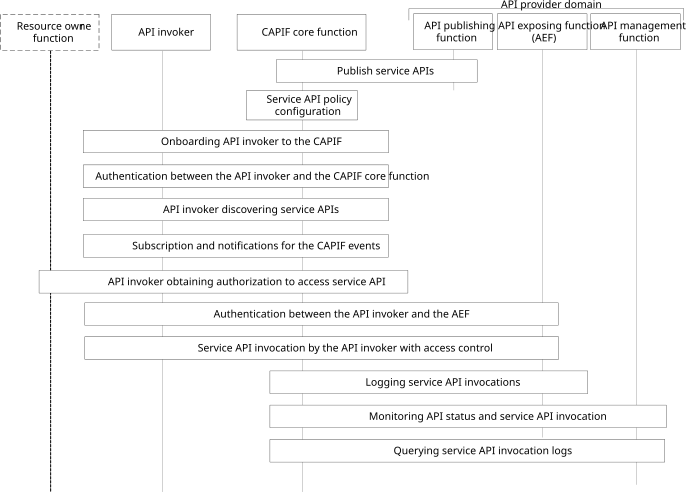

# Annex A (informative): Overview of CAPIF operations

Depicted in figure A-1 is the overview of CAPIF operations. CAPIF operations occur between different actors involving the API invoker, the CAPIF core function, the API exposing function, the API publishing function and the API management function, and optionally the resource owner function for RNAA. High level CAPIF interactions between the actors are shown in figure A-1. This figure is only provided for illustration purposes, and does not represent the order of operations.

Figure A-1: Overview of CAPIF operations

The CAPIF defines the functional entities in subclause 6.3.

The CAPIF defines the reference points between the functional entities in subclause 6.4.

The following operations require the communication between the CAPIF entities:

1\. Publishing service APIs: the API provider utilizes the API publishing function over CAPIF-4 reference point to publish the service APIs on the CAPIF core function, as specified in subclause 8.3 of this specification;

2\. Discovering service APIs: the API invoker discovers the service APIs over CAPIF-1/CAPIF-1e reference points, as specified in subclause 8.7 of this specification;

3\. API event subscription and notification: the API invoker subscribes to and receive service API event notifications over CAPIF-1/CAPIF-1e reference points, as specified in subclause 8.8 of this specification;

4\. Authenticating with CAPIF: the API invoker authenticates itself over CAPIF-1/CAPIF-1e reference points, as specified in subclause 8.10 of this specification;

5\. Authorizing with CAPIF: the API invoker obtains service API authorization over CAPIF-1/CAPIF-1e reference points, as specified in subclause 8.11 of this specification. In RNAA scenarios, API authorization is based on the authorization information obtained from the resource owner, as specified in clause 8.31;

6\. Topology hiding: the API provider, to hide the topology, utilizes the API exposing function over CAPIF-3 reference point, as specified in subclause 8.13 of this specification;

7\. Authenticating the API invoker prior to service API invocation: the API provider, to authenticate the API invoker prior to the service API invocation, utilizes the API exposing function over CAPIF-2/CAPIF-2e and CAPIF-3, as specified in subclause 8.14 of this specification;

8\. Authenticating the API invoker upon the service API invocation: the API provider, to authenticate the API invoker upon invocation of the service APIs, utilizes the API exposing function over CAPIF-2/CAPIF-2e and CAPIF-3, as specified in subclause 8.15 of this specification;

9\. Authorizing API invoker: the API provider, to authorize the API invoker to access the service APIs, utilizes the API exposing function over CAPIF-2/CAPIF-2e and CAPIF-3, as specified in subclause 8.16 of this specification;

10\. Access control: the API provider, to control the access of the service API by the API invoker based on policy or usage limits,

\- utilizes the API exposing function over CAPIF-2/CAPIF-2e and CAPIF-3, as specified in subclause 8.17 of this specification; or

\- in a cascaded deployment, utilizes API exposing functions over CAPIF-2/CAPIF-2e, as specified in subclause 8.18 of this specification;

11\. Logging service: the API provider, to maintain the log of the API invocations at the CAPIF core function for services such as invocation history, utilizes the API exposing function over CAPIF-3, as specified in subclause 8.19 of this specification;

12\. Service monitoring: the API provider, to facilitate monitoring such as API invoker's ID and IP address, utilizes the API management function over CAPIF-5, as specified in subclause 8.21 of this specification; and

13\. Auditing: the API provider, for auditing, utilizes the API management function over CAPIF-5, as specified in subclause 8.22 of this specification.

NOTE: Charging aspects of CAPIF framework, i.e., charging architecture and information flows, are specified in 3GPP TS 32.254 \[20\].
