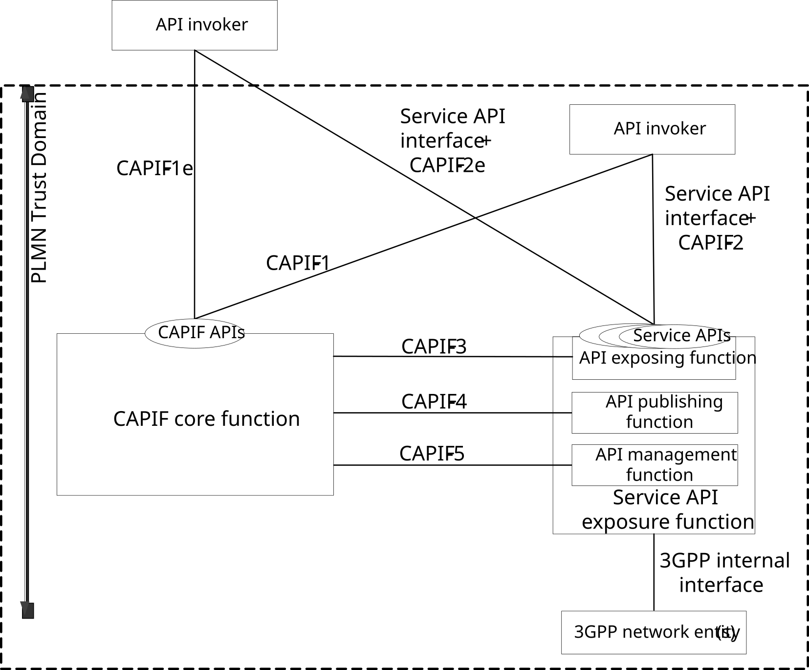
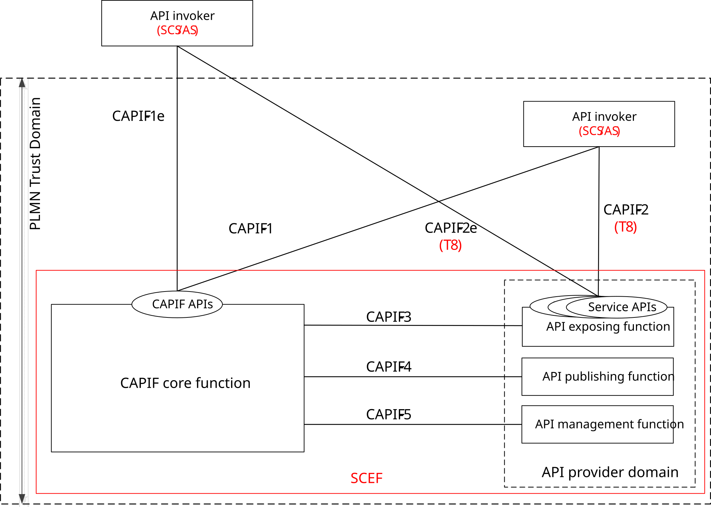
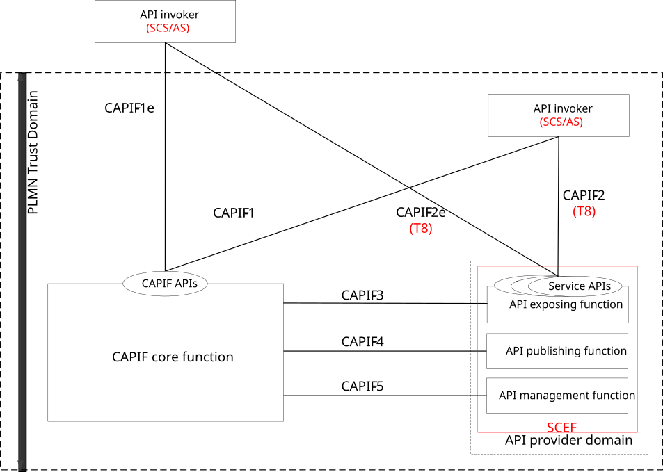
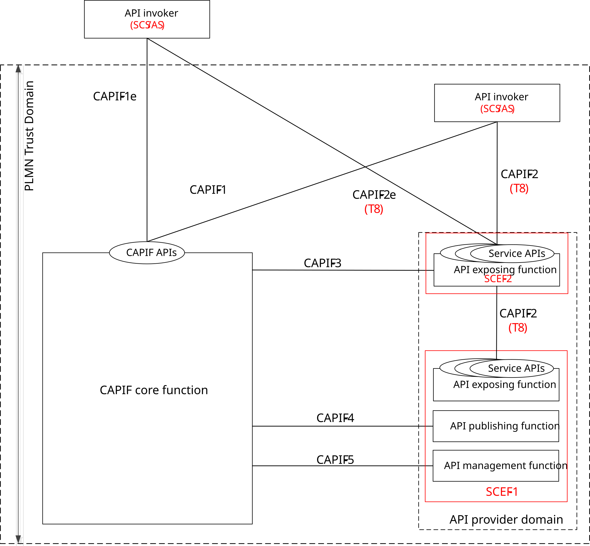
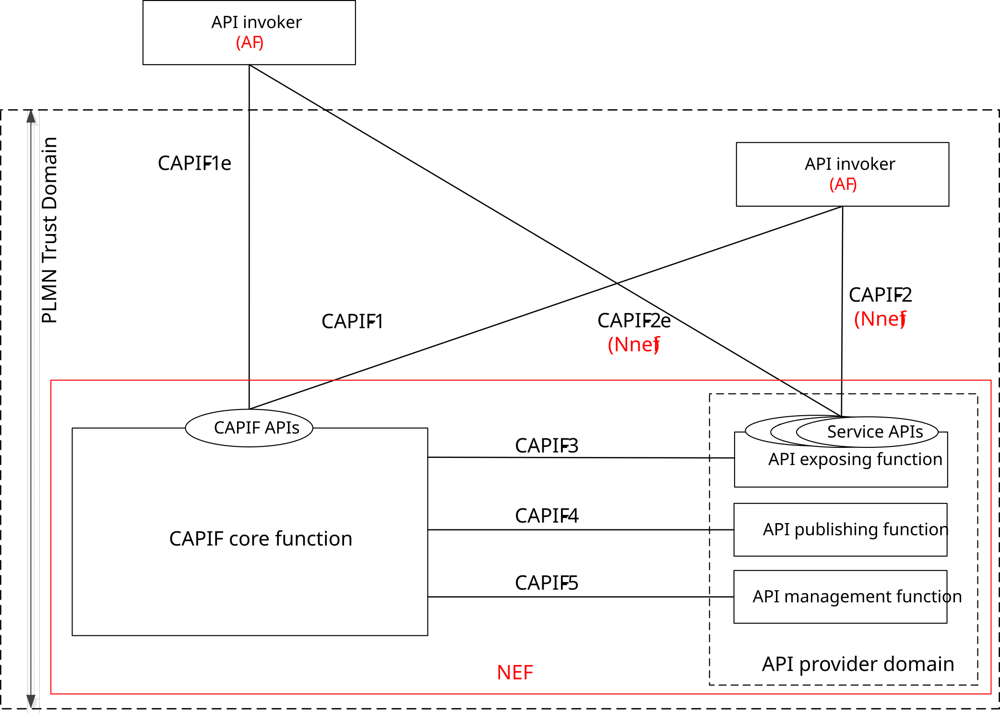
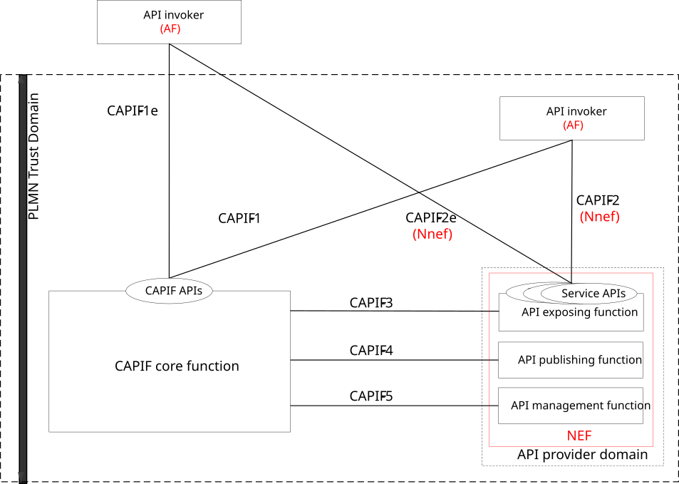
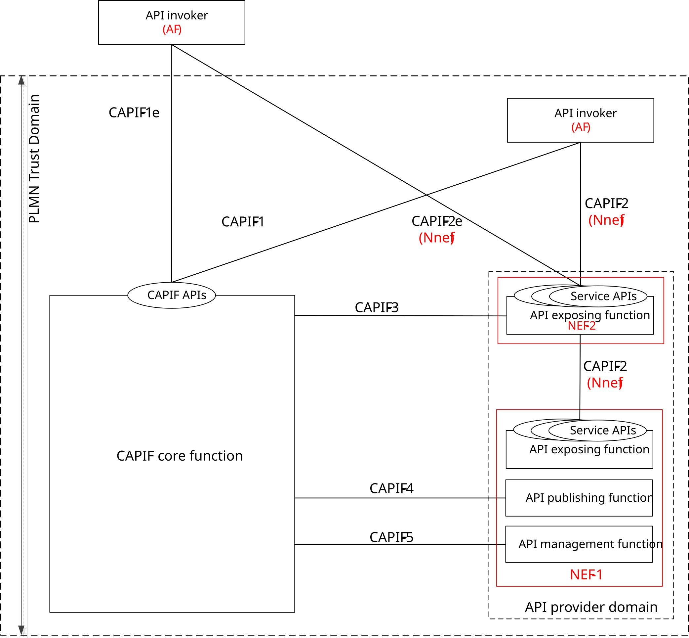
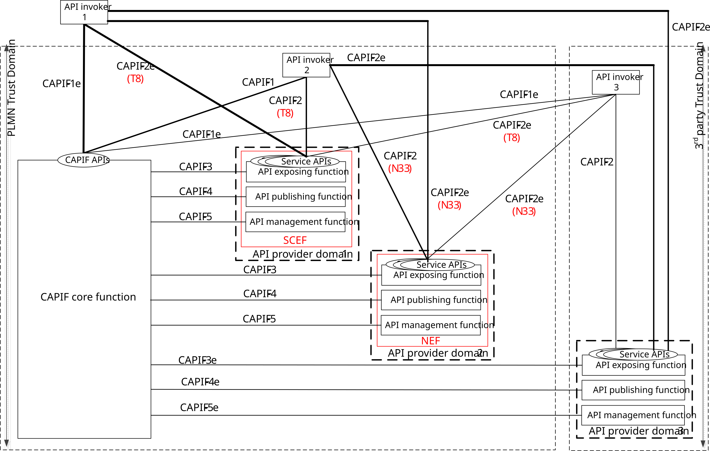
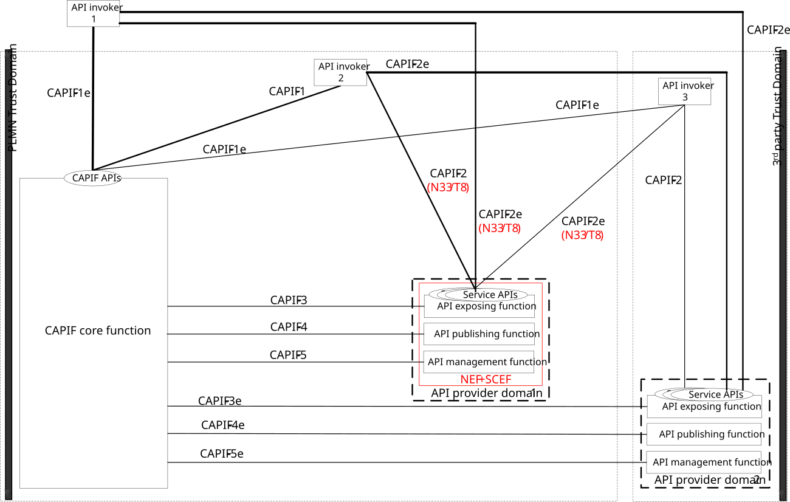

# Annex B (informative): CAPIF relationship with network exposure aspects of 3GPP systems

This annex provides the relationship of CAPIF with network exposure aspects of 3GPP systems. Any system exposing capabilities as service APIs can implement CAPIF. Generic model for CAPIF utilization by service API provider is included. Network exposure aspects of EPS and 5GS are considered for illustration.

NOTE: As there are no impacts on CAPIF's relationship with network exposure aspects of 3GPP systems due to deployment of 3rd party trust domain, it is not illustrated in the figures.

## B.0 CAPIF utilization by service API provider

Figure B.0-1 illustrates the service API interaction with the CAPIF for utilizing framework aspects provided by the CAPIF.

Figure B.0-1: CAPIF utilization by service API provider

The service API aspects of the 3GPP network services and capabilities such as subscriber management, mobility management, transport and other communication services can be exposed for consumption by external 3rd party applications (e.g. API invoker).

Framework aspects typically horizontal in nature caters to common functionality such as onboarding, offboarding, publishing, unpublishing, update service API, discovery, authentication, registration, authorization, logging, monitoring, configuration, topology hiding, that are required to provide service APIs to API invokers. Service APIs can utilize the functions of the API provider domain (i.e. API exposing function, API publishing function, API management function) and interfaces CAPIF-3, CAPIF-4 and CAPIF-5 as specified in this specification.

The service API exposure function is connected to 3GPP network entity(s) via 3GPP internal interface(s). The API publishing function provides the service API information for publishing to the CAPIF core function.

For consuming service API, the API invoker interacts with the service API exposure function via service API interface and CAPIF-2/2e. While the service API interface is responsible for providing service aspects, CAPIF-2/2e supports service API by providing framework aspects such as authentication of the API invoker, authorization verification for the API invoker upon accessing the service API.

## B.1 CAPIF relationship with 3GPP EPS network exposure

### B.1.1 General

The table B.1.1-1 shows the relationship between CAPIF and EPS network exposure aspects. The details of SCEF and its role in exposing network capabilities of EPS to 3rd party applications are specified in 3GPP TS 23.682 \[2\]

Table B.1.1-1: CAPIF relationship with 3GPP EPS network exposure

| Aspects                                                                                                                 | CAPIF                                                              | EPS network exposure           |
|-------------------------------------------------------------------------------------------------------------------------|--------------------------------------------------------------------|--------------------------------|
| Entity providing the APIs to external or 3rd party applications                                              | AEF                                                                | SCEF                           |
| Entity providing framework related services to the applications (discovery, authentication, authorization, etc)         | CAPIF core function                                                | SCEF                           |
| Entity representing the external or 3rd party applications                                                   | API invoker                                                        | SCS/AS                         |
| Entity providing framework related services to support the APIs operation and management (publish, policy enforcements) | CAPIF core function                                                | SCEF                           |
| Interface/Reference point for exposing network capabilities as APIs                                                     | CAPIF-2 and CAPIF-2e (Do not include the service specific aspects) | T8                             |
| Interface/Reference point for exposing framework services as APIs to the applications                                   | CAPIF-1 and CAPIF-1e                                               | Not specified. (May be via T8) |
| Interface/Reference point for framework services to support the APIs operation and management                           | CAPIF-3, CAPIF-4 and CAPIF-5                                       | Internal to SCEF               |

### B.1.2 Deployment models

#### B.1.2.1 General

Based on the relationship captured in table B.1.1-1, the following deployment models for CAPIF are possible to enable EPS network exposure.

NOTE: The deployment models captured in subclause 7 are possible for the SCEF deployment compliant with CAPIF. Not all deployment models are illustrated in this subclause.

#### B.1.2.2 SCEF implements the CAPIF architecture

Figure B.1.2.2-1 illustrates the deployment model where SCEF implements the CAPIF architecture.

Figure B.1.2.2-1: SCEF implements the CAPIF architecture

The SCEF can implement the functionalities of the CAPIF core function, the API exposing function, the API publishing function and the API management function.

According to the CAPIF architecture, CAPIF-2 and CAPIF-2e consist of framework aspects and service specific aspects. The service specific aspects are out of scope of CAPIF. T8 can implement the service specific aspects of CAPIF-2 and CAPIF-2e, and can provide the service APIs exposed by SCEF (AEF) to the SCS/AS (API invoker).

The SCEF can additionally provide CAPIF-1 and CAPIF-1e (CAPIF APIs) to the SCS/AS (API invokers).

#### B.1.2.3 SCEF implements the service specific aspect compliant with the CAPIF architecture

Figure B.1.2.3-1 illustrates the deployment model where SCEF implements the service specific aspect compliant with the CAPIF architecture.

Figure B.1.2.3-1: SCEF implements the service specific aspect compliant with the CAPIF architecture

3GPP EPS can deploy the CAPIF core function along with the SCEF.

The SCEF can implement the functionalities of the API provider domain functions.

According to the CAPIF architecture, CAPIF-2 and CAPIF-2e consist of framework aspects and service specific aspects. The service specific aspects are out of scope of CAPIF. T8 can implement the service specific aspects of CAPIF-2 and CAPIF-2e, and can provide the service APIs exposed by SCEF (AEF) to the SCS/AS (API invoker).

The SCEF can implement the CAPIF-3 reference point/interface to the CAPIF core function.

#### B.1.2.4 Distributed deployment of the SCEF compliant with the CAPIF architecture

Figure B.1.2.4-1 illustrates the distributed deployment model where the SCEF implements the service specific aspect compliant with the CAPIF architecture.

Figure B.1.2.4-1: Distributed deployment of SCEF compliant with the CAPIF architecture

The 3GPP EPS can deploy the CAPIF core function, the SCEF-2 (API exposing function as a gateway) along with the SCEF-1 as illustrated in subclause 7.3.

The SCEF can implement the functionalities of API provider domain functions.

According to the CAPIF architecture, CAPIF-2 or CAPIF-2e consists of framework aspects and service specific aspects. The service specific aspects are out of scope of the CAPIF. T8 can implement the service specific aspects of CAPIF-2 or CAPIF-2e and can provide the service APIs exposed by the SCEF-2 (AEF as a gateway) to the SCS/AS (API invoker).

The SCEF-2 can implement the CAPIF-3 reference point to the CAPIF core function and the SCEF-1 can implement the CAPIF-4 and CAPIF-5 reference points to the CAPIF core function.

## B.2 CAPIF relationship with 3GPP 5GS network exposure

### B.2.1 General

The table B.2.1-1 shows the relationship between CAPIF and 5GS network exposure aspects. The details of NEF and its role in exposing network capabilities of 5GS to 3rd party applications are specified in 3GPP TS 23.501 \[3\] and the details of NEF service operations are specified in 3GPP TS 23.502 \[4\].

Table B.2.1-1: CAPIF relationship with 3GPP 5GS network exposure

| Aspects                                                                                                                 | CAPIF                                                              | 5GS network exposure     |
|-------------------------------------------------------------------------------------------------------------------------|--------------------------------------------------------------------|--------------------------|
| Entity providing the APIs to external or 3rd partyapplications                                               | AEF                                                                | NEF                      |
| Entity providing framework related services to the applications (discovery, authentication, authorization, etc)         | CAPIF core function                                                | NEF (Not specified yet)  |
| Entity representing the external or 3rd party applications                                                   | API invoker                                                        | AF                       |
| Entity providing framework related services to support the APIs operation and management (publish, policy enforcements) | CAPIF core function                                                | NEF (Not specified yet)  |
| Interface/Reference point for exposing network capabilities as APIs                                                     | CAPIF-2 and CAPIF-2e (Do not include the service specific aspects) | Nnef                     |
| Interface/Reference point for exposing framework services as APIs to the applications                                   | CAPIF-1 and CAPIF-1e                                               | Nnef (Not specified yet) |
| Interface/Reference point for framework services to support the APIs operation and management                           | CAPIF-3, CAPIF-4 and CAPIF-5                                       | Internal to NEF          |

### B.2.2 Deployment models

#### B.2.2.1 General

Based on the relationship captured in table B.2.1-1, the following deployment models for CAPIF are possible to enable 5GS network exposure.

NOTE: The deployment models captured in subclause 7 are possible for the NEF deployment compliant with CAPIF. Not all deployment models are illustrated in this subclause.

#### B.2.2.2 NEF implements the CAPIF architecture

Figure B.2.2.2-1 illustrates the deployment model where the NEF implements the CAPIF architecture.

Figure B.2.2.2-1: NEF implements the CAPIF architecture

The NEF can implement the functionalities of the CAPIF core function, the API exposing function, the API publishing function and the API management function.

According to the CAPIF architecture, CAPIF-2 and CAPIF-2e consist of framework aspects and service specific aspects. The service specific aspects are out of scope of CAPIF. Nnef can implement the service specific aspects of CAPIF-2 and CAPIF-2e, and can provide the service APIs exposed by the NEF (AEF) to the AF (API invoker).

The NEF can additionally provide CAPIF-1 and CAPIF-1e (CAPIF APIs) to the AF (API invokers).

#### B.2.2.3 NEF implements the service specific aspect compliant with the CAPIF architecture

Figure B.2.2.3-1 illustrates the deployment model where the NEF implements the service specific aspect compliant with the CAPIF architecture.

Figure B.2.2.3-1: NEF implements the service specific aspect compliant with the CAPIF architecture

3GPP 5GS can deploy the CAPIF core function along with the NEF.

The NEF can implement the functionalities of the API provider domain functions.

According to the CAPIF architecture, CAPIF-2 and CAPIF-2e consist of framework aspects and service specific aspects. The service specific aspects are out of scope of CAPIF. Nnef can implement the service specific aspects of CAPIF-2 and CAPIF-2e, and can provide the service APIs exposed by NEF (AEF) to the AF (API invoker).

The NEF can implement the CAPIF-3 reference point/interface to the CAPIF core function.

#### B.2.2.4 Distributed deployment of the NEF compliant with the CAPIF architecture

Figure B.2.2.4-1 illustrates the distributed deployment model where the NEF implements the service specific aspect compliant with the CAPIF architecture.

Figure B.2.2.4-1: Distributed deployment of NEF compliant with the CAPIF architecture

The 3GPP 5GS can deploy the CAPIF core function, the NEF-2 (API exposing function as a gateway) along with the NEF-1 as illustrated in subclause 7.3.

The NEF can implement the functionalities of API provider domain functions.

According to the CAPIF architecture, CAPIF-2 or CAPIF-2e consists of framework aspects and service specific aspects. The service specific aspects are out of scope of the CAPIF. Nnef can implement the service specific aspects of CAPIF-2 and CAPIF-2 or CAPIF-2e can provide the service APIs exposed by the NEF-2 (AEF as a gateway) to the AF (API invoker).

The NEF-2 (AEF) can implement the CAPIF-3 reference point to the CAPIF core function and the NEF-1 can implement the CAPIF-4 and CAPIF-5 reference points to the CAPIF core function.

## B.3 Integrated deployment of 3GPP network exposure systems with the CAPIF

### B.3.1 General

According to 3GPP TS 23.682 \[2\], when the CAPIF is supported, the SCEF supports the API provider domain functions. According to 3GPP TS 23.501 \[3\], when the CAPIF is supported,the NEF supports the API provider domain functions.

### B.3.2 Deployment model

#### B.3.2.1 General

The SCEF and the NEF may be integrated with a single CAPIF core function to offer their respective service APIs to the API invokers. The following deployment model is possible for integrated deployment of the SCEF and the NEF with the CAPIF core function.

#### B.3.2.2 Integrated deployment of the SCEF and the NEF with the CAPIF

Figure B.3.2.2-1 illustrates integrated deployment of the SCEF and the NEF in different API provider domains with the CAPIF.

Figure B.3.2.2-1: Integrated deployment of the SCEF and the NEF in different API provider domains with the CAPIF

The CAPIF core function, the SCEF and the NEF are deployed in the PLMN trust domain, where the CAPIF core function takes the role of a unified gateway and provides services to different API invokers. The API invokers obtain the T8 and N33 service API information and the corresponding entry point details from the CAPIF core function via CAPIF-1 or CAPIF-1e reference points.

The API invokers can interact independently with the SCEF, the NEF and the 3rd party API exposing functions via CAPIF-2 or CAPIF-2e reference points. In this case, T8 and N33 can be reused to implement the service specific aspects of CAPIF-2 or CAPIF-2e reference points for the corresponding service API interactions of the SCEF and the NEF respectively.

The SCEF and the NEF applies any service API access policy control to the interactions between the API invokers and the T8 and N33 service APIs respectively by communicating with the same CAPIF core function via the CAPIF-3 reference point.

Figure B.3.2.2-2 illustrates integrated deployment of the SCEF + NEF in API provider domain with the CAPIF.

Figure B.3.2.2-2: Integrated deployment of the SCEF+NEF in API provider domain with the CAPIF
