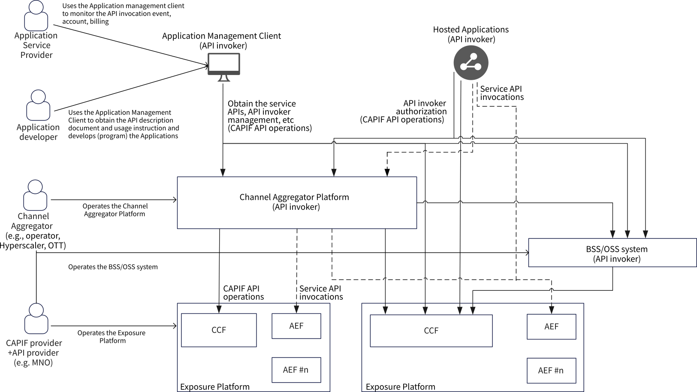

# Annex F (informative): Examples of API invoker roles in CAPIF

The figure F-1 provides examples of API invoker roles in CAPIF and illustrates the usage of CAPIF capabilities.

**Application Management Client:** As specified in clause 3.1, the application developers utilize the CAPIF APIs using an application management client as an API invoker to obtain the service APIs information to implement the application program. Such application programs are hosted on cloud, edge or on a UE.

**BSS/OSS System:** The BSS/OSS system of MNO enables the business relationship with the Application Service Providers (the consumers of the service APIs exposed by the MNO's exposure platform). The BSS/OSS system as an API invoker invoke the CAPIF APIs as per its business logic.

**Channel Aggregator Platform:** As specified in clause 3.1, the Channel Aggregator aggregates the APIs from one or more southbound CAPIF providers with the intention to re-expose such APIs or expose value-added APIs developed using the APIs from the southbound CAPIF providers to the northbound side Application management client or Hosted applications. The Channel Aggregator Platform as API invoker invokes the CAPIF APIs and service APIs as per its business logic.

**Hosted Applications:** As specified in clause 3.1, the hosted applications (which are programmed to utilize the service APIs) as an API invoker invoke the CAPIF APIs and service APIs as per the application business logic.

Figure F-1: Examples of API invoker roles in CAPIF
