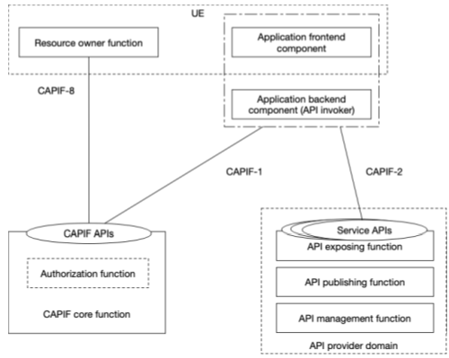

# Annex G (informative): API invoker with a frontend and backend component

In clause 6.3.2 it is highlighted that the API invoker can be either an application on a server or an application on a UE. When considering the UE, the application can comprise of a frontend component on a UE plus a server-side backend component. The motivation for such an arrangement is to address security vulnerabilities associated with issuing access tokens to client-side entities (i.e., an API invoker as an application on a UE), e.g., persistent token theft.

When the API invoker is deployed with a backend component in the network, the backend component is responsible for authentication and authorization procedures towards the CCF Authorization Function. The backend component can proxy service API discovery and invocation requests initiated by the API invoker frontend. This arrangement is depicted in Figure G-1.

Figure G-1: High level functional RNAA architecture for CAPIF supporting an application with a frontend / backend component

NOTE: The information exchanged and the security aspects between the application frontend component and application backend component is not specified in this release of the specification.
