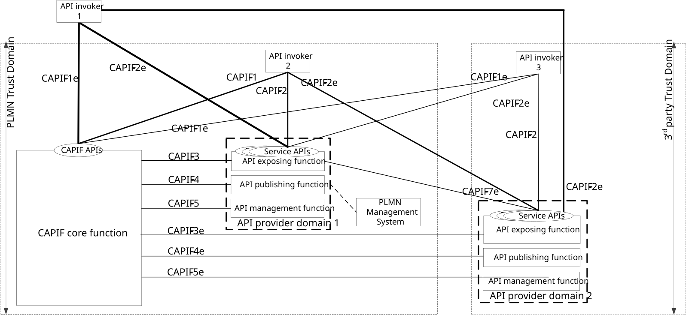

# Annex H (informative): AEF instantiation

As illustrated in figure H-1, CAPIF architecture supports AEFs from multiple API providers (e.g. MNO, 3rd party). The instances of such AEFs are managed by the respective management systems of the API provider (e.g. PLMN management system, 3rd party management system).

The AMF monitors the events reported by the CAPIF core function. These events can be utilized to trigger AEF instantiation by the PLMN management system or 3rd party management system. The AMF can utilize the services of PLMN or 3rd party management systems (e.g. trigger instantiation of corresponding AEFs) via the APIs exposed by the PLMN or 3rd party management systems. It is upto implementation of CAPIF to utilize the services of the PLMN and/or 3rd party management systems for AEF instantiation.

Figure H-1: AEF instantiation
