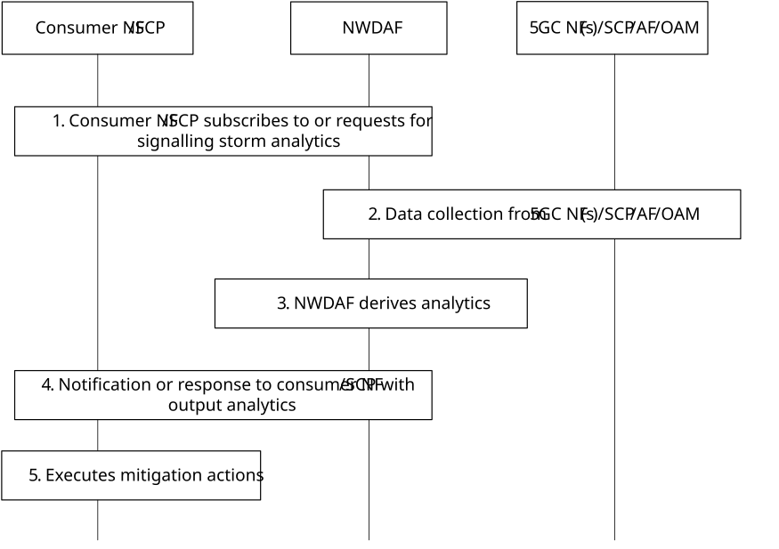

# 6.22.4 Procedures

The NWDAF can provide information on network signalling storm as follows (Figure 6.22.4-1).

Figure 6.22.4-1: Procedure for NWDAF-assisted Network Signalling Storm Mitigation and Prevention

1\. The consumer NF (SCP included) or other entities subscribes to or sends a request to NWDAF for the signalling storm analytics using either Nnwdaf_AnalyticsSubscription_Subscribe or Nnwdaf_AnalyticsInfo_Request service operation. The request additionally includes thresholds such as confidence level and accuracy of detection:

\- The Analytics ID is set to "Signalling Storm" analytics. The target for analytics reporting is set to be any NF/SCP or any UE. Analytic filters may be provided as shown in clause 6.22.1.

\- The consumer NF can request statistics or/and predictions for a given Analytics target period.

\- The consumer NF may also subscribe to "NF load information" analytics as depicted in clause 6.5 and trigger the signalling storm analytics based on output of the NF load analytics, e.g. CPU usage is over 80%.

\- The consumer NF may also subscribe to "Abnormal behaviour" analytics as depicted in clause 6.7.5 and trigger the signalling storm analytics based on the suspicion of DDoS attack.

\- The consumer NF may also subscribe to "Dispersion Analytics" analytics as depicted in clause 6.10 and trigger the signalling storm analytics when the transaction dispersion is above the expected transaction dispersion configurable threshold.

2\. The NWDAF retrieves Input data from NFs, AFs and SCPs, using Nnf_EventExposure_Subscribe, or from NRF using Nnrf_NFManagement_NFStatusSubscribe service operation, such as UE related context data and/or NF context data as depicted in Table 6.22.2-1 and Table 6.22.2-2, NF specific data as depicted in Table 6.22.2-3, application data as depicted in Table 6.22.2-4, and collects input data from OAM and MDAF as depicted in Table 6.22.2-5, Table 6.22.2-6 and Table 6.22.2-7 to derive the required analytics as depicted in clause 6.22.3. The NWDAF may optionally request additional data aligned with the analysis target identified in step 1.

If the NWDAF has subscribed to receive analysis data from MDAF, NWDAF uses the analysis output from MDAF to determine source NFs to retrieve input data for generating signalling storm analytics.

The NWDAF may optionally subscribe the abnormal UE behaviour analytics and UE dispersion analytics as specified in clause 6.7.5 and 6.10.3 as input data from other NWDAFs, using Nnwdaf_AnalyticsSubscription_Subscribe or Nnwdaf_AnalyticsInfo_Request service operation.

3\. The NWDAF derives the required analytics with the collected data described in clause 6.22.2.

4\. The NWDAF invokes Nnwdaf_AnalyticsSubscription_Notify or Nnwdaf_AnalyticsInfo_Request response to the consumer NF/SCP with the output analytics as depicted in Table 6.22.3-1 and/or Table 6.22.3-2 of clause 6.22.3.

5\. Upon receiving the notification of signalling storm analytics, the consumer may execute mitigation actions based on the example mechanisms as depicted in Table 6.22.3-3 of clause 6.22.3.
