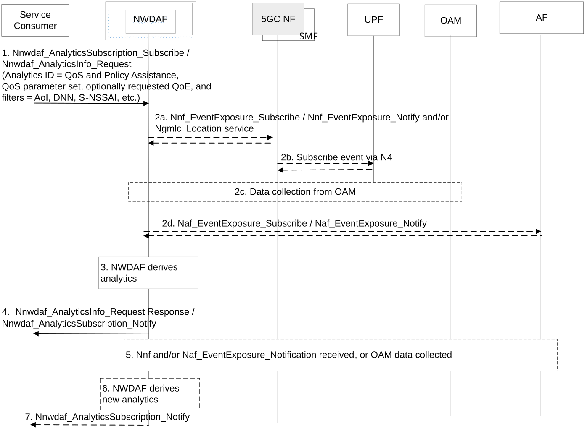

# 6.23 QoS and Policy Assistance Analytics

## 6.23.1 General

Clause 6.23 describes how NWDAF can provide QoS and policy assistance predictions, based on the consumer request. The consumer can either subscribe to analytics notifications (i.e. a Subscribe-Notify model) or request a single notification (i.e. using a Request-Response model).

The service consumer may be a PCF.

The QoS and policy assistance analytics provides predictions of the QoE associated to a set of QoS parameters. When the service consumer needs assistance information to determine QoS or policy, it may send an Nnwdaf_AnalyticsInfo_Request or Nnwdaf_AnalyticsSubscription_Subscribe request to the NWDAF with one or multiple sets of QoS parameters and optionally a requested QoE. The NWDAF provides the candidate set(s) of QoS parameters and the corresponding predicted QoE that can be achieved by applying the candidate QoS parameters set(s).

The candidate QoS parameters set(s) provided by the NWDAF are within the sets of QoS parameters provided by the consumer (i.e. PCF). The NWDAF shall only include the parameter(s) and the corresponding value(s) that are provided by the consumer request (i.e. PCF) in the QoS parameter set(s).

The QoS and policy assistance analytic may be provided for an individual UE or a group of UEs (e.g. the QoE is for the application ID(s) associated to one or more QoS flow(s) of the UE(s)), or for an application (e.g. the QoE is for the service flow(s) of the application ID).

The consumer of these analytics indicates the following information in the request or subscription:

\- Analytics ID = " QoS and Policy Assistance".

\- Target of Analytics Reporting as defined in clause 6.1.3.

\- A list of one or more QoS parameter set(s) and optionally associated QoS parameter set ID(s). Based on the consumer decision (i.e. PCF), each QoS parameter set(s) may include the following individual parameters and non-empty value list(s) for each individual parameter(s):

\- 5QI (standardized or pre-configured); or

\- QoS characteristics attributes (as defined in clause 5.7.3 of TS 23.501 \[2\]): Resource Type, Priority Level, PDB, PER, Averaging Window, Maximum Data Burst Volume.

And optionally for GBR 5QI(s):

\- GBR and MBR.

NOTE 1: In the case of standardised and pre-configured 5QI(s), the specified/configured QoS characteristics (e.g. as defined in Table 5.7.4-1 of TS 23.501 \[2\]) can be pre-configured into NWDAF by operators, subject to operator policy. Therefore, the NWDAF is able to associate the QoS characteristics to the given 5QI in consumer request to derive the predicted QoE.

NOTE 2: QoS characteristics can be included in the QoS parameter set(s) only in the case of dynamically assigned non-standardized 5QI(s).

\- Application ID or Packet Filter set.

\- Optionally, a requested QoE that indicates the NWDAF to only provide the QoS parameter set(s) and their corresponding value(s) for which the predicted QoE is equal to, or higher than, the requested QoE.

\- Analytics Filter Information optionally includes:

\- DNN;

\- Area of Interest (AOI(s));

NOTE 3: A service consumer can use the AOI(s) in order to reduce the amount of signalling that the analytics subscription or request generates.

\- S-NSSAI and NSI ID;

\- List of analytics subsets that are requested (see clause 6.23.3), e.g. parameter(s) in QoS parameter set(s).

\- RAT Type.

\- Frequency.

\- DNAI (for analytics with an edge application server).

\- An Analytics target period indicates the time period over which the analytics are requested.

\- In a subscription, the Notification Correlation Id and the Notification Target Address are included.

\- Optionally, preferred order of results for the list of candidate QoS parameter sets and the predicted QoE associated to each candidate QoS parameter sets:

\- ordering criterion: "QoE" (i.e. QoE that is associated to candidate QoS parameter set) or "usage duration" or "number of usages" of a QoS flow,

\- order: ascending or descending.

\- Optionally, reporting Thresholds, which apply only for subscriptions and indicate conditions on the levels to be reached for the reporting of respective analytics subsets (see clause 6.23.3).

\- Optionally, maximum number of objects and maximum number of SUPIs.

\- Optionally, preferred granularity of location information: TA level or cell level or "longitude and latitude level".

## 6.23.2 Input Data

The NWDAF supporting QoS and policy assistance analytics shall be able to collect information from AF, OAM and 5GC NFs.

The following specified input data might be reused by QoS and policy assistance analytics:

\- The input data defined for Observed Service Experience related network data analytics in clause 6.4.2, e.g. the information of the application, Service Experience and QoE metrics.

\- The input data collected from the OAM for Network Performance analytics as defined in clause 6.6.2, e.g. the RAN status, load and performance per Cell Id for the traffic type of interest and in the Area of Interest.

In addition, more information collected by the NWDAF from relevant 5GC NFs (i.e. UPF, SMF, AMF) is defined in Table 6.23.2-1 and from OAM in Table 6.23.2-2.

NOTE: The NWDAF may also collect the Observed Service Experience Analytics from other NWDAFs, based on NWDAF implementation.

Table 6.23.2-1: Input data from 5GC NF related to QoS and Policy Assistance information

<table>
<colgroup>
<col style="width: 27%" />
<col style="width: 13%" />
<col style="width: 58%" />
</colgroup>
<thead>
<tr class="header">
<th>Information</th>
<th>Source</th>
<th>Description</th>
</tr>
</thead>
<tbody>
<tr class="odd">
<td>QFI allocation, QoS Flow change, or QFI deallocation events (1…max)</td>
<td>SMF</td>
<td>SMF provides such events (see clause 5.2.8.3.1 of TS 23.502 [3]).</td>
</tr>
<tr class="even">
<td>&gt; Used QoS parameter combination</td>
<td>SMF</td>
<td>
The QoS parameter combination that has been applied by the SMF, including the following parameters as defined in Clause 5.7 of TS 23.501 [2]:

- 5G QoS Identifier (5QI);

- and if available:

<blockquote>

- 5G QoS characteristics;

- Guaranteed Flow Bit Rate (GFBR) - UL and DL; and

- Maximum Flow Bit Rate (MFBR) - UL and DL; and

- Maximum Packet Loss Rate - UL and DL.

</blockquote></td>
</tr>
<tr class="odd">
<td>&gt; Traffic descriptor</td>
<td>SMF</td>
<td>One of Application Identifier, IP Packet Filter Set or Ethernet Packet Filter Set</td>
</tr>
<tr class="even">
<td>&gt; S-NSSAI</td>
<td>SMF</td>
<td>Slice used to transport the QoS Flow(s).</td>
</tr>
<tr class="odd">
<td>&gt; DNN</td>
<td>SMF</td>
<td>DNN associated with the QoS Flow(s).</td>
</tr>
<tr class="even">
<td>&gt; DNAI</td>
<td>SMF</td>
<td>Identifies the access to the DN that the PDU Session is connected to.</td>
</tr>
<tr class="odd">
<td>UE identifier</td>
<td>SMF, AMF</td>
<td>The identifier of UE, e.g. SUPI, UE IP address, etc.</td>
</tr>
<tr class="even">
<td>UE Location</td>
<td>AMF</td>
<td>The UE location information, e.g. cell ID or TAI.</td>
</tr>
<tr class="odd">
<td>RAT Type</td>
<td>SMF</td>
<td>RAT Type used for the UE.</td>
</tr>
<tr class="even">
<td>Time stamp</td>
<td>SMF, AMF</td>
<td>The time stamp associated to the collected data.</td>
</tr>
<tr class="odd">
<td>N6 Delay (NOTE 1)</td>
<td>UPF, SMF</td>
<td>The average, maximum and minimum of the observed one way or two ways N6 delay between the UPF and measurement endpoint in the DN, as defined in clause 5.8.2.23 of TS 23.501 [2].</td>
</tr>
<tr class="even">
<td>Additional User Application Metrics (NOTE 2, NOTE 3)</td>
<td>UPF</td>
<td>
The following metrics for an application (identified by an Application ID and/or Packet Filter set) can be determined from the information reported by UPF:

- Start time, i.e. the start time of the application;

- Stop time, i.e. the stop time of the application;

- Packet delay, i.e. average, maximum, minimum of the packet delay measurement for UL/DL/round trip between UE and the PSA_UPF;

- Active time period of the application, i.e. the duration interval time during which the application has traffic data

- Bit Rate during active time period, i.e. the average bit rate of UL and DL data during the active time period of the application;

- Bit Rate, i.e. the average and peak bit rate of UL and DL data of the application;

- Volume, i.e. the UL, DL and/or overall measured data volume;

- Number of Packets, i.e. the total number of packets exchanged for UL, DL and/or overall data volume;

- Number of lost Packets, i.e. the number of lost packets for UL, DL and/or overall data volume.
</td>
</tr>
<tr class="odd">
<td colspan="3">
NOTE 1: Whether N6 delay (independent of QoS Flow) is considered to derive the analytics in comparison to delay between UE and UPF (dependent on the QoS Flow) is left to implementation based on the operator's policy. The NWDAF obtains N6 delay measurement either from UPF based on implementation or from SMF based on clause 5.2.8.3.1 of TS 23.502 [3] in this Release.

NOTE 2: The Number of lost Packets is applicable to the TCP traffic for which the UPF is able to provide the information.

NOTE 3: For the Additional User Application metrics, these UPF events need to be subscribed: QoS Monitoring, User Data Usage Measures and User Data Usage Trends Events. See clause 4.15.4.5 of TS 23.502 [3] for the detailed description and procedures for how the UPF event exposure service (clause 5.2.26.2 of TS 23.502 [3]) is used for UPF data collection. As described in clause 4.15.4.5 of TS 23.502 [3], specific PCC rules to the SMF for the application are needed to enable the QoS monitoring for an application.
</td>
</tr>
</tbody>
</table>

For the analysis of a QoE that must meet the provided Packet Delay Budget, the following input is collected to enable the latency analysis between UE and PSA UPF.

Table 6.23.2-2: Input data from OAM related to Packet Delay between UE and Anchor UPF

| Information            | Source | Description                                                                                                                    |
|------------------------|--------|--------------------------------------------------------------------------------------------------------------------------------|
| UL/DL GTP packet delay | OAM    | Average UL/DL packet delay measurement on N3 between NG-RAN and PSA UPF, as defined in clause 5.4.7 of TS 28.552 \[8\].        |
| Delay in RAN           | OAM    | Average Uplink and Downlink packet transmission delay over the air interface, as defined in clause 5.1.1.1 of TS 28.552 \[8\]. |

## 6.23.3 Output Analytics

The NWDAF shall be able to provide predictions on QoS and Policy Assistance to consumer NFs, i.e. PCF, as defined in Table 6.23.3-1.

Table 6.23.3-1: QoS and Policy Assistance predictions

<table>
<colgroup>
<col style="width: 39%" />
<col style="width: 60%" />
</colgroup>
<thead>
<tr class="header">
<th>Information</th>
<th>Description</th>
</tr>
</thead>
<tbody>
<tr class="odd">
<td>Time slot entry (1..max)</td>
<td>List of time slots during the Analytics target period.</td>
</tr>
<tr class="even">
<td>&gt; Time slot start</td>
<td>Time slot start within the Analytics target period.</td>
</tr>
<tr class="odd">
<td>&gt; Duration</td>
<td>Duration of the time slot.</td>
</tr>
<tr class="even">
<td>&gt; QoS and Policy Assistance information (1…max) (NOTE 6)</td>
<td>List of QoS and Policy Assistance information.</td>
</tr>
<tr class="odd">
<td>&gt;&gt; QoS parameter set identifier</td>
<td>Identifies the QoS parameter set for which the entry applies to.</td>
</tr>
<tr class="even">
<td>&gt;&gt; SDF template (i.e. Application ID or Packet Filter Set)</td>
<td>Identifies the service data flow for which the predicted QoE and the candidate QoS parameter set are provided.</td>
</tr>
<tr class="odd">
<td>&gt;&gt; Duration for the Application</td>
<td>Active time period for the traffic of corresponding application.</td>
</tr>
<tr class="even">
<td>&gt;&gt; Predicted QoE</td>
<td>The predicted QoE of the application when the corresponding QoS parameter set is applied, e.g. average, variance, maximum, minimum of QoE.</td>
</tr>
<tr class="odd">
<td>&gt;&gt; QoS parameter values (NOTE 1, NOTE 4)</td>
<td>The parameters in the QoS parameter set and their corresponding values associated to the predicted QoE.</td>
</tr>
<tr class="even">
<td>&gt;&gt;&gt; 5QI</td>
<td>The reference to 5G QoS characteristics and QoS parameters.</td>
</tr>
<tr class="odd">
<td>&gt;&gt;&gt; QoS characteristics attributes</td>
<td></td>
</tr>
<tr class="even">
<td>&gt;&gt;&gt;&gt; Priority level</td>
<td>The Priority Level associated with 5G QoS characteristics, as defined in clause 5.7.3.3 of TS 23.501 [2].</td>
</tr>
<tr class="odd">
<td>&gt;&gt;&gt;&gt; Resource type</td>
<td>The resource type of the corresponding QoS flow, e.g. GBR QoS flow, non-GBR QoS flow, delay-critical GBR QoS flow.</td>
</tr>
<tr class="even">
<td>&gt;&gt;&gt;&gt; Packet Delay Budget</td>
<td>Packet Delay Budget (PDB) indicates the upper bound for the time that a packet may be delayed between the UE and the N6 termination point at the UPF, as defined in TS 23.501 [2].</td>
</tr>
<tr class="odd">
<td>&gt;&gt;&gt;&gt; Packet Error Rate</td>
<td>Packet Error Rate (PER) defines an upper bound for a rate of non-congestion related packet losses, as defined in TS 23.501 [2].</td>
</tr>
<tr class="even">
<td>&gt;&gt;&gt;&gt; Averaging Window (NOTE 2)</td>
<td>Represents the duration over which the guaranteed and maximum bitrate shall be calculated.</td>
</tr>
<tr class="odd">
<td>&gt;&gt;&gt;&gt; Maximum Data Burst Volume (NOTE 3)</td>
<td>The MDBV denotes the largest amount of data that the 5G-AN is required to serve within a period of 5G-AN PDB, as defined in TS 23.501 [2].</td>
</tr>
<tr class="even">
<td>&gt;&gt;&gt; Bit Rates (NOTE 2)</td>
<td>The bit rates are only applied to GBR QoS flow identified by the SDF template.</td>
</tr>
<tr class="odd">
<td>&gt;&gt;&gt;&gt; GBR</td>
<td>Guaranteed Bit Rate (GBR) for UL and/or DL.</td>
</tr>
<tr class="even">
<td>&gt;&gt;&gt;&gt; MBR</td>
<td>Maximum Bit Rate (MBR) for UL and/or DL.</td>
</tr>
<tr class="odd">
<td>&gt;&gt; Applicable time window of the QoS and Policy Assistance information</td>
<td>The applicable time window of the QoS and Policy Assistance information within the validity period.</td>
</tr>
<tr class="even">
<td>&gt;&gt; RAT Type</td>
<td>Indicating the list of RAT type(s) for which the QoS and Policy Assistance Information applies.</td>
</tr>
<tr class="odd">
<td>&gt;&gt; Frequency</td>
<td>Indicating the list of carrier frequency value(s) for which the QoS and Policy Assistance Information applies.</td>
</tr>
<tr class="even">
<td>&gt;&gt; Validity period</td>
<td>The validity period within the time slot for the QoS and Policy Assistance information analytics as defined in clause 6.1.3.</td>
</tr>
<tr class="odd">
<td>&gt;&gt; Spatial validity</td>
<td>Area where the QoS and Policy Assistance information analytics applies.</td>
</tr>
<tr class="even">
<td>&gt;&gt; Usage Duration information (NOTE 1, NOTE 5)</td>
<td>Maximum/Minimum/Average usage duration of the QoS Flows associated to candidate QoS parameter set.</td>
</tr>
<tr class="odd">
<td>&gt;&gt; Number of usage (NOTE 1, NOTE 5)</td>
<td>The number of times that the QoS Flows associated to candidate QoS parameter set to be used.</td>
</tr>
<tr class="even">
<td>&gt;&gt; Confidence</td>
<td>Confidence of this prediction.</td>
</tr>
<tr class="odd">
<td colspan="2">
NOTE 1: Analytics subset that can be used in "list of analytics subsets that are requested" and "Reporting Thresholds".

NOTE 2: The output analytics only applies to GBR QoS Flow identified by the SDF template.

NOTE 3: The output analytics only applies to Delay-critical GBR QoS Flow identified by the SDF template.

NOTE 4: The parameters that have more than one candidate values provided by the consumer shall be included in the NWDAF output and only the values provided by the consumer are allowed. The parameters with just one value provided by the consumer will be returned depending on the list of analytics subsets that are requested.

NOTE 5: This parameter is included in analytics output if the Target of Analytics Reporting is a specific UE or Analytics Filter contains specific Application ID. It is determined by NWDAF using the SMF QFI allocation and deallocation events. For example, the duration equals to the timestamps difference between the QoS Flow change(s) (e.g. QFI allocation, change, and deallocation); the usage number counts the number of times the application traffic is allocated to the QoS Flow.

NOTE 6: The QoS and Policy Assistance information is reported for the entire QoS parameter set (together with QoS parameter set identifier) if only one parameter value has been provided for each parameter in the set. Otherwise, the QoS and Policy Assistance information for each combination of different parameter values are provided.
</td>
</tr>
</tbody>
</table>

## 6.23.4 Procedures

Figure 6.23.4 shows the procedure for deriving and providing the QoS and Policy Assistance analytics to a consumer 5GC NF (i.e. PCF).

Figure 6.23.4-1: Procedure for QoS and Policy Assistance Analytics

1\. The Consumer NF, i.e. PCF, requests or subscribes to QoS and Policy Assistance analytics from NWDAF and provides the request input information as specified in clause 6.23.1 to NWDAF.

2a. The NWDAF may subscribe to the service data from 5GC NFs, e.g. AMF, SMF, UPF, etc. as defined in clause 6.23.2 by invoking the corresponding NF event exposure service operations, e.g. using Namf_EventExposure_Subscribe service operation for collecting UE location(s); using Nsmf_EventExposure_Subscribe service operation (Event ID, parameters in QoS parameter set, SUPI(s) or Application ID) for collecting the data related to QoS parameter set, etc. as defined in TS 23.502 \[3\]

If the required UE location information is finer granularity than TA/cell level, then NWDAF collects the location data from GMLC instead of AMF by invoking the Ngmlc_Location service as defined in TS 23.273 \[39\] and TS 29.515 \[48\].

2b. For average UL/DL packet delay analysis between UE and PSA_UPF, the SMF subscribes to QoS Monitoring information from UPF using the N4 Session level Reporting procedure defined in TS 23.502 \[3\]. The UPF notifies the subscribed event report directly to the NWDAF.

2c. The NWDAF may collect data from the OAM following the procedure captured in clause 6.2.3.2.

2d. The NWDAF may subscribe to the service data from AF as defined in Table 6.4.2-1 by invoking Nnef_EventExposure_Subscribe or Naf_EventExposure_Subscribe service (Event ID = QoS and Policy Assistance, Application ID, Event Filter information, Target of Event Reporting = UE ID(s)) as defined in TS 23.502 \[3\].

3\. The NWDAF derives the requested analytics on QoS and Policy Assistance based on NWDAF internal logic and based on operator policies, e.g. the NWDAF derives the analytics directly based on the input data defined in clause 6.23.2 or the NWDAF may derive the analytics by consuming the output analytics of Observed Service Experience analytics and the input parameters in Table 6.23.2-1.

NOTE: When requested by the NF consumer (i.e. PCF), the NWDAF may also collect data from OAM as described in clause 6.6.4 and clause 6.9.4 for the purpose of deriving NW performance and QoS sustainability information associated to the QoS parameters set(s).

4\. The NWDAF provides the requested QoS and Policy Assistance to the consumer NF, using either Nnwdaf_AnalyticsInfo_Request response or Nnwdaf_AnalyticsSubscription_Notify, depending on the service operation used in step 1.

5-7. If the consumer NF subscribes to QoS and Policy Assistance Analytics in step 1, once the NWDAF generates new analytics on QoS and Policy Assistance, it provides the new analytics via Nnwdaf_AnalyticsSubscription_Notify to the Consumer NF.
