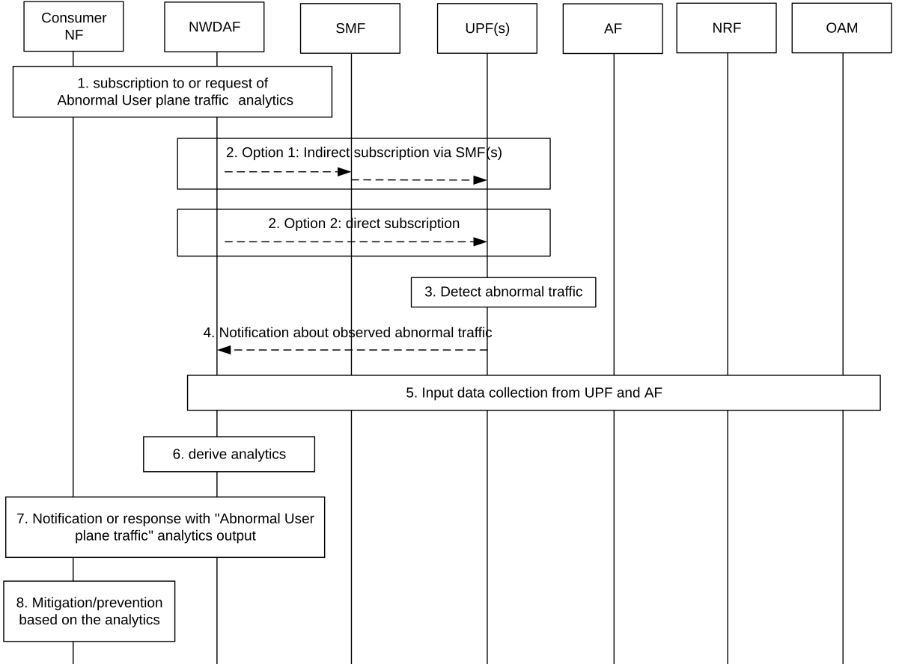
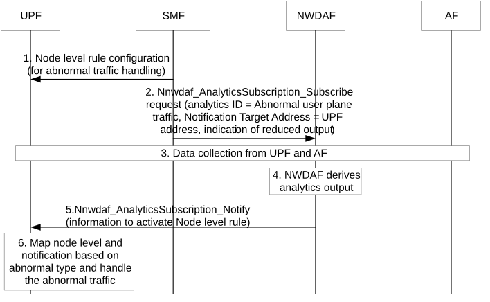

# 6.24 Abnormal User Plane Traffic Analytics

## 6.24.1 General

Clause 6.24 describes how NWDAF can provide statistics and predictions of Abnormal User Plane Traffic Analytics, based on the consumer request. The consumer can either subscribe to analytics notifications (i.e. a Subscribe-Notify model) or request a single notification (i.e. using a Request-Response model).

The analytics consumer may be SMF, PCF, AF or UPF.

NOTE 1: OAM can be the analytics consumer.

The Abnormal User Plane Traffic Analytics provides statistics and predictions of the Abnormal User Plane Traffic as described in clause 6.24.3.

The analytics consumer may indicate the following information in the request or subscription:

\- Analytics ID = "Abnormal User Plane Traffic ".

\- Target of Analytics Reporting, a list of UEs, a group of UEs, any UE.

\- An abnormal traffic pattern type(s), which identifies the abnormal traffic pattern(s) to be analyzed, e.g. malformed packets, duplicate packets, fragmented packets, DDoS, etc.).

NOTE 2: In addition to standardized abnormal traffic type(s), operator specific abnormal traffic type(s) can be configured at NWDAF and the NF consumer and the NFs involved for data collection.

\- Analytics Filter Information optionally includes:

\- DNN;

\- S-NSSAI;

\- Area of Interest (AOI(s));

\- UE IP addresses;

\- UPF IDs;

\- Network instance(s), e.g. in the case of separate IP domains; (See clause 5.6.12 of TS 23.501 \[2\]).

\- Application ID(s);

\- Packet Filter Set;

\- List of analytics subsets that are requested, (see clause 6.24.3).

\- An Analytics target period indicates the time period over which the analytics are requested.

\- In a subscription, the Notification Correlation Id and the Notification Target Address are included.

\- Only for subscriptions: Reporting thresholds for analytics subset(s) (see NOTE 1 in clause 6.24.3), to indicate that analytics are to be provided only when any of the threshold(s) is exceeded.

\- Maximum number of objects, e.g. number of traffic flows, UPFs, UEs, etc.

\- For a UPF as consumer: Reduced output request, to indicate that only parameters marked as applicable for the UPF as consumer in Table 6.24.3-1 are to be reported.

## 6.24.2 Input Data

The NWDAF supporting Abnormal User Plane Traffic Analytics collects information as listed in Table 6.24.2-1 from UPF or AF.

Table 6.24.2-1: Input data from 5GC NF related to Abnormal User Plane Traffic information

<table>
<colgroup>
<col style="width: 31%" />
<col style="width: 17%" />
<col style="width: 50%" />
</colgroup>
<thead>
<tr class="header">
<th>Information</th>
<th>Source</th>
<th>Description</th>
</tr>
</thead>
<tbody>
<tr class="odd">
<td>Application ID</td>
<td>UPF / AF</td>
<td>Identifies the application service provider of the traffic flow.</td>
</tr>
<tr class="even">
<td>Traffic pattern ID</td>
<td>UPF</td>
<td>
Indentifer indicating a potential type of the abnormal traffic pattern configured in the UPF, e.g. malformed packets, duplicate packets, fragmented packets, DDoS, etc.

These are operator specific abnormal traffic pattern IDs. Details are subject to stage 3.
</td>
</tr>
<tr class="odd">
<td>Traffic pattern incident rate</td>
<td>UPF</td>
<td>The occurrence count (e.g. packet number for DDoS) of the traffic patterns observed per time unit (e.g. per minute).</td>
</tr>
<tr class="even">
<td>UL data rate</td>
<td>UPF / AF</td>
<td>The uplink data rate of traffic flows in which traffic patterns are observed</td>
</tr>
<tr class="odd">
<td>DL data rate</td>
<td>UPF / AF</td>
<td>The uplink data rate of traffic flows in which traffic patterns are observed</td>
</tr>
<tr class="even">
<td>UPF load</td>
<td>UPF</td>
<td>The load information of the UPF during the target time window.</td>
</tr>
<tr class="odd">
<td>Parameters of individual traffic flow</td>
<td>UPF</td>
<td>The information/parameters related to the characteristics of the associated traffic flow.</td>
</tr>
<tr class="even">
<td>&gt; Packet filter</td>
<td></td>
<td>The packet filter of the traffic flow, described by the n-tuple (e.g. Source/ destination IP address, Source/Destination port, and protocol, etc.) and the direction (i.e. UL, DL, or Bidirectional).</td>
</tr>
<tr class="odd">
<td>&gt; Protocol header strings (NOTE 2)</td>
<td></td>
<td>String values of control signalling (e.g. SNI, HTTP URL, HTTP User-agent, DNS query names) extracted to identify abnormal application behaviour.</td>
</tr>
<tr class="even">
<td>&gt; Fingerprints (NOTE 2)</td>
<td></td>
<td>
Byte sequences or metadata fingerprints (e.g. TLS/SSL handshake metadata) derived from the traffic flow to identify unknown malicious patterns.

In case IETF RFC 9849 [57], TLS handshake metadata might not be possible to be retrieved and exposed by UPF
</td>
</tr>
<tr class="odd">
<td>&gt; Packet segments (NOTE 2)</td>
<td></td>
<td>
Segments of packets (e.g. the first N bytes) associa.ted with the detected anomaly, used for the purpose of analysing malformed or unrecognizable protocols.

When UPF itself detects the anomalies exposing this information towards the consumer may be uncenssary (e.g. too much signalling).
</td>
</tr>
<tr class="even">
<td>Parameters of typical application traffic</td>
<td>AF</td>
<td>Traffic characteristics of normal traffic from external server/AF.</td>
</tr>
<tr class="odd">
<td>&gt; Traffic characteristic parameters (NOTE 1)</td>
<td></td>
<td>The traffic characteristic parameters of the traffic flow that may include traffic patterns, traffic volume, traffic rate, tolerated packet delay, tolerated loss rate, throughput, etc. within the measurement period.</td>
</tr>
<tr class="even">
<td>&gt; Application protocol Type</td>
<td></td>
<td>The protocol type of the corresponding traffic flow, e.g. TCP, UDP, QUIC, SCTP, etc.), etc.</td>
</tr>
<tr class="odd">
<td>&gt; Protocol header strings</td>
<td></td>
<td>String values of control signalling (e.g. SNI, HTTP URL, HTTP User-agent, DNS query names) extracted to identify typical application behaviour.</td>
</tr>
<tr class="even">
<td>&gt; Fingerprints</td>
<td></td>
<td>Byte sequences or metadata fingerprints (e.g. TLS/SSL handshake metadata) derived from the traffic flow to identify typical patterns.</td>
</tr>
<tr class="odd">
<td>&gt; Packet segments</td>
<td></td>
<td>Segments of packets (e.g. the first N bytes) associated with the typical application traffic.</td>
</tr>
<tr class="even">
<td>&gt; Range of AF address</td>
<td></td>
<td>The address range of the AS which have communicated with the UPF before, e.g. the AS address and the ratio of this address.</td>
</tr>
<tr class="odd">
<td>&gt; Supported concurrent number of UEs communicating with the AF</td>
<td></td>
<td>The maximum/average/minimum number of UE communicating with the same AS in a time window.</td>
</tr>
<tr class="even">
<td>Time window / stamp(s)</td>
<td>UPF/ AF</td>
<td>The time information associated to the measured data, e.g. a time stamp or start time and end time.</td>
</tr>
<tr class="odd">
<td colspan="3">
NOTE 1: The traffic characteristics parameters are for normal traffic, used to train a traffic classifier. The traffic characteristics of normal traffic can be used by the NWDAF to determine whether the input traffic is abnormal traffic by comparing the characteristics of input traffic (from UPF) with the characteristics of normal traffic (from AF). Alternatively, this might be configured by the operator (e.g. in NWDAF).

NOTE 2: This parameter can be requested and is collected per traffic flow. If a maximum number of sample traffic flows per reporting interval is provided in the subscription, the parameter is only collected at most for the indicated number of traffic flows. Otherwise, if a packet filter set is a provided in the subscription, the parameter is collected for every flow matching the packet filter set.
</td>
</tr>
</tbody>
</table>

The UPF only notifies the NWDAF when abnormal traffic exceeds the thresholds if provided by the NWDAF in the related event subscription. The following thresholds can be provided by the NWDAF: Incident rate of traffic pattern, incident rate increase, uplink/downlink traffic data rate of traffic, uplink/downlink traffic data rate increase of traffic.

## 6.24.3 Output Analytics

The NWDAF shall be able to provide the statistics and predictions on Abnormal User Plane Traffic Analytics to consumer NF, e.g. SMF, PCF, AF, UPF, as defined in Table 6.24.3-1 and Table 6.24.3-2.

Table 6.24.3-1: Abnormal User Plane Traffic statistics

<table>
<colgroup>
<col style="width: 27%" />
<col style="width: 72%" />
</colgroup>
<thead>
<tr class="header">
<th>Information</th>
<th>Description</th>
</tr>
</thead>
<tbody>
<tr class="odd">
<td>Abnormal Traffic Description (1…max) (NOTE 1)</td>
<td>
Statistics of a list of Abnormal User Plane Traffic information.

Max. is the number of abnormal traffic types.
</td>
</tr>
<tr class="even">
<td>&gt; Packet filter Set (NOTE 2)</td>
<td>One or more (UL and/or DL) packet filters describing the abnormal traffic. For example, Source/destination IP address and port, etc.</td>
</tr>
<tr class="odd">
<td>&gt; Abnormal traffic type (NOTE 2)</td>
<td>Type of the detected anomaly: malformed packets, duplicate packets, fragmented packets, DDoS, or operator specific values.</td>
</tr>
<tr class="even">
<td>&gt; Traffic parameters of the abnormal traffic (NOTE 1)</td>
<td>The parameters/ characteristics of abnormal traffic flow, e.g. UL and/or DL volume, data rate, incident rate, or burst size of abnormal traffic.</td>
</tr>
<tr class="odd">
<td>&gt; Severity (NOTE 1)</td>
<td>Indicates the relative severity level of the detected abnormality.</td>
</tr>
<tr class="even">
<td>&gt; UPF ID</td>
<td>Identifies the UPF(s) that is affected by the abnormal traffic flow.</td>
</tr>
<tr class="odd">
<td>&gt; UE IP address(es)</td>
<td>Identifies the UE(s) and/or PDU Session(s) that are affected by the abnormal user plane traffic flow.</td>
</tr>
<tr class="even">
<td>&gt; Application info (1...max)</td>
<td></td>
</tr>
<tr class="odd">
<td>
 &gt;&gt; Application ID(s)

(NOTE 2)
</td>
<td>Application ID(s) associated to the abnormal traffic.</td>
</tr>
<tr class="even">
<td>&gt;&gt; Application protocol</td>
<td>The application protocol (TCP, UDP, etc.) of the application.</td>
</tr>
<tr class="odd">
<td colspan="2">
NOTE 1: Analytics subset that can be used in "list of analytics subsets that are requested" and "Reporting Thresholds".

NOTE 2: When UPF is the consumer, only those parameters are provided by NWDAF. For the UPF as consumer, the Time information starts with the time of reporting.
</td>
</tr>
</tbody>
</table>

Table 6.24.3-2: Abnormal User Plane Traffic prediction

<table>
<colgroup>
<col style="width: 27%" />
<col style="width: 72%" />
</colgroup>
<thead>
<tr class="header">
<th>Information</th>
<th>Description</th>
</tr>
</thead>
<tbody>
<tr class="odd">
<td>Abnormal Traffic Description (1…max) (NOTE 1)</td>
<td>
Predictions of a list of Abnormal User Plane Traffic information.

Max. is the number of abnormal traffic types.
</td>
</tr>
<tr class="even">
<td>&gt; Packet filter Set (NOTE 2)</td>
<td>One or more (UL and/or DL) packet filters describing the abnormal traffic. For example, Source/destination IP address and port, etc.</td>
</tr>
<tr class="odd">
<td>&gt; Abnormal traffic type (NOTE 2)</td>
<td>Type of the detected anomaly: malformed packets, duplicate packets, fragmented packets, DDoS, or operator specific values.</td>
</tr>
<tr class="even">
<td>&gt; Traffic parameters of the abnormal traffic (NOTE 1)</td>
<td>The parameters/ characteristics of abnormal traffic flow, e.g. UL and/or DL volume, data rate, incident rate, or burst size of abnormal traffic.</td>
</tr>
<tr class="odd">
<td>&gt; Severity (NOTE 1)</td>
<td>Indicates the relative severity level of the predicted abnormality.</td>
</tr>
<tr class="even">
<td>&gt; UPF ID</td>
<td>Identifies the UPF(s) that is affected by the abnormal traffic flow.</td>
</tr>
<tr class="odd">
<td>&gt; UE IP address(es)</td>
<td>Identifies the UE(s) and/or PDU Session(s) that are affected by the abnormal user plane traffic flow.</td>
</tr>
<tr class="even">
<td>&gt; Application info (1...max)</td>
<td></td>
</tr>
<tr class="odd">
<td>
 &gt;&gt; Application ID(s)

(NOTE 2)
</td>
<td>Application ID(s) associated to the abnormal traffic.</td>
</tr>
<tr class="even">
<td>&gt;&gt; Application protocol</td>
<td>The application protocol (TCP, UDP, etc.) of the application.</td>
</tr>
<tr class="odd">
<td>&gt; Time information</td>
<td>The time information associated to the abnormal traffic, e.g. start and stop timestamp, duration.</td>
</tr>
<tr class="even">
<td>&gt; Confidence</td>
<td>Confidence of this prediction.</td>
</tr>
<tr class="odd">
<td colspan="2">
NOTE 1: Analytics subset that can be used in "list of analytics subsets that are requested" and "Reporting Thresholds".

NOTE 2: When UPF is the consumer, only those parameters are provided by NWDAF.For the UPF as consumer, the Time information starts with the time of reporting.
</td>
</tr>
</tbody>
</table>

## 6.24.4 Procedures

### 6.24.4.1 Procedure applicable for all consumers except for the UPF

The NWDAF can provide information on Abnormal User Plane Traffic as follows (Figure 6.24.4.1-1).

Figure 6.24.4.1-1: Procedure for NWDAF-assisted Abnormal User Plane Traffic Mitigation and Prevention

1\. The consumer NF subscribes to or sends a request to NWDAF for the Abnormal User Plane Traffic analytics using either Nnwdaf_AnalyticsSubscription_Subscribe or Nnwdaf_AnalyticsInfo_Request service operation. The subscription or request includes:

\- Analytics ID set to "Abnormal User Plane Traffic";

\- Target of Analytics Reporting: a list of UEs, a group of UEs, or "any UE";

\- Type of abnormal traffic, e.g. malformed packets, duplicate packets, fragmented packets; and

\- other parameters as described in clause 6.24.1.

2\. The NWDAF subscribes to Input data as described in Table 6.24.2-1 from UPF(s), using UPF event exposure and either direct subscription (if Target of Event Reporting is set to "any UE") or indirect subscription via the SMF (if specific UEs are targeted), with the Traffic Pattern IDs required for the type of abnormal traffic.

NOTE 1: NWDAF is expected to be configured which Traffic Pattern ID(s) are required for the analytics of the type of abnormal traffic.

3\. The UPF(s) observes the user plane traffic, based on respectively Traffic Pattern ID and the threshold received from the NWDAF.

4\. When the number of detected packet flows that were matching with the Traffic Pattern ID exceeds the threshold, the UPF(s) notifies the NWDAF (as subscribed by NWDAF in step 2, respectively) about the observed abnormal user plane traffic by providing a list of packet filters describing the detected packet flows.

5\. The NWDAF collects input data as described in Table 6.24.2-1 from UPF and AF, as described in clause 6.2.3.

NOTE 2: If UPF notifies per Traffic pattern ID as subscribed in step 2, the steps 2-4 can be executed again before step 6 is performed. If so, the NWDAF can aditionally subscribe to UPF providing a packet filter set for which further detailed measurements can be requested (the parameters which can be requested when a packet filter set is provided are described in Table 6.24.2-1).

6\. The NWDAF derives the required analytics described in clause 6.24.3.

7\. The NWDAF invokes Nnwdaf_AnalyticsSubscription_Notify or Nnwdaf_AnalyticsInfo_Request response to the consumer NF.

8\. Based on the output data analytics from NWDAF, the consumer may execute mitigation or prevention actions for the abnormal user plane traffic. The mitigation or prevention operations are based on operator's policy/configuration and NF implementation as described in clause 5.54 in TS 23.501 \[2\]. See examples in table 6.24.4.1-1.

Table 6.24.4.1-1: Example mechanisms to mitigate and prevent Abnormal User Plane Traffic

| Analytics consumer | Example actions                                                                                                                                                                                                                                                                    |
|--------------------|------------------------------------------------------------------------------------------------------------------------------------------------------------------------------------------------------------------------------------------------------------------------------------|
| SMF                | Configuring UPF(s) to enforce the downlink traffic suppression (e.g. packet dropping) or shaping of abnormal traffic, or to suppress Downlink Data Reporting, e.g. by modifying the N4 rules, or generating Node Level rules based on the previous analytics result(s) from NWDAF. |
| SMF                | UPF reselection for affected UEs when load level is high.                                                                                                                                                                                                                          |
| PCF                | Supply policy rules to gate or shape abnormal traffic or adjust its QoS.                                                                                                                                                                                                           |
| AF                 | Reconfigure misconfigured UEs supervised by the AF.                                                                                                                                                                                                                                |

### 6.24.4.2 Procedure for SMF subscription for abnormal traffic analytics on behalf of UPF

Figure 6.24.4.2-1: Procedure for SMF subscription for abnormal traffic analytics on behalf of UPF

When UPF is the analytics consumer, the SMF may subscribe to the abnormal traffic analytics from the NWDAF for the UPF and the UPF is configured with one or several Node Level rules, e.g. to suppress the abnormal traffic based on the analytics output.

1\. The SMF configures one or several Node Level rules (as described in table 6.24.4.2-1) for UPF node level abnormal traffic handling on UPF as described in clause 4.4 of TS 23.502 \[3\]. The Node Level rule is generated by SMF based on local configuration.

The Node Level rule sent from SMF to UPF is described in clause 5.8.6 of TS 23.501 \[2\].

2\. The SMF subscribes to NWDAF for the "Abnormal user plane traffic" analytics, including an indication that reduced output is requested and sets the Notification Target Address to the addresses of UPF(s).

The subscription or request includes:

\- Analytics ID set to "Abnormal User Plane Traffic";

\- Target of Analytics Reporting: "any UE";

\- Type of abnormal traffic, e.g. malformed packets, duplicate packets, fragmented packets as described in clause 6.24.1.

NOTE 1: SMF gets the Notification Target Address of UPF during N4 Association Setup procedure.

NOTE 2: The Notification target Address can also include SMF address to subscribe same analytics as described in clause 6.24.4.1. The SMF may use the analytics output to configure the Node Level rule in step 1 (i.e. in this case, step 1 is performed after step 2).

3\. The NWDAF collects input data from UPF(s) and AF as described in clause 6.24.4.1.

4\. The NWDAF derives the analytics output for the UPF(s) as described in clause 6.24.4.1.

5\. The NWDAF notifies the analytics output information described in clause 6.24.3 directly to the Notification Target Address of the UPF(s) with reduced output.

6\. Based on the analytics output from NWDAF, the UPF identifies the Node Level rule that has the same abnormal traffic type as received in the analytics output. The UPF adds the Packet Filter Set or Application ID received in the analytics output to the Traffic Filters parameter in the identified Node Level rule (see detailed description in clause 5.54 of TS 23.501 \[2\]. Then the UPF detects the traffic based on generated traffic filters and take pre-configured actions in Node Level rule as described in clause 5.8.6 of TS 23.501 \[2\] to suppress the impact of abnormal traffic on the processing efficiency of user plane.
