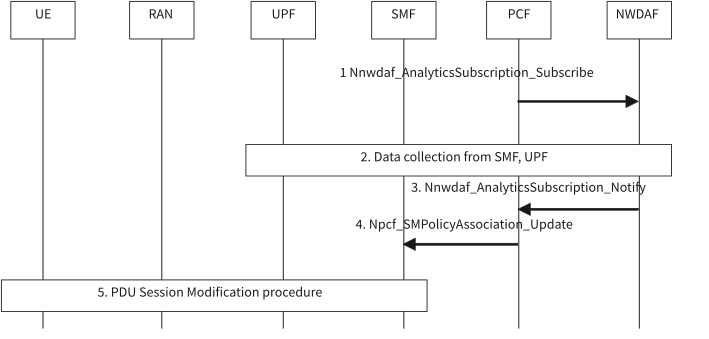

# 6.25 Traffic pattern analytics

## 6.25.1 General

With traffic pattern Analytics, NWDAF provides statistics or predictions of the traffic pattern for a traffic flow based on the collected user plane traffic information. The NF consumer (i.e. PCF) can perform QoS adjustment based on the traffic pattern.

The analytics service consumer is PCF.

The consumer of these analytics may indicate in the request:

\- Analytics ID = "Traffic pattern";

\- Target of Analytics Reporting as defined in clause 6.1.3;

\- Analytics Filter Information:

\- Application ID or Packet Filter set;

\- S-NSSAI;

\- DNN;

\- UE address;

\- Area of Interest (AOI(s));

\- An optional list of analytics subsets that are requested (see clause 6.25.3).

\- Optionally, preferred level of accuracy of the analytics.

\- Optionally, preferred level of accuracy per analytics subset (see clause 6.25.3).

\- An Analytics target period indicates the time period over which the analytics are requested.

\- Reporting Thresholds, which apply only for subscriptions and indicate conditions on the levels to be reached for the respective analytics subsets (see clause 6.25.3).

\- Optionally, maximum number of objects.

\- In a subscription, the Notification Correlation Id and the Notification Target Address are included.

## 6.25.2 Input data

NWDAF collects input data from the SMF and/or UPF. The detailed data are described in Table 6.25.2-1. The NWDAF may also collect the packet drop and/or packet delay measurement data from the OAM and UPF as described in Table 6.13.2-1 of clause 6.13.2.

Table 6.25.2-1: Traffic characteristic Information collected by NWDAF

<table>
<colgroup>
<col style="width: 31%" />
<col style="width: 17%" />
<col style="width: 50%" />
</colgroup>
<thead>
<tr class="header">
<th>Information</th>
<th>Source</th>
<th>Description</th>
</tr>
</thead>
<tbody>
<tr class="odd">
<td>Application/Service data flow(s) identifier</td>
<td>UPF</td>
<td>Application ID or Packet Filter set</td>
</tr>
<tr class="even">
<td>UE identifier</td>
<td>UPF</td>
<td>UE identifier, e.g. UE address or UE ID.</td>
</tr>
<tr class="odd">
<td>Data flow characteristic information</td>
<td></td>
<td>The characteristic of the service data flow.</td>
</tr>
<tr class="even">
<td>&gt; QoS flow Packet Delay</td>
<td>UPF</td>
<td>The observed Packet delay for UL/DL/round trip directions between UE and PSA_UPF.</td>
</tr>
<tr class="odd">
<td>&gt; N6 Delay (NOTE 1)</td>
<td>UPF, SMF</td>
<td>The observed N6 delay between the UPF and measurement endpoint in the DN, as defined in clause 5.8.2.23 of TS 23.501 [2].</td>
</tr>
<tr class="even">
<td>&gt; UL/DL data rates</td>
<td>UPF</td>
<td>The measured average UL/DL data rate during the measurement duration as defined in clause 5.45 of TS 23.501 [2].</td>
</tr>
<tr class="odd">
<td>&gt; packet interval</td>
<td>UPF</td>
<td>The interval value (e.g. minimum, maximum, average and/or variance value) between packets with the traffic flow.</td>
</tr>
<tr class="even">
<td>&gt; Packet drop (NOTE 2)</td>
<td>UPF</td>
<td>Indicate the number or rate of dropped data packets of the flow.</td>
</tr>
<tr class="odd">
<td>&gt; Data volume</td>
<td>UPF</td>
<td>The data volume of the flow measured within a given time window.</td>
</tr>
<tr class="even">
<td>&gt;Congestion information</td>
<td>UPF</td>
<td>A percentage of congestion level as defined in clause 5.45 of TS 23.501 [2].</td>
</tr>
<tr class="odd">
<td colspan="3">
NOTE 1: Whether N6 delay (independent of QoS Flow) is considered to derive the analytics in comparison to delay between UE and UPF (dependent on the QoS Flow) is left to implementation based on the operator's policy. The NWDAF obtains N6 delay measurement either from UPF based on implementation or from SMF based on clause 5.2.8.3.1 of TS 23.502 [3] in this Release.

NOTE 2: The indication of UPF packet drop is only applied to the scenarios when UPF dropped buffered data.
</td>
</tr>
</tbody>
</table>

The NWDAF collects input data from the UPF either indirectly via the SMF, or directly from the UPF using the "UserDataUsageMeasures", "QoS Monitoring" and "UserDataUsageTrends" event exposure events as described in clause 4.15.4.5 of TS 23.502 \[3\]. Further details about input parameters in subscription to UPF event exposure events are described in Table 4.15.4.5.1-1 of TS 23.502 \[3\].

## 6.25.3 Output analytics

The NWDAF notifies or responds to the consumer NF with the output analytics as listed in Table 6.25.3-1 and Table 6.25.3-2.

Table 6.25.3-1: Traffic pattern statistics

<table>
<colgroup>
<col style="width: 27%" />
<col style="width: 72%" />
</colgroup>
<thead>
<tr class="header">
<th>Information</th>
<th>Description</th>
</tr>
</thead>
<tbody>
<tr class="odd">
<td>Traffic flow identifier</td>
<td>Information identifying the traffic flow, e.g. the Application ID and/or Packet Filter Set, identifier of the service data flow(s) of the target application(s).</td>
</tr>
<tr class="even">
<td>Identifier of the affected UE(s)</td>
<td>Identifier of the UE(s) associated to the traffic pattern, e.g. UE ID(s), UE address(es).</td>
</tr>
<tr class="odd">
<td>Traffic pattern information</td>
<td>The traffic pattern statistic of the traffic flow.</td>
</tr>
<tr class="even">
<td>&gt; Maximum Burst Size (NOTE 1, NOTE 2)</td>
<td>Maximum Burst Size statistic as defined in clause 6.1.3.22 of TS 23.503 [4] of the target application(s).</td>
</tr>
<tr class="odd">
<td>&gt; Maximum Bitrate (NOTE 1, NOTE 3)</td>
<td>Maximum Bitrate statistic (UL, DL) as defined in clause 6.1.3.22 of TS 23.503 [4] of the target application(s).</td>
</tr>
<tr class="even">
<td>&gt; Guaranteed Bitrate (NOTE 1, NOTE 3)</td>
<td>Guaranteed Bitrate statistic (UL, DL) as defined in clause 6.1.3.22 of TS 23.503 [4] of the target application(s).</td>
</tr>
<tr class="odd">
<td>&gt; 5GS delay (NOTE 1)</td>
<td>5GS delay statistic (UL, DL) as defined in clause 6.1.3.22 of TS 23.503 [4] of the target application(s).</td>
</tr>
<tr class="even">
<td>&gt; Packet Error Rate (NOTE 1)</td>
<td>Packet Error Rate statistic (UL, DL) as defined in clause 6.1.3.22 of TS 23.503 [4] of the target application(s).</td>
</tr>
<tr class="odd">
<td>&gt; Packet interval (NOTE 1)</td>
<td>Average time interval between packets with the traffic flow, which can be taken as the periodicity as defined in clause 5.27 of TS 23.501 [2] if applicable.</td>
</tr>
<tr class="even">
<td colspan="2">
NOTE 1: Analytics subset that can be used in "list of analytics subsets that are requested" and "Reporting Thresholds".

NOTE 2: This applies to QoS Flows using a Delay-critical GBR resource type only.

NOTE 3: This applies to GBR QoS Flows only.
</td>
</tr>
</tbody>
</table>

Table 6.25.3-2: Traffic pattern predictions

<table>
<colgroup>
<col style="width: 27%" />
<col style="width: 72%" />
</colgroup>
<thead>
<tr class="header">
<th>Information</th>
<th>Description</th>
</tr>
</thead>
<tbody>
<tr class="odd">
<td>Traffic flow identifier</td>
<td>Information identifying the traffic flow, e.g. the Application ID and/or Packet Filter Set, identifier of the service data flow(s) of the target application(s).</td>
</tr>
<tr class="even">
<td>Identifier of the affected UE(s)</td>
<td>Identifier of the UE(s) associated to the traffic pattern, e.g. UE ID(s), UE address(es).</td>
</tr>
<tr class="odd">
<td>Traffic pattern information</td>
<td>The predicted traffic pattern of the traffic flow.</td>
</tr>
<tr class="even">
<td>&gt; Maximum Burst Size (NOTE 1, NOTE 2)</td>
<td>Predicted Maximum Burst Size as defined in clause 6.1.3.22 of TS 23.503 [4] of the target application(s).</td>
</tr>
<tr class="odd">
<td>&gt; Maximum Bitrate (NOTE 1, NOTE 3)</td>
<td>Predicted Maximum Bitrate (UL, DL) as defined in clause 6.1.3.22 of TS 23.503 [4] of the target application(s).</td>
</tr>
<tr class="even">
<td>&gt; Guaranteed Bitrate (NOTE 1, NOTE 3)</td>
<td>Predicted Guaranteed Bitrate (UL, DL) as defined in clause 6.1.3.22 of TS 23.503 [4] of the target application(s).</td>
</tr>
<tr class="odd">
<td>&gt; 5GS delay (NOTE 1)</td>
<td>Predicted 5GS delay (UL, DL) as defined in clause 6.1.3.22 of TS 23.503 [4] of the target application(s).</td>
</tr>
<tr class="even">
<td>&gt; Packet Error Rate (NOTE 1)</td>
<td>Predicted Packet Error Rate (UL, DL) as defined in clause 6.1.3.22 of TS 23.503 [4] of the target application(s).</td>
</tr>
<tr class="odd">
<td>&gt; Packet interval (NOTE 1)</td>
<td>Average time interval between packets with the traffic flow, which can be taken as the periodicity as defined in clause 5.27 of TS 23.501 [2] if applicable.</td>
</tr>
<tr class="even">
<td>&gt; Confidence</td>
<td>Confidence of this prediction.</td>
</tr>
<tr class="odd">
<td colspan="2">
NOTE 1: Analytics subset that can be used in "list of analytics subsets that are requested" and "Reporting Thresholds".

NOTE 2: This applies to QoS Flows using a Delay-critical GBR resource type only.

NOTE 3: This applies to GBR QoS Flows only.
</td>
</tr>
</tbody>
</table>

Table 6.25.3-3: Example action of the consumer

| Consumer | Example of actions                                 |
|----------|----------------------------------------------------|
| PCF      | Generate or update PCC rules by adjusting the QoS. |

## 6.25.4 Procedures

Figure 6.25.4.1-1: Procedure for NWDAF assisted traffic pattern generation for QoS adjustment

1\. Based on the subscription retrieved from UDR or internal logic, the PCF subscribes to NWDAF for the "traffic pattern" analytic and includes the Analytics Filter Information in the message.

2\. Based on the subscription from PCF, the NWDAF collects input data from SMF and/or UPF as described in table 6.25.2-1. The NWDAF can discover the SMF serving the PDU session based on the DNN, S-NSSAI of the PDU session and UE ID provided from PCF as described in clause 6.2.8.

3\. The NWDAF provides the analytic output as described in Table 6.25.3-2 to PCF.

4\. PCF creates/updates PCC rule for target application(s) based on the traffic pattern provided from NWDAF as described in clause 5.27.3 of TS 23.501 \[2\] and 6.1.3.22 of TS 23.503 \[4\].

5\. SMF triggers PDU Session Modification Procedure as described in TS 23.502 \[3\] based on the updated PCC rule.
