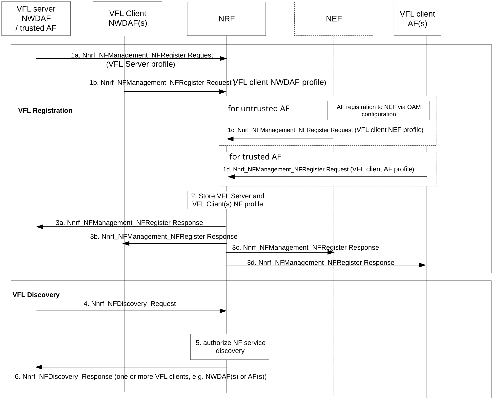
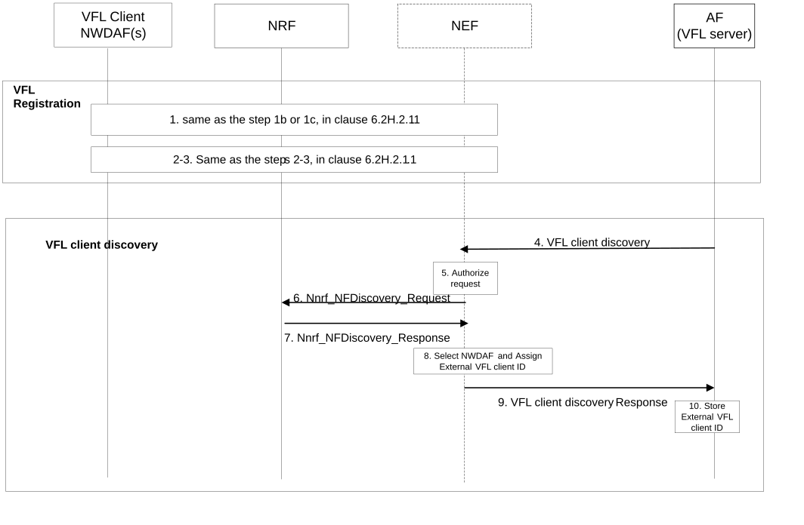

# 6.2H.2.1 Registration and Discovery procedure for Vertical Federated Learning

## 6.2H.2.1.1 Registration and Discovery procedure for Vertical Federated Learning when NWDAF or trusted AF is acting as the VFL server

Figure 6.2H.2.1.1-1: Registration and Discovery procedure for Vertical Federated Learning when NWDAF or trusted AF is acting as VFL server

Steps 1 to 3 are the NWDAF and AF Registration procedures when the VFL server is NWDAF or a trusted AF.

1a. VFL Server NWDAF/trusted AF registers to NRF with its NF profile, which includes NF Type (i.e. NWDAF type or AF type), Analytics ID(s), service area if available, VFL capability information per analytics ID, as described in clause 5.2.

1b. NWDAF as VFL client registers to NRF with its NF profile, which includes NF Type (i.e. NWDAF type), Analytics ID(s), service area if available, VFL capability information per analytics ID and VFL interoperability indicator(s), optional supported feature ID(s) and other parameters, as defined in clause 5.2.

1c. When untrusted AF as VFL client, it shall register to the NEF via OAM configuration: Analytics ID(s) and its VFL capability information per supported analytics ID and VFL interoperability indicator(s) and optional supported feature ID(s) and other parameters, as defined in clause 5.5. Then NEF updates NEF profile to NRF including associated AF ID and AF's parameters described in clause 5.5.

1d. When trusted AF as VFL client, it registers to NRF with its NF profile, which includes NF Type (i.e. AF type), analytics ID(s), service area if available, VFL capability information per analytics ID and VFL interoperability indicator and optional supported feature IDs and other parameters, as defined in clause 5.5.

2\. The NRF receives the registrations from VFL server and VFL client(s) and NEF(s) and stores their NF profile.

3\. The NRF sends registration response to VFL server and VFL client(s) and NEF(s).

Steps 4 to 6 are the NWDAF, AF and NEF Discovery procedures when the VFL server is NWDAF or trusted AF.

4-6. The VFL server determines that the ML Model requires VFL based on e.g. operator policy, Analytics ID, VFL interoperability indicator(s) and Service Area.

NOTE: Step 4 in Figure 6.2H.2.1.1-1 may be triggered at the VFL Server by itself or a request from a consumer.

If an NWDAF can not perform as VFL Server, it first discovers and selects another VFL Server from NRF by invoking the Nnrf_NFDiscovery_Request service operation. The following criteria might be used: Analytics ID, VFL capability type as VFL server, Time Period of Interest and optional Service Area.

Once the VFL Server is determined, the VFL Server discovers other NWDAF(s) and/or AF(s) as VFL Client from NRF by invoking the Nnrf_NFDiscovery_Request service operation. The following criteria might be used: NF type(s) (i.e. NWDAF type, AF type, or NEF type), Analytics ID, VFL capability type (i.e. VFL client), VFL interoperability indicator(s), Time Period of Interest, optional feature ID(s) (used to discover a combination of VFL Client(s), which supports all the feature ID(s) provided by the VFL Server) and optional Service Area. The AF(s) discovered by the VFL Server may be trusted and/or untrusted, the NF type may be AF type when the AF(s) as VFL Client are trusted, and the NF type may be NEF type when the AF(s) as VFL Client are untrusted and the NF type may contain both AF type and NEF type if both trusted AF and untrusted AF are involved as VFL clients.

When an AF is acting as a VFL server, only NWDAF(s) are discovered as VFL clients.

## 6.2H.2.1.2 Registration and Discovery procedure for Vertical Federated Learning when untrusted AF is acting as the VFL server

The procedure below shows registration and discovery for VFL training and inference when the untrusted AF is the VFL server. There can be multiple NWDAFs as VFL clients.

NOTE 1: For a deployment scenario that untrusted AF is the VFL server and only one NWDAF will be an VFL client, it is assumed that VFL client information for an Analytic ID is configured in NEF and step 6 and 7 may be skipped in Figure 6.2H.2.1.2-1.

Figure 6.2H.2.1.2-1: Registration and Discovery procedure for Vertical Federated Learning when an untrusted AF is acting as VFL server and NWDAF(s) are the VFL clients

Steps 1 to 3 are the NWDAF and AF Registration procedures when the VFL server is untrusted AF.

1\. Same as the step 1b or 1c, in clause 6.2H.2.1.1, NWDAF as VFL client registers to NRF with its NF profile, it may include those analytics IDs on which it supports to do VFL with AF as VFL server. The VFL client may also include its capability of aggregating the intermediate results of the other clients into its NF profile. Based on operator local policies, the untrusted AF may register its capability as VFL server for an Analytics ID to NEF via OAM configuration, this is used to make it possible for NWDAF to trigger the AF to train a model. The AF may also register an Analytics ID in NRF e.g. when a trained model is available. Then NEF updates NEF profile to NRF including associated AF ID and AF's parameters described in clause 5.5.

NOTE 2: The AF can use non-standardized values of the Analytics ID. The non-standardized values can be used by the AF as the VFL server to initiate the VFL training or VFL inference and these values need to be supported by NWDAFs acting as VFL clients. It is the operator´s responsibility to guarantee that non-standardized Analytics ID values within a PLMN are unique.

2-3. Same as the steps 2-3, in clause 6.2H.2.1.1.

Steps 4-10 are the NWDAF Discovery procedures when the VFL server is an untrusted AF.

4\. Untrusted AF acting as the VFL server determines that VFL operations are required and the NWDAF(s) as VFL client(s) are required. The AF sends a Nnef_VFLNFDiscovery_NwdafDiscovery Request for the VFL client(s) to the NEF and for each client provides selection criteria: Analytics ID, required NF type (i.e. NWDAF type), VFL capability type (i.e. VFL client) and optionally VFL interoperability indicator, Time Period of Interest, required feature ID(s) and Service Area.

NOTE 3: Step 4 in Figure 6.2H.2.1.2-1 may be triggered at the VFL Server by itself or when requested from a consumer.

5\. The NEF checks based on configured policies whether the AF is entitled to request single or multiple a VFL client(s) for the Analytics ID.

6-7. The NEF discovers VFL client(s) (i.e. NWDAF(s)) on behalf of the AF from the NRF by invoking the Nnrf_NFDiscovery_Request using the selection criteria provided by the AF as defined in step 4.

8\. The NEF selects NWDAF(s), e.g. by using the NWDAF(s) NF profile and parameters including load/priority/capacity, that are capable of acting as VFL client(s) and matching the received selection criteria. The NEF anonymizes NWDAF instances ID(s) and assigns external NWDAF ID(s) for each selected NWDAF instance as VFL client. The NEF stores the external NWDAF ID(s) together with information how to reach the NWDAFs.

NEF may select VFL client NWDAF to perform aggregation for other clients in this particular Nnef_VFLNFDiscovery_NwdafDiscovery Request. The selection of an NWDAF to perform aggregation can be based on the aggregation capability in NF profile.

NOTE 4: The external NWDAF ID assigned by NEF is temporary and can be released if needed.

9\. The NEF sends Nnef_VFLNFDiscovery_NwdafDiscovery Request response only including the external NWDAF ID(s) as selected in step 8 and information on how they relate to corresponding selection criteria provided by the AF, which includes VFL interoperability indicator and optionally Time interval supporting VFL training, supported feature ID(s) and Service Area. If VFL client is selected to perform aggregation in step 8, the NEF only responds with the NWDAF will be performing aggregation.

NOTE 5: If VFL client is selected to perform aggregation by NEF, it implies that in Training, preparation and inference phase, VFL server only communicates with this client, not the clients whose intermediate results will be aggregated. This assumes a single NEF/NEF set is used.

10\. The AF stores the received external NWDAF ID(s) and uses it subsequent interactions with the NEF to indicate the target VFL client.

NOTE 6: If the VFL client NWDAFs are statically preconfigured to the NEF and untrusted AF and not released, the discovery procedure can be skipped.

The AF may indicate to the NEF that the AF will no longer use the VFL process identified by VFL Correlation ID (external NWDAF IDs are no longer required). If the NEF receives this indication, it shall remove the stored external NWDAF ID(s) associated with the VFL correlation ID allocated to the AF. Then, the NEF responds to the AF.
