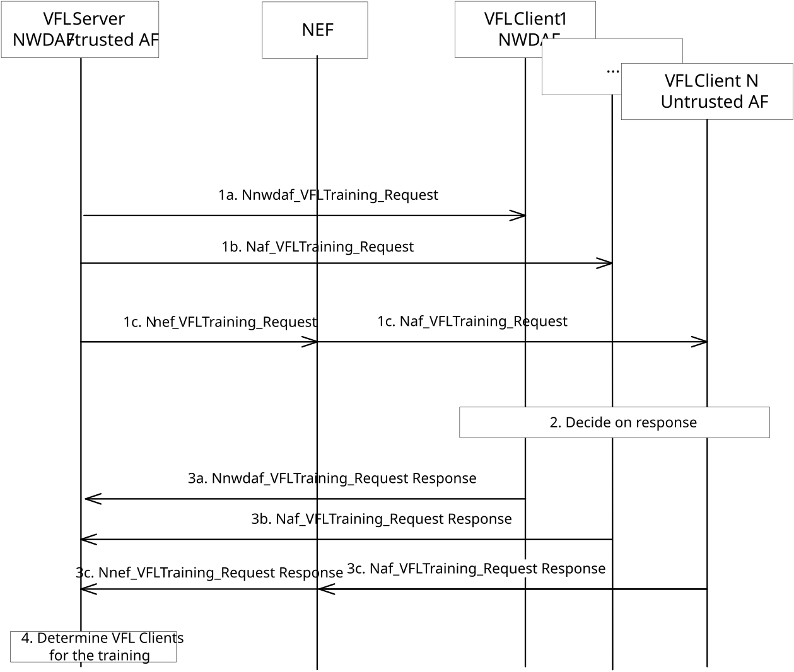
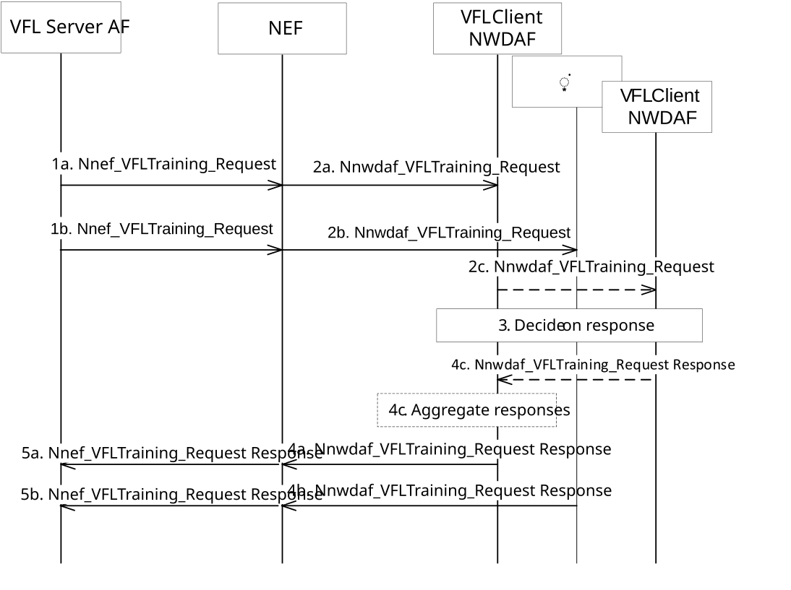

# 6.2H.2.2 Preparation procedure for Vertical Federated Learning

## 6.2H.2.2.0 General

The preparation procedure is used to check if the VFL Client(s) can meet the ML Model training requirements. The procedure includes the negotiation, between server and client(s) to enable interoperability, sample alignment and may include feature negotiation if the VFL Server did not learn the supported FeatureIDs from each VFL Client using the discovery phase, alternatively the VFL Server may know the supported FeatureIDs by a VFL Client based on configuration. The Vertical Federated Learning preparation procedure can be skipped if the VFL Server can decide which VFL Client(s) support the VFL procedure to be performed, e.g. based on local configuration or offline procedures.

## 6.2H.2.2.1 Preparation procedure for Vertical Federated Learning when NWDAF/trusted AF is the VFL Server

Figure 6.2H.2.2.1-1: Preparation procedure for Vertical Federated Learning when NWDAF/Trusted AF is the VFL Server

1\. An NWDAF as VFL Server may send a Vertical Federated Learning preparation request including the Analytics ID to each of the NWDAF VFL Client(s) using Nnwdaf_VFLTraining_Request and to each of the AF as VFL Clients(s) using Naf_VFLTraining_Request when the VFL Client is a trusted AF and Nnef_VFLTraining_Request, via NEF when the VFL Client is an untrusted AF. An AF as VFL Server may send a Vertical Federated Learning preparation request including the Analytics ID to each of the NWDAF VFL Client(s), using Nnwdaf_VFLTraining_Request. The NWDAF or trusted AF as a VFL Server may also provide ML model training requirements, which include the VFL Interoperability indicator, the suggested VFL Interoperability Information to negotiate the intermediate results that will be used in VFL process (e.g, VFL training and/or VFL inference). Optionally the suggested list of sample IDs (e.g, SUPI(s), GPSI(s)) expected to be used in the VFL process, the feature ID(s) expected to be used in VFL process for each VFL Client and additional criteria for sample alignment, (e.g. time window of the data samples, and required minimum sample size). When a Trusted AF is acting as a VFL Server, the VFL Client can only be an NWDAF.

NOTE 1: In step 1, the feature ID(s) will only be provided to the VFL Client(s) when the VFL Server received the supported feature ID(s) of VFL Client(s) during the VFL Client(s) discovery procedure as defined in clause 6.2H.2.1.

NOTE 2: For UE as samples, UEs can be registered to the network and NWDAF as a VFL server can check with UDM whether the UEs are registered to the network.

NOTE 3: When NWDAF is acting as VFL server and the VFL Client is an untrusted AF, the AF ID obtained in the discovery procedure (see clause 6.2H.2.1.1) is included to indicate the target AF to the NEF in the Nnef_VFLTraining_Request.

2\. Each VFL Client checks if it can meet the ML Model training requirements. Each VFL Client checks the list of sample IDs suggested by the VFL Server and additional criteria for sample alignment and then provides to the VFL Server the list of sample IDs that it can accept within the sample IDs suggested by the VFL Server in the VFL process and satisfying the additional criteria for sample alignment. If the suggested list of sample IDs is not provided by the VFL Server, the VFL Client provides the list of supported sample IDs based on local dataset used for VFL process to the VFL Server. Each VFL Client checks the VFL Interoperability Information and determines which VFL Interoperability information that the VFL Client supports. The VFL Client determines whether it supports the feature ID(s) that will be used in VFL process when the feature ID(s) was provided by the VFL Server; alternatively, the VFL Clients may provide the list of supported feature ID(s), which is associated to the VFL Interoperability information, to the VFL Server, or VFL Server may know the supported featureID(s) for a VFL Client based on configuration.

3\. Each NWDAF VFL Client invokes Nnwdaf_VFLTraining_Request Response or each AF VFL Client invokes Naf_VFLTraining_Request Response in the case of trusted AF VFL Client, or Nnef_VFLTraining_Request Response via NEF when the AF is untrusted, to indicate to the VFL Server whether it accepts the ML Model training requirements, the VFL Client can also indicate that it cannot join the FL process. When NEF is involved in the procedure, if the NEF receives the SUPI as sample ID(s) from NWDAF, the NEF shall map the SUPI(s) to GPSI(s) before sending to the AF.

4\. The VFL Server determines the VFL Client(s) for the VFL process and final list of samples ID(s) that all selected VFL Client(s) support as the samples to be used in the VFL process based on the list of sample IDs that can be accepted by the VFL Client(s) within the sample IDs suggested by the VFL Server, or the the list of supported sample IDs provided by the VFL Client(s). If the VFL Server is NWDAF, it may map the sample ID(s) in different types (e.g, SUPI, GPSI) from the VFL Client(s) into same format (i.e SUPI) as described in clause 6.2.8.2.4.4 before determining the final list of sample ID(s). The VFL Server also determines the feature ID(s) per VFL Client and VFL Interoperability Information to be used in VFL process and provides them to the selected VFL Client(s) at the start of the training phase, as described in clause 6.2H.2.3.1.

## 6.2H.2.2.2 Preparation procedure for Vertical Federated Learning when untrusted AF is the VFL server

This clause specifies the preparation (including sample alignment) procedure for untrusted AF-initiated VFL scenarios between AF and NWDAF(s) within a single PLMN.

Figure 6.2H.2.2.2-1: Preparation procedure for Vertical Federated Learning when untrusted AF is the VFL Server

The untrusted AF as VFL server first determines the VFL client(s) of VFL process(es), NEF ID and external NWDAF ID(s) of all selected VFL Client(s) for each VFL process and uses it subsequent interactions with the NEF.

1- The untrusted AF as VFL server sends VFL preparation requests to each of the candidate VFL client(s), using Nnef_VFLTrainingRequest_Request to check if the VFL client(s) can meet the ML Model training requirements (which includes the Analytics ID, VFL Interoperabiltiy indicator and optionally list of sample IDs, Feature ID(s), etc.). The external NWDAF IDs obtained in the discovery procedure (see clause 6.2H.2.1.1) is included to indicate the target NWDAFs. The suggested VFL Interoperability Information to negotiate the intermediate resuls that will be used in training.

2- The NEF maps the external NWDAF and GPSI(s) to the internal NWDAF and SUPI(s). The NEF send VFL preparation request to the corresponding candidate internal NWDAF ID using Nnwdaf_VFLTraining_Request service with the same information as provided in step 1 in clause 6.2H.2.2.1.

2c. An NWDAF VFL client that aggregates the results of other VFL clients may determine to sends VFL preparation requests to the other VFL clients during the preparation procedure.

3- Same as step 2 in clause 6.2H.2.2-1.

4- Same as step 3 in clause 6.2H.2.2-1.

4c. An NWDAF VFL client that interacted with additional NWDAF VFL client(s) in step 2 receives responses from each of those client(s) and aggregates the response(s) and own information to complete the response to the VFL server.

5- The NEF maps the internal NWDAF and SUPI(s) to the external NWDAF and GPSI(s). The NEF sends the Nnef_VFLTraining_Request Response to the VFL Server with the same information as provided in step 4.

6- Same as step 4 in clause 6.2H.2.2-1.
