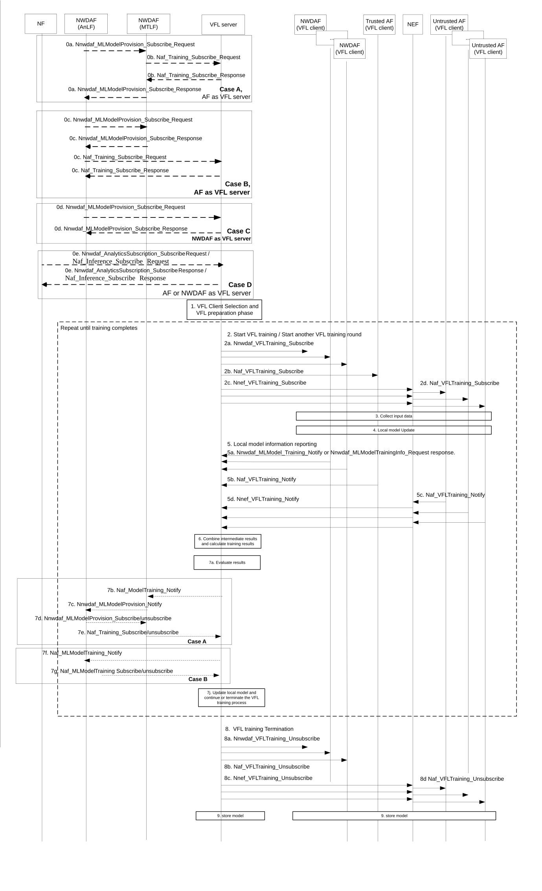
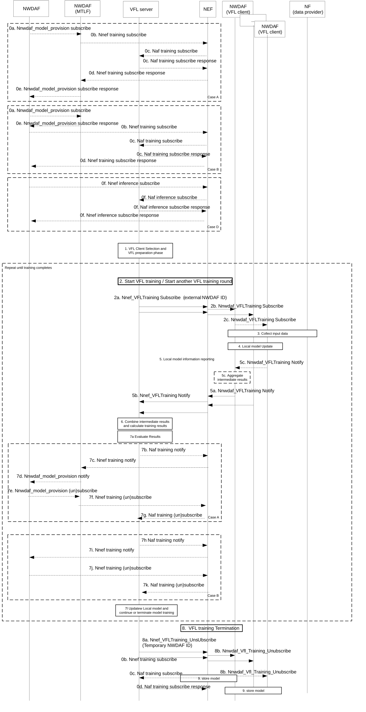

# 6.2H.2.3 Training Procedure for Vertical Federated Learning

## 6.2H.2.3.1 Training Procedure for Vertical Federated Learning when NWDAF or trusted AF is acting as VFL server

The figure 6.2H.2.3.1-1 below shows the training procedure for Vertical Federated Learning when NWDAF is acting as VFL server.

Figure 6.2H.2.3.1-1: Training procedure for Vertical Federated Learning when NWDAF or trusted AF is acting as VFL server

NOTE 1: In the case when AF is server the clients can only be NWDAFs.

0\. \[OPTIONAL\] VFL training is triggered in the VFL server for the following cases:

\- Based on local configuration and agreement among vendors and/or application providers participating in the same group for specific procedure(s) and Analytics ID.

\- Triggered by either Analytics consumer, AnLF via ML model provisioning or NWDAF containing MTLF (VFL Server is a trusted AF):

Step 0a (case A). The NWDAF containing AnLF that wants to perform inference and does not have a model, it discovers an NWDAF containing MTLF from NRF and sends a subscription request for a model to the NWDAF containing MTLF using Nnwdaf_MLModelProvision_Subscribe.

Step 0b. (case A). The NWDAF containing MTLF decides to use VFL for the ML Model subscription and realizes it cannot be VFL server but wants an AF to act as VFL server, the NWDAF containing MTLF discovers an AF as VFL server according to 6.2H.2.1, and may send a request to the VFL server AF using Naf_Training_Subscribe including Analytics ID. The AF as VFL server starts VFL Training according to step 1. The NWDAF containing MTLF may either send in the service subscription response that no ML model identifier will be made available due to VFL model to be used and that training is ongoing, alternatively the NWDAF containing the MTLF just indicates that no ML model identifier will be made available and training is completed together with the NF ID of the VFL server and the NWDAF containing AnLF may request the inference output using the requested Analytics ID as described in step 1 of clause 6.2H.2.4.1. If the received Nnwdaf_MLModelProvision_Subscribe service contains the time when ML Model is needed, the MTLF may forward it in Naf_Training_Subscribe to the VFL server. If VFL server cannot meet the time when ML Model is needed, it may not to start the VFL training.

NOTE 2: The AF may have registered in NRF for the particular Analytics ID that it can perform Inference for it. In this case no training will be performed.

\- Triggered by NWDAF containing AnLF (VFL Server is a trusted AF):

Step 0c. (case B). Same as step 0a. Alternatively, the NWDAF containing AnLF knows by configuration that the Analytics ID is trained using VFL, then the AnLF discovers the AF VFL Server and requests the AF VFL Server to train the ML Model.

If a ML model provisioning subscription request from an NWDAF containing AnLF is received in step 0c, the MTLF sends in the service subscription response an indication that no ML model is available due to VFL model to be used and that the subscription is terminated (i.e. as new cause code) and may also provide VFL server ID. The NWDAF containing AnLF can directly send the Analytics Subscription requests to the NWDAF containing MTLF as VFL Server or the VFL server indicated by the VFL server ID as described in step 1 of clause 6.2H.2.4.1. The NWDAF containing AnLF can also discover an AF VFL Server from NRF that supports the Analytics ID.

The AnLF then sends request to AF VFL server to train a ML Model with the Analytics ID as described in step 1 of clause 6.2H.2.4.1. The AnLF may also include the time when ML Model is needed in the training request. The VFL server AF estimates the VFL training completion time using Analytics ID and compare it with the time when ML Model is needed. If the VFL training completion time is no later than the time when ML Model is needed, the AF may start VFL training, indicate to the AnLF that training is ongoing with VFL training completion time and will subsequently indicate that the training is complete to the NWDAF containing AnLF, optionally, together with the VFL correlation ID. If not, the VFL server AF indicates to the NWDAF containing AnLF that the time when ML Model is needed cannot be fulfilled together with estimated VFL training completion time and may not start VFL training if there are no further training requests received from AnLF. Based on the message sent by VFL server, the NWDAF containing AnLF can send a request to perform Inference using the requested Analytics ID and optionally the VFL correlation ID to retrieve an VFL Inference output from as described in step 1 of clause 6.2H.2.4.1. The AnLF may send VFL inference request to VFL server AF after it receives the Analytics request with Analytics ID from consumer NF. The AnLF needs to store the mapping relationship between Analytics ID and VFL correlation ID.

\- Triggered by NWDAF containing AnLF via ML model provisioning (VFL Server is a NWDAF):

Step 0d. (case C). If the NWDAF containing AnLF wants to perform inference and does not have a model, it discovers an NWDAF containing MTLF from NRF and sends a subscription request for a model to the NWDAF containing MTLF using Nnwdaf_MLModelProvision_Subscribe. If the discovered NWDAF containing MTLF does not have the whole model due to the use of VFL, it sends a response to the AnLF that no complete Model is available due to VFL used and that the subscription is terminated (i.e. as new cause code), and may also provide VFL server ID and/or an estimated VFL training completion time when the training is complete. The NWDAF containing AnLF can directly send the Analytics Subscription requests to the NWDAF containing MTLF as VFL Server or the VFL server indicated by the VFL server ID as described in step 1 of clause 6.2H.2.4.1.

The NWDAF containing AnLF can also discover new VFL Server from NRF that supports the Analytics ID, then and can send Analytics Subscription requests to that VFL Server as described in step 1 of clause 6.2H.2.4.1.

\- Triggered by Analytics consumer. (VFL Server is either an AF or an NWDAF):

Step 0e. (case D). NF consumer needs analytics output for a specific Analytics ID, it discovers an NWDAF from NRF to provide the analytics ID. If the discovered NWDAF is a VFL server which supports the analytics ID, then to generate the analytics output via VFL inference as defined in clause 6.2H.2.4, the VFL server may trigger VFL training if no corresponding VFL training has been performed.

For all cases, if the time when Analytics information includes in the Analytics request, the VFL server estimate the completion time of VFL training and/or VFL inference using Analytics ID received and compare it with the time when Analytics information is needed. If the completion time is no later than the time when Analytics information is needed, the VFL server starts VFL training and/or VFL inference.

NOTE 3: If the VFL training is complete, then only the time of VFL inference will be estimated.

NOTE 4: VFL server can also decide to initiate VFL training based on operator policy or internal configuration.

1\. The NWDAF acting as VFL server determines the VFL clients that participate in VFL procedure in the VFL clients discovery and preparation phase as described in the clause 6.2H.2.1 and clause 6.2H.2.2.

Steps 2-6 are repeated until the training termination condition is reached.

2\. To start the VFL training, the VFL server sends a request to start the training to all selected VFL clients. The request includes VFL correlation ID, at least the parameters negotiated during the preparation phase and the VFL training iteration number set to 0, and a Notification Correlation ID. Optionally, the VFL Server includes parameters according to clause 6.2H.3.

If the VFL procedure continues in subsequent iterations, the VFL server sends an update request for a new VFL training iteration containing an incremented a VFL training iteration number and intermediate model training information to each of the VFL clients for next round of VFL training. The VFL Server, based on internal logic, may provide checkpoint information according to clause 6.2H.3.

2a. The VFL server sends a Nnwdaf_VFLTraining_Subscribe to the selected NWDAF VFL clients(s).

2b. The VFL server sends a Naf_VFLTraining_Subscribe to the selected trusted AF VFL clients(s).

2c. For each selected untrusted AF VFL clients, the VFL server sends a Nnef_VFLTraining_Subscribe to the NEF handling that AF. The AF ID determined in the preparation procedure is included to indicate the target AF to the NEF.

2d. For each selected untrusted AF VFL client, the NEF sends a Naf_VFLTraining_Subscribe to that AF. The NEF may also translate the analytic filter information if needed, e.g. TAIs into geographical area.

3\. \[Optional\] Each VFL client collects its local data by using the current mechanism if the VFL client has no local data already available. The data used by each VFL Client is collected as per alignment information.

4\. During VFL training procedure, each VFL client further trains the local ML model associated with the same VFL Correlation ID based on their own collected or available data and when applicable (e.g. after the first round of training) and possible intermediate model training information distributed by the VFL server in the previous training iteration. Each VFL Client computes and reports the client intermediate training result of the local ML model to the VFL server. VFL client(s) may also report a delta from the initial list of samples according to clause 6.2H.3.

NOTE 5: The intermediate model training information and intermediate training result are constructed in per sample granularity.

5\. Each VFL client reports the computed client intermediate training result of the local ML model to the VFL server and sends it with the Notification Correlation ID and a VFL training iteration number. A client may indicate in message for a request to leave the VFL. Each client may report local ML model accuracy monitoring information if ML model accuracy monitoring flag is received in step 2. The VFL client(s) may send an intermediate training result can not provide on time indication to VFL server.

NOTE 6: If the VFL Server deems the training cannot continue, it responds back by informing the VFL Client to cease the VFL training by performing step 8 for this client.

5a. A NWDAF VFL client sends a Nnwdaf_VFLTraining_Notify.

5b. A trusted AF VFL client sends a Naf_VFLTraining_Notify to the VFL server.

5c. An untrusted AF VFL client sends a Naf_VFLTraining_Notify to the NEF.

5d. For each untrusted AF VFL client, the NEF converts any external identifiers to internal identifiers and sends a Nnef_VFLTraining_Notify to the VFL server.

6\. The VFL server may collect the local data and generate its own local intermediate training result. The VFL Server computes the intermediate model training information (e.g. gradient information or loss information) based on the VFL Client(s) intermediate training result(s) received in step 4, its own local intermediate results and the label. The intermediate model training information is used for updating the models of VFL clients and/or the model of the VFL Server. Different intermediate model training information may be computed for different VFL clients and for the VFL Server itself.

The VFL server may locally compute contribution weights for each VFL client participating in the VFL process and store them for subsequent use, e.g. during inference. How the VFL computes the VFL contribution weights is up to implementation.

The VFL server may also decide to compute the global ML model metric (e.g. ML model accuracy) based on all the intermediate training result received from VFL clients and the label at any time of VFL training. When determining to generate the ML model metric, the VFL server may include an indication to indicate to the VFL clients to use the sample ID of the dataset for accuracy monitoring to calculate intermediate training results in Nnwdaf_VFLTraining_Subscribe service operation. Corresponding to the sample IDs for accuracy monitoring, each VFL client collects local data as input data for local ML model trained in step 4, then the VFL client generates the intermediate training result based on the trained local ML model and the input data, and it provides the intermediate training result to VFL server. The VFL server computes the ML model metric (e.g. VFL accuracy) based on the received intermediate training result and the label, which are both corresponding to the sample IDs for accuracy monitoring. The VFL server may optionally take account the local ML model accuracy monitoring information received from VFL client(s) when computing global ML Model metric.

7\. \[Optional\] The VFL server evaluates (e.g. based on the convergence of a loss function or loss value and/or if the pre-set iteration number is reached and/or global ML model metric is stable) whether VFL Training process converged. If the VFL Server evaluates the VFL Training process did not converge, the VFL Server determines another round of VFL training is required and repeats step 2 - 6. If the VFL Server evaluates the VFL training process converged, it determines the VFL Training is completed. In this case, the VFL Server terminates the current VFL training process via step 7. On the other hand, based on the received delta of the sample list or the can not provide intermediate training information on time indication from VFL client(s), the VFL server may determines that some of the VFL client(s) to leave the VFL training process and the VFL server may send termination messages to the determined VFL client(s). Alternatively, the VFL server may determine to stop the whole VFL training process and send VFL termination message to all VFL client(s).

The VFL training termination decision may be also made as follows:

Step 7b, 7c and 7f. Based on the consumer request, the VFL server notifies VFL status report to the consumer, to update the metric value to the consumer periodically (e.g. a certain number of training rounds or at fixed periods) or dynamically when some pre-determined status is achieved (e.g. the ML Model Accuracy threshold is achieved or training time expires).The VFL status report may include global model metric (e.g. ML model accuracy). When training is completed a VFL server will add training is completed to the Notification target address (i.e. NWDAF containing MTLF or AnLF). An AF VFL server may include VFL correlation ID.

NOTE 7: If the NWDAF containing MTLF receives a notification from VFL server indicating that is no longer able to continue a training subscription, it can send a termination request to the NWDAF containing AnLF. If the VFL server is not able to provide training results in the requested time, it may provide an estimated completion time and the NWDAF containg MTLF can notify it to the the NWDAF containing AnLF.

If NWDAF including MTLF has forwarded a subscription request to VFL server AF in step 0b, in the Notification to the first NWDAF containing AnLF. When training is completed, it indicates training is completed, and if AF VFL server added the VFL correlation ID it may forward it to the NWDAF containing AnLF.

NOTE 8 The AnLF can later include the VFL correlation ID in inference request to VFL server AF.

Steps 7d, 7e, 7g and 7i. The consumer decides whether the current model can fulfil the requirement, e.g. ML model metric is satisfactory for the consumer and determines to either unsubscribe or continue the training process.

Based on the subscription request sent from the consumer, the VFL server updates or terminates the current VFL training process.

8\. The VFL server sends VFL training termination message to VFL Client if it decides to terminate the VFL training process.

8a. The VFL server sends a Nnwdaf_VFLTraining_Unsubscribe to the selected NWDAF VFL clients(s).

8b. The VFL server sends a Naf_VFLTraining_Unsubscribe to the selected trusted AF VFL clients(s).

8c. For each selected untrusted AF VFL clients, the VFL server sends a Nnef_VFLTraining_Unsubscribe to the NEF handling that AF.

8d. For each selected untrusted AF VFL clients, the NEF sends a Naf_VFLTraining_Unsubscribe to that AF.

9\. The VFL Server, stores VFL correlation ID, the local trained ML Model, the mapping information of the VFL correlation ID to the following parameters: Analytics ID related to the VFL training process, locally trained Model. Additionally, the VFL server stores the VFL client information (including the NF ID of the VFL Client), which may be used to determine associated VFL client in the VFL inference.

Each VFL client updates local ML model based on the intermediate model training information, if received and stores VFL correlation ID, the locally trained ML Model, the mapping information of the VFL correlation ID to locally trained Model

NOTE 9: The VFL correlation ID and the stored mapping information are used later for inference as described in Clause 6.2H.2.4.1.

NOTE 10: If untrusted AF is involved in VFL Clients, the message between NWDAF acting as VFL Server and the untrusted AF is via NEF.

## 6.2H.2.3.2 Training Procedure for Vertical Federated Learning untrusted AF is acting as VFL server

Figure 6.2H.2.3.2-1: Training procedure for Vertical Federated Learning when untrusted AF is acting as VFL server

0\. \[CONDITIONAL\] Same as in step 0 in clause 6.2H.2.3.1, when the AF is the VFL Server, but AF is replaced with untrusted AF, and Nnef_Training_Subscribe offered by NEF is used. The AF ID obtained on the untrusted AF VFL server discovery procedure is included to indicate the target AF to the NEF.

NEF forwards the subscription request to AF using Naf_Training_Subscribe.

In addition:

\- Either based on the information received or internal configuration, VFL server decides to initiate VFL training procedure, or

\- case E) same as step 0d, but the Analytics consumer contacts the NWDAF containing AnLF that wants to perform inference and does not have a model, it discovers VLF Server from NRF that is a VFL Server, then request the VFL Server via NEF to perform inference. The VFL server may trigger VFL training if no corresponding VFL training has been performed.

1\. Same as step 1 in Figure 6.2H.2.3.1-1.

Steps 2-7 are repeated until the training termination condition is reached.

2\. To start VFL training, the VFL server do same as in step 2 in Figure 6.2H.2.3.1-1, using Nnef_VFLTraining_Subcribe.

2c. If a NWDAF VFL client is selected to aggregate the intermediate training results of other VFL clients, this NWDAF VFL client may send Nnwdaf_VFLTraining_Subscribe to other one or more indirect NWDAF VFL client as configured from which it desires to receive the client intermediate training results.

NOTE: To support the intermediate results sharing between VFL clients in step 2c, the VFL clients might be selected by NEF as described in clause 6.2H.2.1.2 and/or by using parameters available from preparation phase e.g. based on the VFL Interoperability Indicator and/or the parameters in VFL Interoperability Information (e.g. gradient dimension of local model, split point of the preconfigured initial model, etc.).

3\. \[Optional\] Same as step 3 in Figure 6.2H.2.3.1-1.

4\. Same as step 4 in Figure 6.2H.2.3.1-1.

5\. Same as step 5 in Figure 6.2H.2.3.1-1.

5a. A NWDAF VFL client sends a Nnwdaf_VFLTraining_Notify.

5b. For an untrusted AF acting as VFL server, the NEF converts any internal identifiers to external identifiers, provides the external NWDAF ID and sends a Nnef_VFLTrainingNotify to the VFL server.

5c-5d. The NWDAF VFL clients share the client intermediate training results with the NWDAF VFL client from which it received subscription request in step 2c. This NWDAF VFL client aggregates the received client intermediate training results from the NWDAF VFL clients, performs local computation using the aggregated intermediate inference results, then sends one notification to the NEF by including its client intermediate training result.

6\. \[Optional\] Same as step 6 in Figure 6.2H.2.3.1-1.

7a. Same as step 7a in Figure 6.2H.2.3.1-1.

7b-g. Same as in steps 7b-e in clause 6.2H.2.3.1, when the AF is the VFL Server, but AF is replaced with untrusted AF, and Naf_Training_Notify is used towards NEF and NEF forwards the Notification to NWDAF using Nnef_Training_Notify. The AF stores the External NWDAF IDs together with the NEF ID and VFL correlation ID, to be able to use this e.g. for Inference later.

8\. Same as step 8 of Figure 6.2H.2.3.1-1. However, sub steps in that figure are not applicable.

8a. For each NWDAF VFL client, the untrusted AF as VFL server sends a Nnef_VFLTraining Unsubscribe to the NEF handling that AF. The untrusted AF identifies the VFL client using the external NWDAF ID assigned in the discovery procedure (see clause 6.2H.2.1.1).

8b. The NEF sends an Nnwdaf_VFLTraining_Unsubscribe to the NWDAF VFL client indicated by the received external NWDAF ID.

8c. An NWDAF VFL client may send Nnwdaf_VFLTraining_Unsubscribe to other one or more NWDAF VFL clients in step 2c.

9\. Same as step 9 of Figure 6.2H.2.3.1-1.
