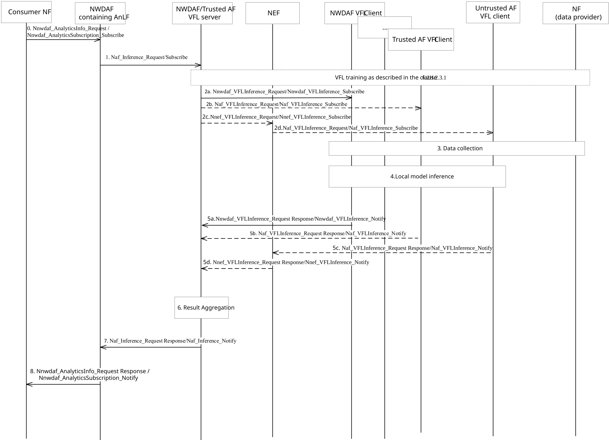
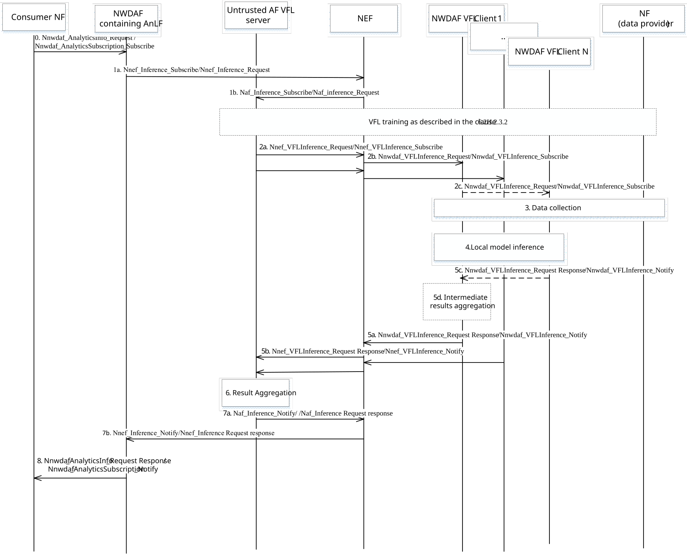

# 6.2H.2.4 Inference procedure for vertical federated learning

## 6.2H.2.4.1 Inference procedure for vertical federated learning when NWDAF or Trusted AF is acting as VFL server

Figure 6.2H.2.4.1-1: Inference procedure for vertical federated learning when NWDAF or Trusted AF is acting as VFL server

The inference procedure when trusted AF is acting as VFL server may be triggered by a request or subscription from a 5GC consumer NF or internal service logic of the AF acting as VFL server. If triggered by internal service logic of the AF acting as VFL server, the steps 0, 1,7 and 8 are skipped.

0\. The analytics consumer NF sends an Analytics request/subscribe (providing parameters as defined in clause 6.1.3) to NWDAF containing AnLF by invoking a Nnwdaf_AnalyticsInfo_Request or a Nnwdaf_AnalyticsSubscription_Subscribe.

1\. If the NWDAF containing AnLF can be the VFL server to generate the VFL inference results for the requested analytics ID, then step 1 is skipped.

If the NWDAF containing AnLF cannot generate the analytics output, the NWDAF containing AnLF determines the VFL Server AF for the requested analytics.

If the VFL server is trusted AF, the NWDAF containing AnLF sends a request to trusted AF VFL server using Naf_Inference_subscribe/request including Analytics ID, Target of Analytics Reporting = e.g. UE IDs and optionally the VFL Correlation ID and Analytics Reporting Information with parameters as defined clause 6.1.3, = e.g Analytics target period, Analytics Filter Information and Analytics Accuracy Request.

2\. Based on the information received in the step 0 or 1, VFL server decides to initiate the VFL inference procedure with the VFL clients. Before the VFL server initiate the VFL inference procedure, the VFL server may initiate the VFL training procedure if no VFL model is already trained as described in the clause 6.2H.2.3 based on the information received in the step 0 or 1 or VFL server local configuration. VFL Server selects clients(s) using information stored in the VFL training process. The VFL server may select some or no clients, e.g. depending on the accuracy of the VFL model, Time when analytics information is needed, the contribution to the training result, the received time when Analytics information is needed and the current status of the VFL clients. The VFL Server should ensure the required Time when intermediate local result is needed is less or equal to the Time when analytics information is needed.

When no VFL Clients are selected, the VFL server may generates the VFL inference results based only on its local trained ML model associated with the determined VFL correlation ID, skipping the steps 2 - 6 (and 7 if step 1 was also skipped).

NOTE 1: The VFL server determines the Maximum response time of VFL clients based on the Time when analytics information is needed. If the server does not select VFL clients for all features, it can internally store information about the features considered when deriving the analytics results together with a timestamp to identify the analytics results, to enable to subsequently trace the origin of analytics results and to interpret possible feedback on analytics accuracy.

When a VFL client is not available for inference, e.g. depending on the contribution to the training result, fulfillment of the received time when Analytics information is needed, the accuracy of the VFL model, the contribution to the training result and the current status of the VFL clients, the VFL server may select another available VFL client with a well-trained model not yet selected for inference, from the original training process, or the VFL server may select a new VFL client and start a new training procedure.

VFL server NWDAF or trusted AF determines and sends a VFL Inference request/subscription to each VFL client including the Target of VFL inference = e.g. UE IDs, VFL correlation ID to indicate the VFL client which previously well-trained VFL local model associated with this ID will be used and optionally VFL inference filter, Data time window, Time when intermediate local result is needed, Dataset Statistical Properties, Analytics Metadata Request, as defined in clause 6.2H.2.4.3.

NOTE 2: The target of VFL inference is derived from the target of Analytics reporting received by VFL server in step 0 or step 1 and may be equivalent to the target of Analytics reporting. The VFL inference filter is derived by VFL server using the Analytics filter received in step 0 or step 1 and may be equivalent to the Analytics filter.

2a. For each NWDAF VFL client, the VFL Server NWDAF or trusted AF sends an Nnwdaf_VFLInference_Subscribe or Nnwdaf_VFLInference_Request to the VFL client.

2b. For each trusted AF VFL client, the VFL Server NWDAF sends an Naf_VFLInference_Subscribe or Naf_VFLInference_Request to the VFL client.

2c. For each untrusted AF VFL client, the VFL Server NWDAF sends an Nnef_VFLInference_Subscribe or Nnef_VFLInference_Request to the NEF serving the AF. The AF ID determined in the preparation procedure is included to indicate the target AF to the NEF.

2d. For each untrusted AF VFL client, the NEF converts any internal identifiers to external identifiers and sends an Naf_VFLInference_Subscribe or Naf_VFLInference_Request to the untrusted AF VFL client.

NOTE 3: For the trusted AF is acting as VFL server, the VFL client can only be the NWDAF.

3\. Each VFL Client collects its local data by using mechanism as specified in clause 6.2 and considering a possibly received data time window to ensure that different VFL clients use the inference data collected in the same time period if the VFL Client does not have local data available already.

4\. Based on the VFL correlation ID, each VFL Client determines the VFL local model to generate the intermediate local results.

NOTE 4: In this Release, it is assumed that local intermediate inference is shared between VFL server and VFL client.

5\. VFL Client sends the client intermediate local results to the VFL server. If requested in step 2, it includes Analytics Metadata, as defined in clause 6.2H.2.4.3. Alternatively, the VFL client may report their status and other cause value for rejecting the VFL inference process (e.g. overload, target UE moved out of NWDAF serving area) in the VFL inference response service.

The intermediate local results, which are sent from the VFL Client to the VFL Server during the VFL inference process, are the information for the VFL Server to combine and generate the VFL inference results.

If the VFL server used an inference subscription in step 2, step 5 may be repeated.

5a. Each NWDAF VFL client sends an Nnwdaf_VFLInference_Notify or Nnwdaf_VFLInference_Request response to the VFL Server NWDAF or trusted AF.

5b. Each trusted AF VFL client sends a Naf_VFLInference_Notify or Naf_VFLInference_Request response to the VFL Server NWDAF.

5c. Each untrusted AF VFL client sends a Naf_VFLInference_Notify or Naf_VFLInference_Request response to the NEF.

5d. For each untrusted AF VFL client, the NEF converts any external to internal identifiers and sends an Nnef_VFLInference_Notify or Nnef_VFLInference_Request response to the NWDAF VFL server.

6\. The VFL server may also collect its local data and generate the intermediate local results. When the VFL Server selected VFL clients to participate in the VFL Inference process, it combines all the intermediate local results to generate the combined inference results based on the VFL correlation ID. The VFL server takes into account the participation of each VFL client during the ML training process and the importance of the intermediate local results when it generates the combined inference results.

The VFL server may compute the VFL accuracy based on all the intermediate local results received from VFL clients and the label, if it receives Analytics accuracy request in step 0. The server also aggregates possibly received analytics metadata.

7\. If the trusted AF as the VFL server is determined as described in the step 1, the trusted AF as VFL server sends Naf_Inference_Request Response//Naf_Inference_Notify to the consumer (i.e. NWDAF containing AnLF) including the inference results and optionally, the accuracy information, Validity period, Confidence, Analytics Metadata Information (see clause 6.1.3 for explanations of those parameters).

NOTE 5: If the AF VFL server is no longer able to continue an inference subscription, it can send a termination request to the NWDAF containing AnLF. If the AF VFL server is not able to provide analytics in the requested time, it may provide a Revised waiting time.

8\. The NWDAF containing AnLF provides the analytics output to the analytics consumer NF based on the VFL inference results by means of either Nnwdaf_AnalyticsInfo_Request Response or Nnwdaf_AnalyticsSubscription_Notify, depending on the service used in step 0.

The NWDAF containing AnLF may provide VFL accuracy if the consumer NF provides Analytics Accuracy request in step 0.

NOTE 6: There may be some time delay between the time when the AnLF provides the analytics output to consumer NF and the time when the AnLF provides VFL accuracy, as the labels are collected after making predictions. The analytics result and VFL accuracy may be send in different response messages.

## 6.2H.2.4.2 Inference procedure for vertical federated learning when untrusted AF is acting as VFL server

Figure 6.2H.2.4.2-1: Inference procedure for vertical federated learning when untrusted AF is acting as VFL server

The inference procedure when untrusted AF is acting as VFL server may be triggered by a request or subscription from a 5GC consumer NF or internal service logic of the AF acting as VFL server. If triggerd by internal service logic of the AF acting as VFL server, the steps 0, 1,7 and 8 are skipped.

0\. Same as step 0 in clause 6.2H.2.4.1.

1\. Same as step 1 in clause 6.2H.2.4.1, to NEF using Nnef_Inference_subscribe/request. NEF forwards the subscription request to AF using Naf_Inference_subscribe/request. The NWDAF containing AnLF determine the VFL server AF during the VFL training phase as described in clause 6.2H.2.3.2 or based on the untrusted AF VFL server discovery procedure as described in the clause 6.2H.2.1.2. The AF ID obtained on the untrusted AF VFL server discovery procedure is included to indicate the target AF to the NEF.

2\. Same as step 2 in clause 6.2H.2.4.1, to NEF using Nnef_VFLInference_subscribe/request. An untrusted AF determinds the VFL process to be used and sends the request to the NEF indicated by the NEF ID, includes the VFL Correlation ID and external NWDAF ID(s).

NEF converts any received external identifiers to internal identifiers and forwards the subscription request to NWDAF using Nnwdaf_VFLInference_subscribe/request.

2c An NWDAF VFL client may send Nnwdaf_VFLInference_Subscribe or Nnwdaf_VFLInference_Request to the other one or more indirect NWDAF VFL client as configured from which it desires to receive the client intermediate inference results.

NOTE: To support the intermediate results sharing between VFL clients in step 2c, the VFL clients might be selected based on the VFL Interoperability Indicator and/or the parameters in VFL Interoperability Information (e.g. gradient dimension of local model, split point of the preconfigured initial model, etc.).

3\. Same as step 3 in clause 6.2H.2.4.1.

4\. Same as step 4 in clause 6.2H.2.4.1.

5\. Same as step 5 in clause 6.2H.2.4.1, to NEF using Nnwdaf_VFLInference_Notify/Request Response.

NEF converts any received internal identifiers to external identifiers and forwards the subscription notify to the untrusted AF using Nnef_VFLInference_Notify/Request Response.

5c-5d. The indirect NWDAF VFL clients share the client intermediate inference results with the NWDAF VFL client from which it received request in step 2c. This NWDAF VFL client aggregates the received client intermediate inference results, performs local computation using the aggregated intermediate inference results, then sends one notify message to the NEF by including its client intermediate inference result.

If the VFL server used an inference subscription in step 2, step 5 may be repeated.

6\. Same as step 6 in clause 6.2H.2.4.1.

7\. Same as step 7 in clause 6.2H.2.4.1, to NEF using Naf_Inference_Notify/Request Response.

NEF converts any received internal identifiers to external identifiers and forwards the subscription Notify to NWDAF using Nnef_Inference_Notify/Request Response.

8\. Same as step 8 in clause 6.2H.2.4.1.

## 6.2H.2.4.3 Contents of VFL Inference service

The consumers of the VFL inference services may provide the input parameters in Nnwdaf_VFLInference service or Naf_VFLInference service or in Nnef_VFLInference service as listed below:

\- Analytics ID: identifies the analytics for which the ML Model is requested to be used for inference.

\- (Only for VFL Inference subscribe service) A Notification Target Address (+ Notification Correlation ID) as defined in clause 4.15.1 of TS 23.502 \[3\], allowing to correlate notifications received from the VFL client with the subscription.

\- (for new VFL Inference subscription or inference request) A VFL Correlation ID: indicate the VFL client which previously well-trained VFL local model associated with this ID will be used.

\- (for new VFL Inference subscription or inference request) Target of VFL inference: indicates the object(s) for which data for VFL inference is requested, i.e. a list of SUPIs, group of UEs identified by a list of Internal-Group-Ids or External-Group-Ids.

\- (Only for new VFL Inference subscribtion) Subscription Correlation ID.

\- (only for Nnef_VFLInference service) external NWDAF ID when an NWDAF is the VFL Client or AF ID when an untrusted AF is the VFL Client.

\- \[Optional\] VFL inference filter: indicates the conditions to be fulfilled for generating intermediate local inference results, e.g. S-NSSAI, Area of Interest. Parameter types in the VFL inference filter are the same as parameter types in the Analytics Filter Information which are defined in procedures. S-NSSAI is only applicable for the Nnwdaf_VFLInference service.

\- \[Optional\] Time when intermediate local inference result is needed: indicates to the VFL client the latest time to receive intermediate local inference result.

\- \[Optional\] Dataset Statistical Properties: information in order to influence the data selection mechanisms to be used for the generation of an intermediate local inference results. See clause 6.1.3 for details.

\- \[Optional\] Data time window: if specified, only events that have been created in the specified time interval are considered for the inference result generation.

\- \[Optional\] Analytics metadata request: indicates a request from VFL server to VFL client to provide the "analytics metadata information" related to the produced intermediate local inference results.

The VFL client provides to the consumer of the VFL inference service operations the output information in as listed below:

\- (Only for Inference notify) Notification Correlation Information.

\- Intermediate local inference results: the output of the client VFL local model, which is used for the VFL server to generate the VFL inference results.

\- VFL correlation ID.

\- Analytics ID.

\- \[Optional\] Analytics metadata information: additional information required to aggregate the output analytics for the requested Analytics ID(s):

\- Number of data samples used for the generation of the output analytics.

\- Data time window of the data samples.

\- Dataset Statistical Properties of the analytics output used for the generation of the analytics.

\- \[Optional\] Data source(s) of the data used for the generation of the output analytics.

## 6.2H.2.4.4 Contents of ML Model Inference services

The consumers of the inference services may provide the input parameters in Naf_Inference service or in Nnef_Inference service as listed below:

\- Analytics ID: identifies the analytics for which the ML Model is requested to be used for inference.

\- (Only for Inference subscribe service) A Notification Target Address (+ Notification Correlation ID) as defined in clause 4.15.1 of TS 23.502 \[3\], allowing to correlate notifications received from the VFL client with the subscription.

\- (For new Inference subscription or inference request) Target of ML Model inference: indicates the object(s) for which data for ML Model inference is requested, i.e. a list of SUPIs, group of UEs identified by a list of Internal-Group-Ids or External-Group-Ids.

\- (Only for Nnef_Inference service) AF ID when an untrusted AF is the VFL Server.

\- \[Optional\] Inference filter: indicates the conditions to be fulfilled for generating intermediate local inference results, e.g. S-NSSAI, Area of Interest. Parameter types in the inference filter are the same as parameter types in the Analytics Filter Information which are defined in procedures.

\- \[Optional\] Time when intermediate local inference result is needed: indicates to the VFL server the latest time to receive intermediate local inference result.

\- \[Optional\] (for new Inference subscription or inference request) A VFL Correlation ID: indicates to the VFL server which previously well-trained VFL local model associated with this ID will be used.

\- \[Optional\] Dataset Statistical Properties: information in order to influence the data selection mechanisms to be used for the generation of an intermediate local inference results. See clause 6.1.3 for details.

\- \[Optional\] Data time window: if specified, only events that have been created in the specified time interval are considered for the inference result generation.

\- \[Optional\] Analytics metadata request: indicates a request from NF consumer to the VFL server to provide the "analytics metadata information" related to the produced intermediate local inference results.

The VFL server provides to the consumer of the ML Model inference service operations the output information in as listed below:

\- (Only for Inference notify) Notification Correlation Information.

\- Analytics ID.

\- Inference results generated by the VFL server.

\- \[Optional\] Analytics metadata information: additional information required to aggregate the output analytics for the requested Analytics ID(s):

\- Number of data samples used for the generation of the output analytics.

\- Data time window of the data samples.

\- Dataset Statistical Properties of the analytics output used for the generation of the analytics.

\- \[Optional\] Data source(s) of the data used for the generation of the output analytics.

\- \[Optional\] Indication that the AF is not able to provide the inference results within the maximum response time and estimated completion time.

\- \[Optional\] Termination request.
