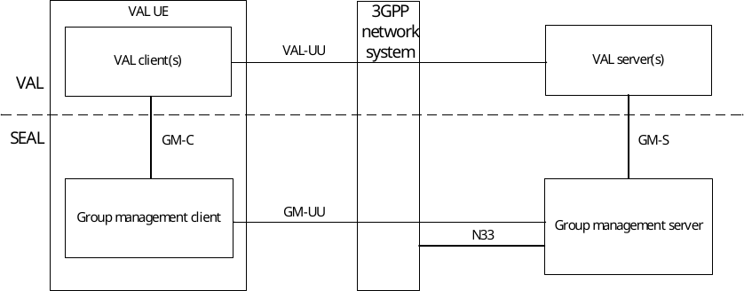
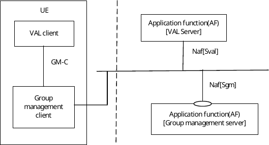
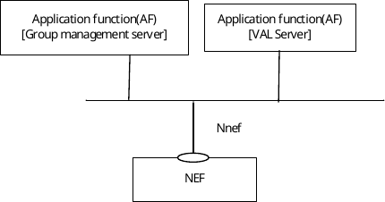
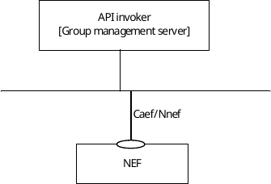
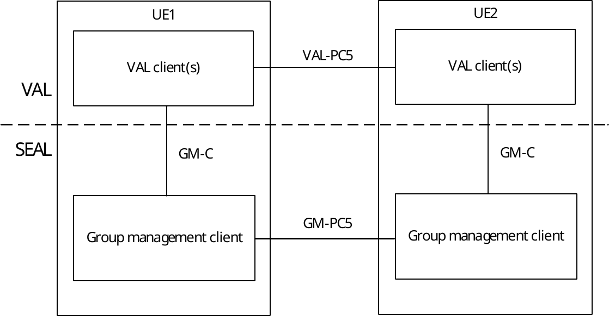

# 10.2 Functional model for group management

## 10.2.1 General

The functional model for the group management is based on the generic functional model specified in clause 6. It is organized into functional entities to describe a functional architecture which addresses the support for group management aspects for vertical applications. The on-network and off-network functional model is specified in this clause.

## 10.2.2 On-network functional model description

Figure 10.2.2-1 illustrates the generic on-network functional model for group management.

Figure 10.2.2-1: On-network functional model for group management

The group management client communicates with the group management server over the GM-UU reference point. The group management client provides the support for group management functions to the VAL client(s) over GM‑C reference point. The VAL server(s) communicate with the group management server over the GM-S reference point.

The group management server interacts with the NEF of the underlying 3GPP network system via N33 reference point to perform group management procedures for 5G Virtual Network (5GVN) groups.

Figure 10.2.2-2 exhibits the service-based interfaces for providing and consuming group management services. The group management server could provide service to VAL server and group management client through interface Sgm.

Figure 10.2.2-2: Architecture for group management – Service based representation

Figure 10.2.2-3 illustrates the service-based representation for utilization of the 5GS network services based on the 5GS SBA specified in 3GPP TS 23.501 \[10\].

Figure 10.2.2-3: Architecture for group management utilizing the 5GS network services based on the 5GS SBA – Service based representation

Figure 10.2.2-4 illustrates the service-based representation for utilization of the Core Network northbound APIs via CAPIF.

Figure 10.2.2-4: Utilization of Core Network Northbound APIs via CAPIF – service based representation

The Group management server acts as authorized API invoker to consume services from the Core Network northbound API entities like NEF which act as API Exposing Function as specified in 3GPP TS 23.222 \[8\].

## 10.2.3 Off-network functional model description

Figure 10.2.3-1 illustrates the off-network functional model for group management.

Figure 10.2.3-1: Off-network functional model for group management

The group management client of the UE1 communicates with the group management client of the UE2 over the GM‑PC5 reference point.

## 10.2.4 Functional entities description

### 10.2.4.1 General

The functional entities for group management SEAL service are described in the following subclauses.

### 10.2.4.2 Group management client

The group management client functional entity acts as the application client for management of groups. A VAL system maintains groups corresponding to one or more vertical applications. The group management client interacts with the group management server. The group management client also supports interactions with the corresponding group management client between the two UEs.

The group management client functional entity is supported by the signalling user agent and HTTP client functional entities of the signalling control plane.

### 10.2.4.3 Group management server

The group management server functional entity provides for management of groups supported within the vertical application layer. The group management server acts as CAPIF's API exposing function as specified in 3GPP TS 23.222 \[8\]. The group management server also supports interactions with the corresponding group management server in distributed SEAL deployments.

The group management server functional entity is supported by the SIP AS and HTTP server functional entities of the signalling control plane.

All the group management clients supporting users belonging to a single group are required to use the same group management server for that group. A group management client supporting a user involved in multiple groups can have relationships with multiple group management servers.

## 10.2.5 Reference points description

### 10.2.5.1 General

The reference points for the functional model for group management are described in the following subclauses.

### 10.2.5.2 GM-UU

The interactions related to group management functions between the group management client and the group management server are supported by GM-UU reference point. This reference point utilizes Uu reference point as described in 3GPP TS 23.401 \[9\] and 3GPP TS 23.501 \[10\].

GM-UU reference point is used for VAL service signalling for VAL service data management of the VAL service. The GM-UU reference point supports:

\- Configuration of group related data at the group management client by the group management server; and

\- Configuration of group related data at the group management server by the group management client.

The GM-UU reference point uses the HTTP-1/HTTP-2 reference points for transport and routing of group management related signalling. The GM-UU reference point uses the SIP-1/SIP-2 reference points for subscription/notification related signalling.

### 10.2.5.3 GM-PC5

The interactions related to group management functions between the group management clients located in different VAL UEs are supported by GM-PC5 reference point. This reference point utilizes PC5 reference point as described in 3GPP TS 23.303 \[12\].

### 10.2.5.4 GM-C

The interactions related to group management functions between the VAL client(s) and the group management client within a VAL UE are supported by GM-C reference point.

### 10.2.5.5 GM-S

The interactions related to group management functions between the VAL server(s) and the group management server are supported by GM-S reference point. This reference point is an instance of CAPIF-2 reference point as specified in 3GPP TS 23.222 \[8\].

GM-S reference point supports the VAL server to obtain group information corresponding to the VAL service. The GM-S reference point uses HTTP-1/HTTP-2 reference points for transport and routing of group management related signalling. The GM-S reference point uses SIP-2 reference point for subscription/notification related signalling.

### 10.2.5.6 GM-E

The interactions related to group management functions between the group management servers in a distributed deployment are supported by GM-E reference point.

### 10.2.5.7 N33

For group management procedures pertaining to a 5GVN group the group management server interacts with the NEF of the underlying 3GPP network using the dynamic 5G Virtual Network group management procedures exposed by the NEF via the N33 reference point, as specified in TS 23.501 \[10\] and in TS 23.502 \[11\].
