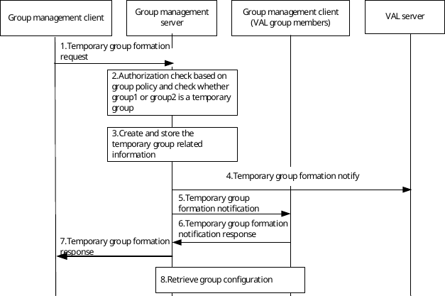

# 10.3.10 Temporary groups

## 10.3.10.1 Temporary group formation within a VAL system

Figure 10.3.10.1-1 below illustrates the temporary group formation within a VAL system.

Temporary groups are formed by combining two or more groups. The temporary group formation is applicable only for groups configured with at least one common VAL service. The temporary group formation shall be rejected if any of the requested VAL services are not common to all the constituent VAL service groups.

Pre-conditions:

1\. The group management client, group management server, VAL server and the VAL group members belong to the same VAL system.

2\. The group management client has retrieved the group configurations of the groups.

3\. The VAL server has subscribed to receive group management event notifications.

Figure 10.3.10.1-1: Temporary group formation within a VAL system

1\. The group management client of the VAL user requests temporary group formation operation to the group management server, which is the group management server of one of the groups to be regrouped. The identities of the groups being combined shall be included in this message. The group management client may indicate the security level required for the temporary group. The group management client may indicate the priority level required for the temporary group.

2\. The group management server checks whether temporary group formation operation is performed by an authorized VAL user, based on group policy. The group management server checks whether group1 or group2 is a temporary group. If group 1 or group2 is a temporary group, then the group regrouping will be rejected, otherwise the group regrouping can proceed.

3\. The group management server creates and stores the information of the temporary group, including the temporary VAL group ID, the VAL group ID of the groups being combined, the priority level of the temporary group and the security level of the temporary group. If the authorized VAL user does not specify the security level and the priority level, the group management server shall set the lowest security level and the highest priority of the constituent groups. If VAL service types of the groups being combined are not identical, group management server determines the overlapping part and stores the VAL service list for the temporary group.

4\. The group management server notifies the VAL server regarding the temporary group creation with the information of the constituent groups, i.e. temporary VAL group ID, group1's VAL group ID and group2's VAL group ID. If VAL service list is included, VAL server stores it and provides VAL service types accordingly.

5\. The group management server notifies the VAL group members of the constituent VAL groups by sending temporary group formation notification messages.

6\. The VAL group members of the constituent VAL groups send individual temporary group formation notification response messages.

7\. The group management server provides a temporary group formation response to the group management client of the authorized VAL user. If VAL service list is included, group management client stores it and initiates VAL service types accordingly.

8\. The VAL group members of the constituent VAL groups individually request group configuration data from the group management server for the temporary group. The group configuration data includes security, priority, and other parameters.
