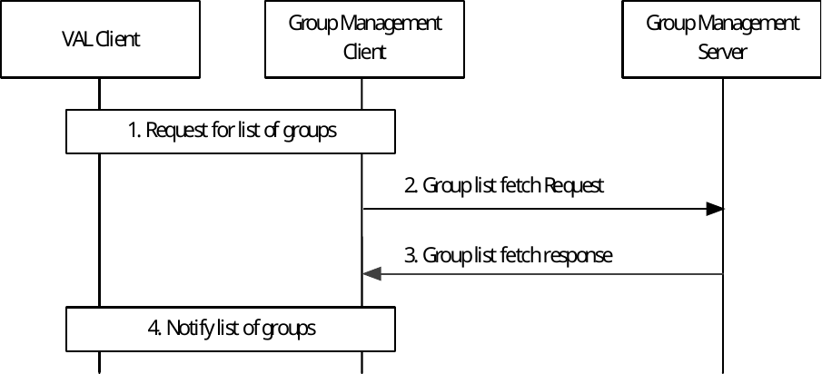

# 10.3.11 Group List Fetch

Figure 10.3.11-1 illustrates the group list fetch operations to fetch list of groups by the group management client.

Pre-conditions:

1\) List of groups to which a VAL UE/ VAL User belongs to is known to the Group management server for each of the VAL UE/ VAL User.

2\) VAL user has not received group announcement message as it was offline previously.

Figure 10.3.11-1: Group list fetch

1\) The VAL client requests group management client to provide the list of groups in which the VAL UE or VAL User is a member.

2\) The group management client initiates the group list fetch request towards the Group management server. The information elements described in clause 10.3.2.36 are included in the group list fetch request.

3\) The group management server checks the authorization of group list fetch request and if authorized, sends the group list fetch response containing list of groups in which the VAL user is member. The information elements described in clause 10.3.2.37 are included in the group list fetch response.

4\) The group management client notifies the list of groups to the VAL client.
