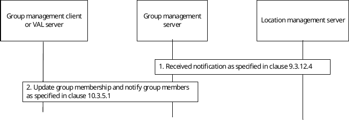

# 10.3.12 Location-based group update

Figure 10.3.12-1 below illustrates the location-based group update.

Pre-conditions:

1\. The group management client, group management server, VAL server, location management server and the VAL group members belong to the same VAL system.

2\. The location based group has been created as specified in clause 10.3.7.

3\. The group management server has subscribed to monitor UEs moving in or out of the fixed location area as specified in clause 9.3.12.

Figure 10.3.12-1: Location-based group update

1\. The group management server receives location area monitoring notification from location management server as specified in clause 9.3.12.4.

2\. The group management server updates the group members and sends notification as specified in clause 10.3.5.1.
