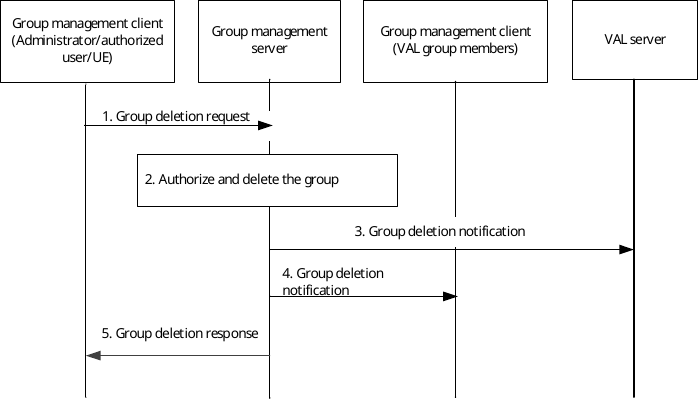

# 10.3.13 Group deletion

Figure 10.3.13-1 below illustrates the group deletion operation by authorized VAL user/UE/administrator to delete a group. It applies to group deletion by a VAL administrator or by authorized user/UE.

Pre-conditions:

1\. The group management client, group management server, VAL server and the VAL group members belong to the same VAL system.

2\. The authorized VAL user/UE/administrator is aware of the group identity which needs to be deleted.

Figure 10.3.13-1: Group deletion

1\. The group management client of the authorized VAL user/UE/administrator requests group deletion operation to the group management server. The identity of the group to be deleted shall be included in this message.

2\. The group management server authorizes the request and if authorized, deletes the group.

3\. The group management server notifies the VAL server regarding the group deletion.

4\. The group members of the VAL group are notified about the deleted VAL group.

5\. The group management server provides a group deletion response to the group management client of the administrator/authorized VAL user/UE.
