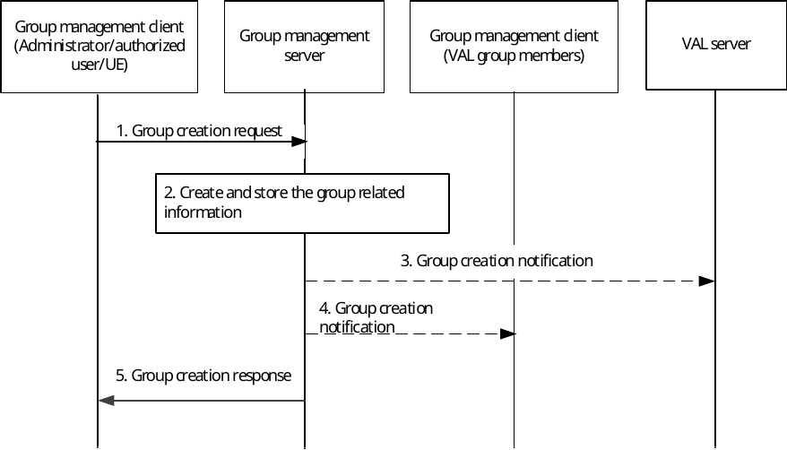

# 10.3.3 Group creation

Figure 10.3.3-1 below illustrates the group creation operations by authorized VAL user/UE/administrator to create a group. It applies to the scenario of normal group creation by a VAL administrator or by authorized user/UE.

Pre-conditions:

1\. The group management client, group management server, VAL server and the VAL group members belong to the same VAL system.

2\. The authorized VAL user/UE/administrator is aware of the users' identities which will be combined to form the VAL group.

Figure 10.3.3-1: Group creation

1\. The group management client of the authorized VAL user/UE/administrator requests group create operation to the group management server. The identities of the users or UEs being combined and the information of the VAL services that are enabled on the group shall be included in this message.

2\. During the group creation, the group management server creates and stores the information of the group. The group management server performs the check on the policies e.g. maximum limit of the total number of VAL group members for the VAL group(s). The external group identifier, identifying the member UEs of the VAL group at the 3GPP core network, is stored in the newly created VAL group's configuration information.

NOTE: The exact policies are out of scope of the present document.

3\. The group management server may conditionally notify the VAL server regarding the group creation with the information of the group members.

4\. The VAL group members of the VAL group are notified about the newly created VAL group configuration data.

5\. The group management server provides a group creation response to the group management client of the administrator/authorized VAL user/UE.
