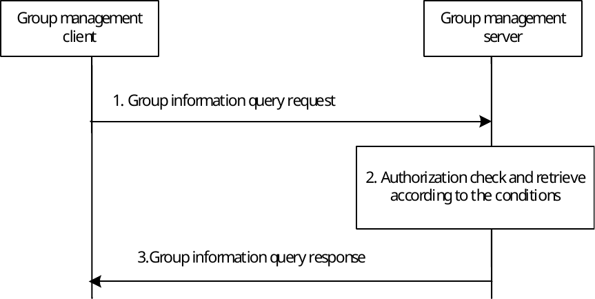

# 10.3.4 Group information query

## 10.3.4.1 General

A VAL user/UE can request the membership list on an VAL group regardless the user or UE's group membership.

## 10.3.4.2 Procedure

Figure 10.3.4.2-1 below illustrates the group information query on a VAL group.

Figure 10.3.4.2-1: Group information query

1\. The group management client of the VAL user/UE requests the group information on the VAL group from the group management server by sending a group information query request. The query type is included.

2\. The group management server checks whether the VAL user/UE is authorized to perform the query. If authorized, then the group management server retrieves the requested group information based on the query type.

3\. The group management server sends a group information query response including the retrieved group information to the group management client.
