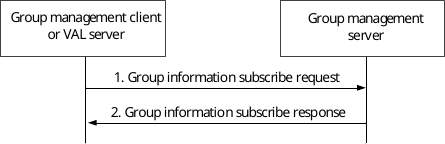
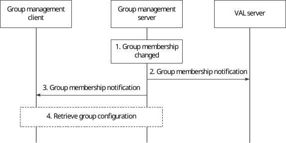
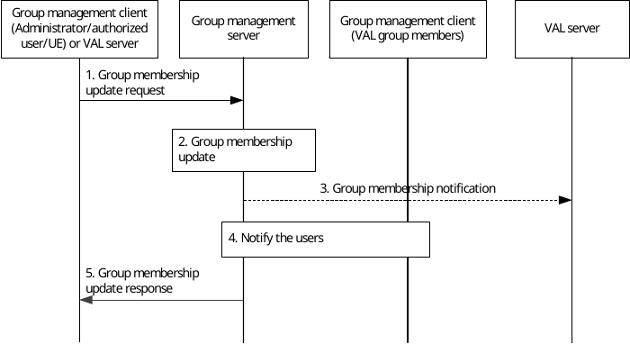

# 10.3.5 Group membership

## 10.3.5.0 Group membership subscription

The procedure for subscription for group membership data as described in figure 10.3.5.0-1 is used by the group management client and VAL server to indicate to the group management server that it wishes to receive updates of group membership data for groups for which it is authorized.

Pre-conditions:

1\. The group management server and VAL server serve the same VAL system;

2\. The initiator of this operation is aware of the current group membership of the VAL group;

Figure 10.3.5.0-1: Subscription for group membership

1\. The group management client or VAL server subscribes to the group membership information stored at the group management server using the group information subscribe request.

2\. The group management server provides a group information subscribe response to the group management client or VAL server indicating success or failure of the request.

## 10.3.5.1 Group membership notification

Figure 10.3.5.1-1 illustrates the group membership notification operations to the VAL server(s) and group management clients upon the group membership change at group management server.

Pre-conditions:

1\. VAL group is created on the group management server.

2\. The group management client or VAL server has subscribed to the group configuration information.

Figure 10.3.5.1-1: group membership notification

1\. The membership of a specific VAL group is changed at group management server.

2\. The group management server notifies the VAL server(s) regarding the group membership change with the information of the updated group members.

3\. The group management server updates the group management clients of the VAL users/UEs who have been added to or removed from the group.

4\. The group management client requests to retrieve the relevant group configurations from group management server, if the user or UE is added to the group. If the user or UE is deleted from the group, the locally stored group configurations in the VAL UE may be removed.

## 10.3.5.2 Group membership update by authorized user/UE/VAL server

Figure 10.3.5.2-1 below illustrates the group membership update operations by an authorized user/UE/administrator/VAL server to change the membership of a VAL group (e.g. to add or delete group members).

Pre-conditions:

1\. The group management server and VAL server serve the same VAL system;

2\. The initiator of this operation is aware of the current group membership of the VAL group;

3\. The authorized user/UE/administrator/VAL server is aware of the users' identities which will be added to or deleted from the VAL group.

Figure 10.3.5.2-1: Group membership update by authorized user/UE/VAL server

1\. The group management client of the authorized user/UE/administrator or VAL server requests group membership update operation to the group management server.

2\. The group management server updates the group membership information. The group management server may perform the check on policies e.g. the maximum limit of the total number of VAL group members.

NOTE 1: The exact policies are out of scope of the present document.

3\. The group management server notifies the VAL server(s) regarding the group membership change with the information of the updated group members.

NOTE 2: Step 3 does not happen when the VAL server is requesting group membership update operation.

4\. The group members that are added to or deleted from the group by this operation are notified about the group membership change. This step may be followed by retrieving group configurations.

5\. The group management server provides a group membership response to the group management client of the authorized user/UE/administrator or the VAL server.
