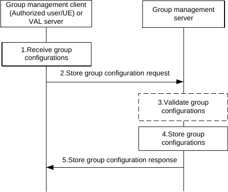
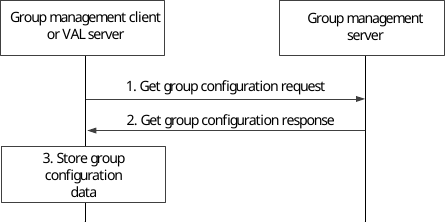
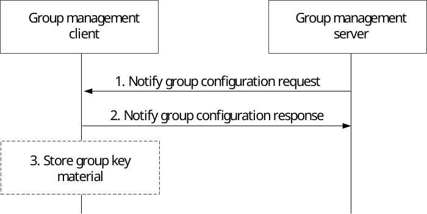
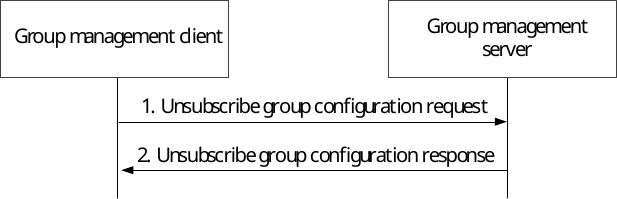
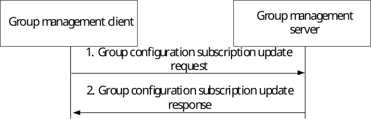

# 10.3.6 Group configuration management

## 10.3.6.1 Store group configurations at the group management server

The procedure for store group configurations at the group management server is described in figure 10.3.6.1-1.

Pre-conditions:

\- The group management server may have some pre-configuration data which can be used for online group configuration validation;

Figure 10.3.6.1-1: Store group configurations at group management server

1\. The group configurations are received by the group management client of an authorized user/UE or VAL server.

2\. The received group configurations are sent to the group management server for storage using a store group configuration request.

3\. The group management server may validate the group configurations before storage.

4\. The group management server stores the group configurations.

5\. The group management server provides a store group configuration response indicating success or failure. If any validation or storage fails, the group management server provides a failure indication in the store group configuration response.

## 10.3.6.2 Retrieve group configurations

The procedure for retrieve group configurations at the group management client or the VAL server is described in figure 10.3.6.2-1. This procedure can be used following service authorisation when the configuration management client has received the list of groups and the group management client needs to obtain the group configurations, or following a notification from the group management server that new group configuration information is available.

Pre-conditions:

\- The group management server has received configuration data for groups, and has stored this configuration data;

\- The VAL UE has registered for service and the group management client or the VAL server needs to download group configuration data applicable to the user/UE.

Figure 10.3.6.2-1: Retrieve group configurations

1\. The group management client or the VAL server requests the group configuration data.

2\. The group management server provides the group configuration data to the client or the VAL server.

3\. The group management client or the VAL server stores the group configuration information.

## 10.3.6.3 Subscription and notification for group configuration data

The procedure for subscription for group configuration data as described in figure 10.3.6.3-1 is used by the group management client to indicate to the group management server that it wishes to receive updates of group configuration data for groups for which it is authorized.

Pre-conditions:

\- The group management server has some group configurations stored.

Figure 10.3.6.3-1: Subscription for group configurations

1\. The group management client subscribes to the group configuration information stored at the group management server using the subscribe group configuration request.

2\. The group management server provides a subscribe group configuration response to the group management client indicating success or failure of the request.

The procedure for notification of group configuration data as described in figure 10.3.6.3-2 is used by the group management server to inform the group management client that new group configuration data is available. It can also be used by the group management server to provide new group related key material to the group management client.

Pre-conditions:

\- The group management client has subscribed to the group configuration information

\- The group management server has received and stored new group configuration information, or the group management server has generated and stored new key material, or both of these have occurred.

Figure 10.3.6.3-2: Notification of group configurations

1\. The group management server provides the notification to the group management client, who previously subscribed for the group configuration information. Optionally, the notify group configuration request may contain group related key material for the group management client.

2\. The group management client provides a notify group configuration response to the group management server.

3\. If the group management server had provided group related key material to the group management client, the group management client stores the key material.

If the group management server has notified the group management client about new group configuration information through this procedure, the group management client may then follow the procedure described in subclause 10.3.6.2 in order to retrieve that group configuration information.

Figure 10.3.6.3-3 illustrates the high-level unsubscription for group configuration procedure used by a group management client to indicate to a group management server to stop sending notifications of group configuration data changes for groups for which it is authorized.

Pre-conditions:

\- The group management client has an active subscription to group configuration data changes.

Figure 10.3.6.3-3: Unsubscription for group configurations

1\. The group management client decides to unsubscribe notifications about group configuration data changes and sends an unsubscribe group configuration request to the group management server including the information specified in table 10.3.2.43-1.

2\. The group management server shall check if the group management client is authorized to perform the unsubscribe operation. If so, the group management server cancels the subscription and provides an unsubscribe group configuration response to the group management including the information specified in table 10.3.2.44-1.

Figure 10.3.6.3-4 describes a procedure used by the group management client to update some parameters related to an existing subscription, for instance the notification target URI or the minimum time between consecutive notifications.

Pre-conditions:

\- The group management client has an active subscription to group configuration data changes.

Figure 10.3.6.3-4: Update an existing subscription for group configurations

1\. The group management client decides to update an active subscription and sends a group configuration subscription update request to the group management server including the information specified in table 10.3.2.45-1.

2\. The group management server shall check if the group management client is authorized to update the subscription. If so, the group management server updates the subscription and provides a group configuration subscription update response to the group management including the information specified in table 10.3.2.46-1.

## 10.3.6.4 Structure of group configuration data

The group configuration data contains group configuration data common to all VAL services and group configuration data specific to each VAL service.

NOTE: For a VAL service, the VAL group configuration data is listed in the corresponding VAL service specification and is outside the scope of the present document.
