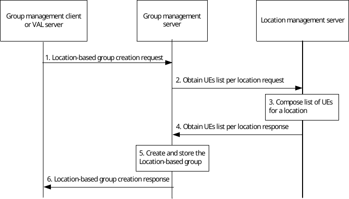

# 10.3.7 Location-based group creation

Figure 10.3.7-1 below illustrates the location-based group creation.

Pre-conditions:

1\. The group management client, group management server, VAL server, location management server and the VAL group members belong to the same VAL system.

2\. The authorized VAL user/UE/administrator or VAL server is not aware of the users' or UE identities which will be combined to form the VAL group.

Figure 10.3.7-1: Location-based group creation

1\. The group management client or the VAL server requests location-based group create operation to the group management server. The location criteria for determining the identities of the users or UEs to be combined shall be included in this message and the location criteria may be the VAL service area identified by the VAL service area ID.

2\. The group management server requests the location management server for obtaining the users or UEs corresponding to the location information or the VAL service area identified by the VAL service area ID as defined in clause 9.3.2.9.

3\. The location management server composes the list of users or UEs within the requested location as defined in clause 9.3.10.

4\. The group management server receives the composed list of users or UEs from the location management server as described in clause 9.3.2.10. The location management server may include VAL service IDs associated with the list of users or UEs.

5\. During the group creation, the group management server creates and stores the information of the location-based group. The group management server performs the check on the policies e.g. maximum limit of the total number of VAL group members for the VAL group(s). If an external group identifier, identifying the member UEs of the VAL group at the 3GPP core network is available, then the external group ID is stored in the newly created VAL group's configuration information. If VAL service ID list was received in step 1 as part of group formation criteria and not in step 4 for the composed list of users or UEs, the group management server shall retrieve the VAL service data from the configuration management server as described in clause 11.3.2.13 and form the group with relevant users or UEs.

NOTE: The exact policies are out of scope of the present document.

6\. The group management server provides a location-based group creation response to the group management client or the VAL server.
